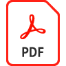

# Anpassa och varumärkesanpassa en 3D-modell med [!DNL Dimension] och Adobe [!DNL Stock]

Anpassa och märka en 3D-modell i [!DNL Dimension] använda material, miljöegenskaper, belysning och fotografi för att skapa fotorealistiska bilder för alla designprojekt.

>[!VIDEO](https://video.tv.adobe.com/v/331005?hidetitle=true)

Klicka på filikonen PDF om du vill hämta en snabbguide för den här självstudiekursen.

