# Tips och tekniker för att mastra 3D-ljus i CGI

Lär dig mer om 3D-belysning och hur du skapar olika ljusförhållanden som helt kan ändra en datorgenererad scen och hur objekten ser ut i den.

Vi uppfattar världen omkring oss med våra sinnen: Vi hör, vi känner, vi luktar, vi ser. Vi kan se eftersom våra ögon hämtar information som vi får av elementära partiklar som kallas foton. Den här informationen bearbetas av vår hjärna för att skapa en bild. Det vi tolkar som en objektfärg, glansighet, genomskinlighet eller metalliska egenskaper är alla produkter som samverkar mellan fotona och objektets yta.

Ljusmekaniker i en datorgenererad 3D-scen följer samma naturliga princip för spridning av foton genom en process som kallas [strålföljning](https://en.wikipedia.org/wiki/Ray_tracing_(graphics)). Placerar ut former och interagerar med materialet för att effektivt definiera hur objekten ska visas i den slutliga bilden. Ljus visar dimensionaliteten för allt som finns i en 3D-scen.

Vissa material är känsligare för ljusförhållanden än andra. Ta metaller till exempel: Ett chrome-objekt speglar i princip allt som finns runt det. Om ett ljus flyttas, blir ljusare eller större, syns all den informationen direkt på kromytan i nästan spegelliknande detalj, så att den kan se helt annorlunda ut än det ena ljuset till det andra.

## Arbeta med 3D-ljus för att skapa effektiva 3D-renderingar

Processen att skapa en 3D-rendering är aldrig helt densamma, men detta är de vanligaste stegen:

1. Skapa eller hämta objekt
1. Scensammansättning
1. Bildruta scenen
1. **Ljus**
1. Skapa eller tilldela material
1. Återgivning

När du kommer till ljusfasen är det idealiskt att ställa in ljuset innan du arbetar med materialet. För att göra detta kan du tilldela ett neutralt grå, matt material till hela scenen. På så sätt kan du se och förstå hur ljuskällorna påverkar objektets silhuetter i scenen. När materialet är klart kan belysningen behöva förfinas ytterligare.

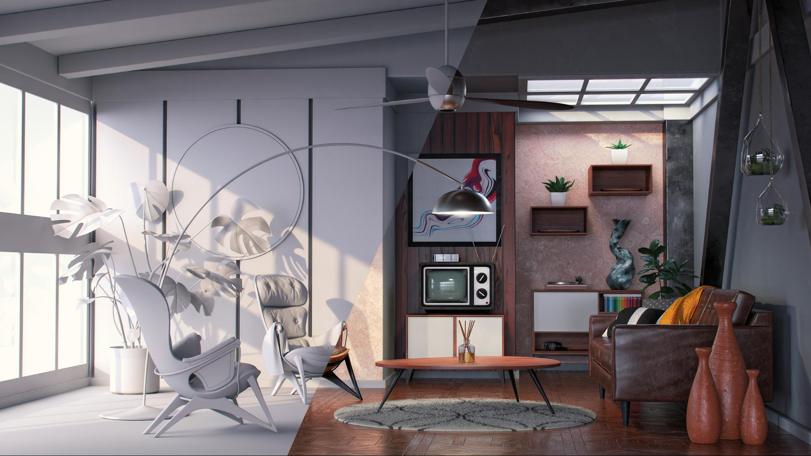

Det är bäst att arbeta med ljuset en i taget. Det aktiva ljuset bör vara det enda som syns i motivet, medan alla andra ljus tillfälligt ska vara avstängda. På så sätt kan du se hur ett visst ljus påverkar scenen och ändra det genom att arbeta med dess egenskaper, t.ex. position, riktning, intensitet osv.

Ett annat användbart trick är att skapa en sfär med glänsande metallmaterial (en krom eller en spegel). Den här&quot;spegelbollen&quot; reflekterar effektivt hela motivet runt det, så att du enkelt kan avgöra ljusets position, riktning eller storlek. Om det gäller miljöbelysning kan du se spegelreflexen i spegelbollen, som hjälper dig att ställa in dess orientering i rymden.

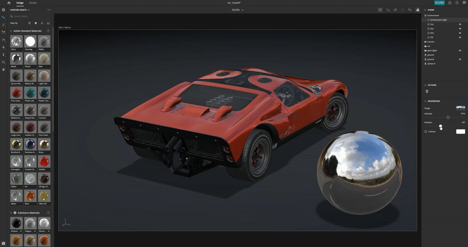

## Typer av ljus i Adobe [!DNL Dimension]

### Miljöljus

Miljöljus är ekvirektangulära (sfäriska) bilder som är figursatta runt hela scenen. Som namnet antyder används dessa ljus för att emulera hela miljön, inklusive ljuskällorna, som lagras i dem.

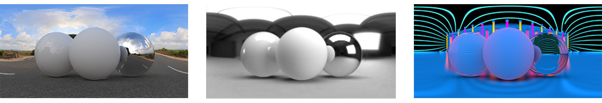

När du skapar en ny scen i [[!DNL Dimension]](https://www.adobe.com/products/dimension.html) skapas ett standardmiljöljus åt dig. Det är därför du direkt kan se någonting på platsen. Adobe [!DNL Dimension] Starter Assets innehåller ett visst antal omgivningsljus som du kan prova direkt. Dessutom erbjuder [Adobe [!DNL Stock]](https://stock.adobe.com/search?filters[content_type:3d]=1&amp;filters[3d_type_id][0]=2&amp;load_type=3d+lp) ett stort urval av miljöljus.

Miljöljus ger mycket realistiska resultat och kan spara mycket tid. För att åstadkomma något liknande manuellt måste du faktiskt skapa hela miljön i 3D (inklusive olika ljuskällor), vilket är en avsevärd mängd arbete.

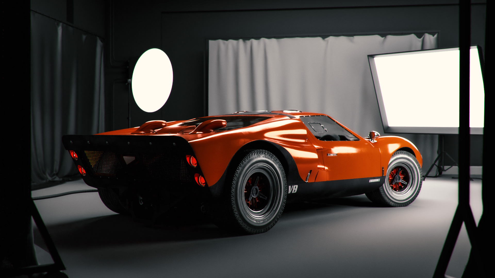

Det finns många sätt att skapa miljöljus, bland annat att fånga från en 3D-scen, från ett foto och använda parametriska system. Om miljöljuset är gjort av en 3D-scen är processen okomplicerad. Utdatabilden måste vara 32 bitar, vilket fångar ljusinformationen från alla ljuskällor i scenen. 3D-kameran måste använda den ekvirektangulära projektionen (för att skapa en sfärisk bild).

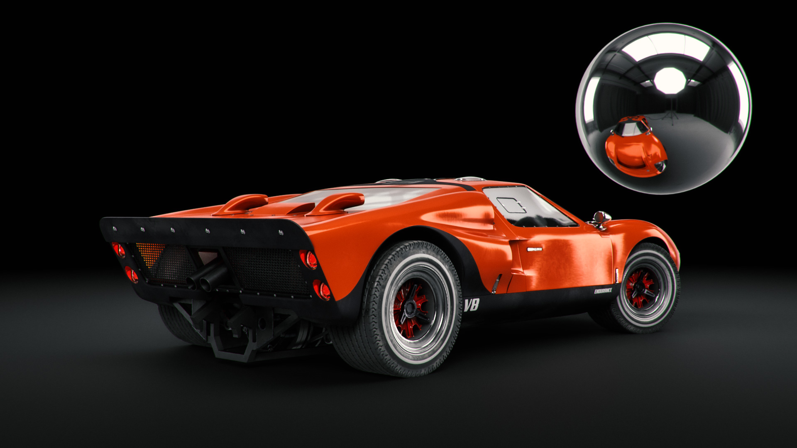

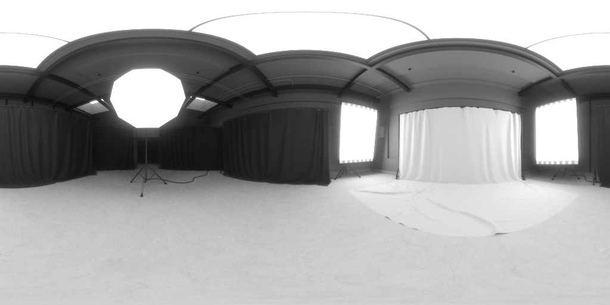

Du kan också skapa miljöljus genom att ta foton av verkligheten. För det här arbetsflödet krävs en 360-kamera (t.ex. [Ricoh Theta Z1](https://theta360.com/en/about/theta/z1.html)). Kameran används sedan för exponeringsgaffling eller för att ta flera bilder av samma miljö, tagna med olika exponeringsvärden (från underexponerade till överexponerade). Dessa bilder används sedan för att konstruera 32-bitarsbilder, som ofta kallas HDR (kort för ett High Dynamic Range). Ett sätt att montera en sådan bild är med funktionen Lägg samman till HDR i Photoshop. Det inbäddade exponeringsintervallet blir intensitetsegenskapen.

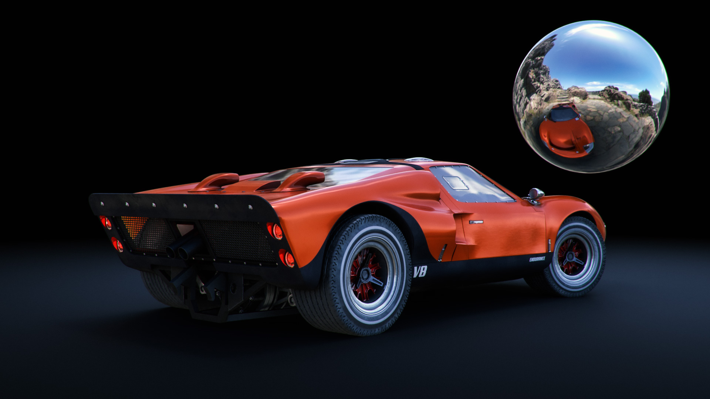

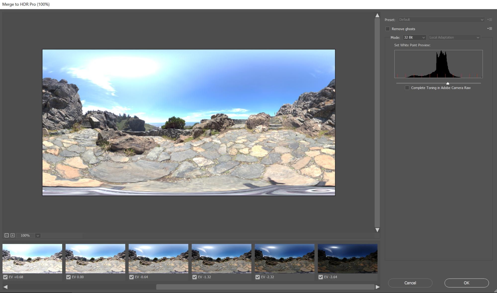

I båda fallen är ljuskällorna (och deras intensitet) bakade i dessa bilder och kommer att avge ljuset när de används i [!DNL Dimension].

Med dessa metoder har du spelat in allt ljus, alla speglingar och alla detaljer du behöver, men med 3D-programmen kan du fortsätta redigera dem i 3D-rymden så att du kan justera ljusrotationen samt ändra intensiteten och färgen.

### Riktningsljus

Förutom miljöljus, som avger ljus från 360 grader, finns det även riktningsljus som avger ljus från endast en riktning. De används för att emulera blixtljus och andra typer av ljus som kommer från en väldefinierad sändare, och de kan formas som en cirkel eller fyrkant.

Med riktningsljus får du full kontroll över ljussättningen. Ljussättning av motivet görs på samma sätt som i traditionell fotografering, där varje ljuskälla kan styras separat så att du kan skapa en egen virtuell belysning. En av de vanligaste ljusinställningarna är 3-punktsljussystemet.

[!DNL Dimension] har en praktisk funktion, Aim Light at Point, som du kan använda till att styra rotation och höjd genom att helt enkelt klicka och dra över ett 3D-objekt. På så sätt kan du styra ljusstrålarna dynamiskt. Dessa parametrar kan även justeras manuellt.

Du kan ändra färg och intensitet på riktningsljusen samt justera formen på ljuskällan - göra den cirkelformad eller rektangulär, sträcka ut den eller göra den större. Slutligen kan du mjuka upp ljuskällans kanter.

![Ändra formen på ett riktat ljus i Adobe  [!DNL Dimension]](assets/Mastering3dlighting_12.gif)

Om du gör ljuskällan mindre än objektet blir skuggorna skarpare, med en skarpare kontur, eftersom strålarna inte kan komma förbi det upplysta objektet. Större ljuskällor ger mjukare skuggor, eftersom strålarna i det här fallet kommer från objektets alla sidor (markerade med rött i bilden nedan), vilket skapar en array med skuggor. Dessa skuggor mjukas upp av strålarna från motsatt riktning.

### Sun and sky

Solljus är en speciell typ av riktningsljus. Processen för att ställa in den är mycket lik ett vanligt riktningsljus, men detta ljus ändrar automatiskt färgen med höjden. när den är nära horisonten (låga höjdvinkelvärden) kommer den gradvis att bli varmare för att simulera solnedgången. Du kan också ändra färgen genom att använda förinställningar. Samtidigt kommer grumlighet att påverka skuggans mjukhet.

![Ändra ljusegenskaper för solljus på en 3D-bilmodell i Adobe  [!DNL Dimension]](assets/Mastering3dlighting_15.gif)

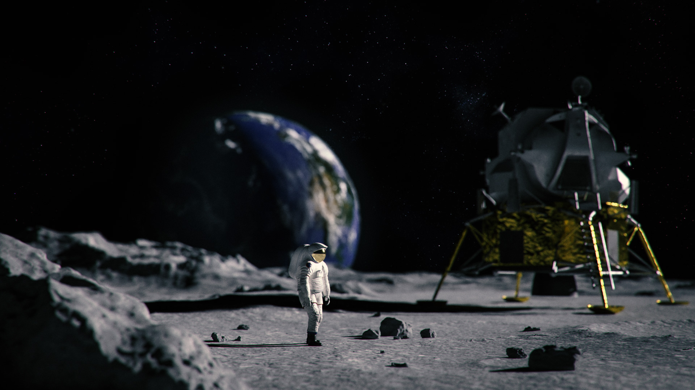

Vi kan emulera himlen med omgivningsljus, och allt miljöljus med himlen kan användas. Nu måste vi justera solljuset (gjort i [!DNL Dimension]) mot solen, som tagits i omgivningsljuset. Ett snabbt sätt att göra detta är att skapa en sfär och tilldela den ett metallmaterial. Detta ger oss reflexioner i realtid av miljön, så vi kan använda Aim Light vid punkten för att justera solljuset mot solen.

Om omgivningsljuset har en mulet himmel kan egenskapen cloudiness användas för att bättre matcha dessa villkor.

![Ändra molnegenskaper för belysning av himmelmiljö på en 3D-bilmodell i Adobe  [!DNL Dimension]](assets/Mastering3dlighting_17.gif)

När solljuset och Sky Environment-ljuset har parats kan du rotera dem tillsammans med egenskapen Global rotation.

### Objektbaserade ljus

Du kan göra om objekt till ljuskällor genom att aktivera glödegenskapen för deras material. På så sätt kan du skapa objekt som glödlampor, neonljus, softbox och alla typer av skärmar och skärmar.

Den största fördelen med att använda den här typen av belysning är intensitetsutfallet, som ger mycket naturliga resultat. Detta är mycket användbart för visualisering av produkter eller andra studiobaserade scener.

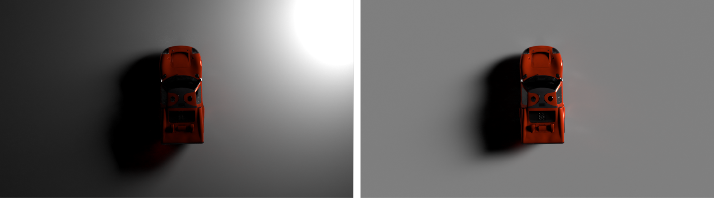

Du kan styra skuggornas mjukhet genom att skala glödobjektet uppåt eller nedåt med omformningsverktyget. Om du gör den större ökar även ljusintensiteten.

Till skillnad från tidigare typer av ljus som vi har täckt kan dessa ljus även utnyttja texturer, förutom rena färger. Texturerna kan fästas till basfärgen på deras material och ljusintensiteten styrs med ett glödreglage.

## Exempel på effektiv 3D-belysning

### Produktbelysning

Det finns många fototekniker för att ställa in ljuset för en produktbild. Vi kommer att använda en av de vanligaste inställningarna, nämligen 3-punktsljussystemet.

Den här installationen består av tre ljuskällor:

1. **Nyckelljus:** använd som primär källa, detta lyser ungefär från kamerans riktning

   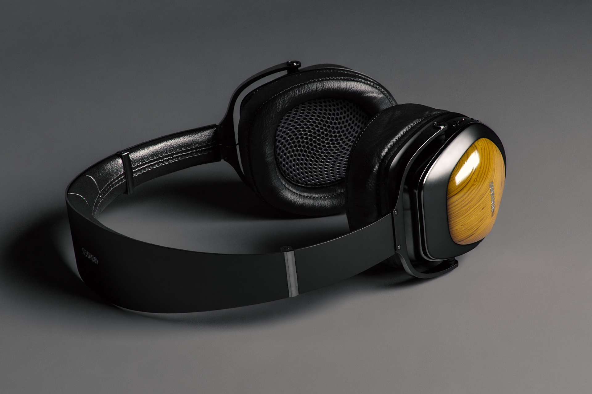

1. **Skarpt ljus:** orienterat på motsatt sida från nyckeln, används för att visa motivets silhuett.

   

1. **Fyllnadsljus:** mindre intensivt och används för att fylla i mörkare områden. Detta används för områden som de två föregående ljusen inte når.

   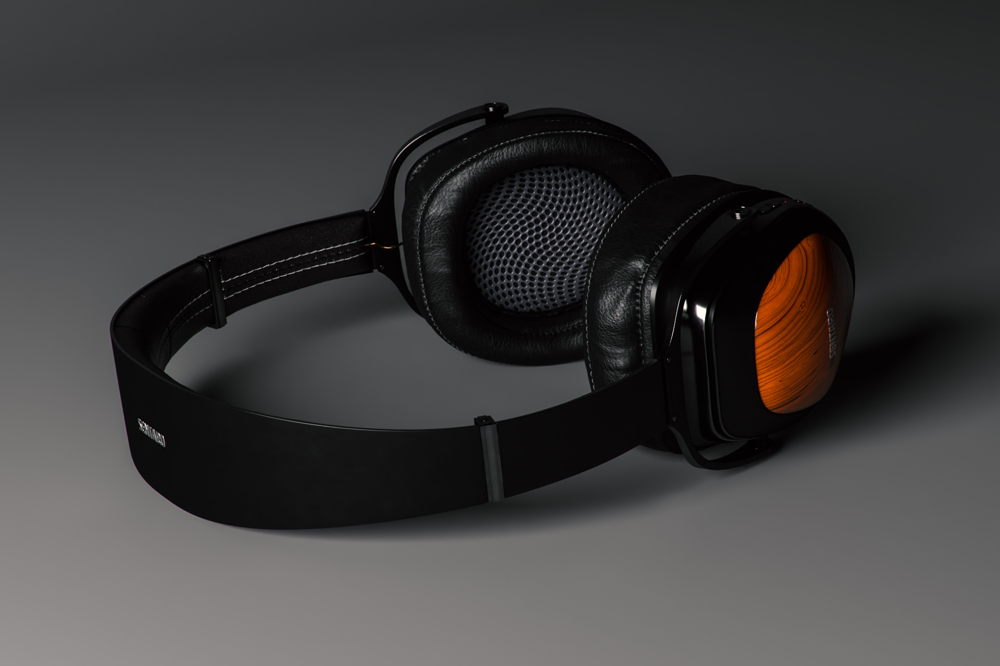

Det finns två sätt att skapa 3-punktsbelysningen i [!DNL Dimension] - med riktningsljus (som läggs till individuellt i scenen eller med en förinställning för 3-punktsljus) eller via glödesobjekt.

### Kreativ belysning

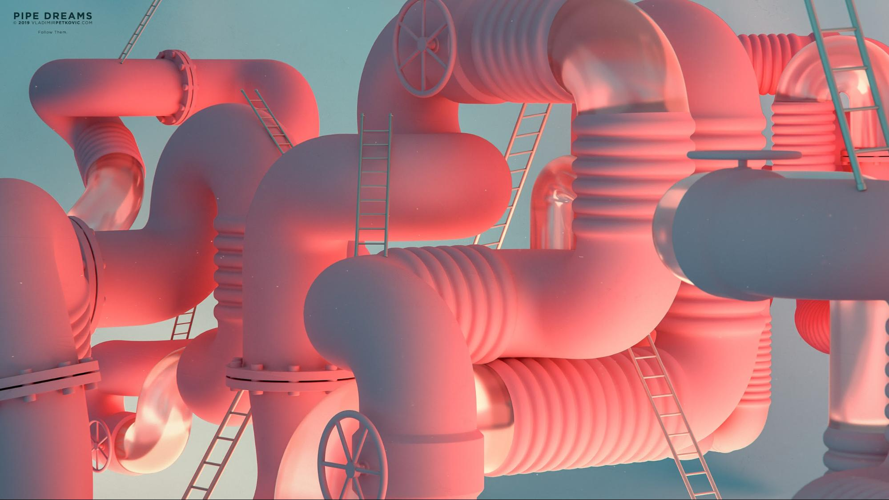

Kreativ belysning används där fysisk precision inte är det primära målet. Detta inkluderar abstrakta och surrealistiska scener av alla de slag, så det finns inga gränser där våra idéer kan föra oss.

I exemplet ovan var idén att skapa en drömlik miljö: godis, pastellfärger och jämna ytor. Ljussystemet består av tre glödande plåtar (två på sidan och den huvudsakliga plåten från botten). Alla glödande plåtar är orealistiskt stora, vilket ger mycket mjuka skuggor och högdagrar. Ljuskällorna är färgade och den färgen överförs till det material som tilldelats objekten i scenen.

Scenens motiv (rören) är helt omgivet av vägggeometrin. Det gör att ljusstrålar studsar fram och tillbaka och blandas på intressanta sätt. Att spela upp med kalla VS-varma toner ger ofta fin kontrast (den här tekniken används ibland i porträttfotografering).

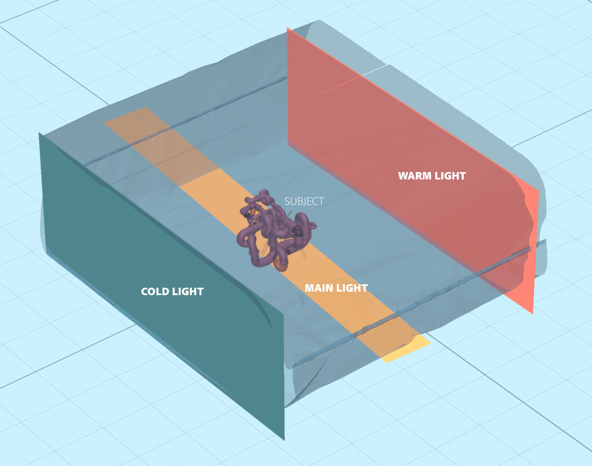

### Inredningsvisualisering

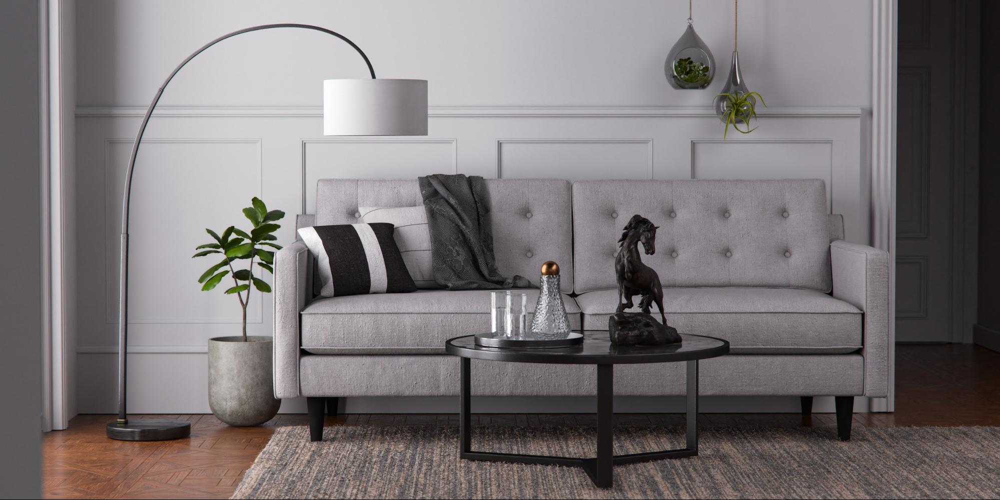

När du skapar en visualisering av en 3D-interiör följer du en viss uppsättning regler som nästan alltid garanterar bra resultat. I det här fallet kommer vi endast att beakta naturligt ljus (inga artificiella källor, som lampor).

Först och främst måste en sådan här scen finnas i en innesluten miljö. Precis som i verkligheten kommer interiören att behöva väggar, golv, tak och fönster. Det ser till att ljuset kommer genom fönstren och studsar sedan runt (via en process som kallas strålföljning). Det här beteendet ger väldigt naturligt ljus (de inkluderade områdena, som hörnen, blir till exempel mörkare).

Eftersom motivet nästan är helt omgivet av arkitekturgeometri kommer vi att se mycket lite belysning och nästan inga reflektioner från miljöljuset. Men i det här fallet skapar vi faktiskt vår egen miljö, som är själva interiören. Ljuset reagerar då på motivet genom att studsa bort dem och de omgivande väggarna. Objekten speglar bara varandra och väggarna runt dem. Det är trots det en god idé att lägga till ett miljöljus med himlen. Då läggs en liten blå, diffus fyllning till.

Det enklaste sättet att ställa in detta ljus är att använda plan med glödande material. I det här fallet har vi tre plan som täcker alla öppningar i insidan.

Ljusets intensitet styrs av ljusets glödegenskap i materialet. Du kan lägga till en färg eller till och med en textur som kan användas för att kasta intressanta skuggor. Om du använder glödmaterial får du också ljusintensitetsfall, vilket är mycket viktigt för inre belysning.

### Utomhusbelysning

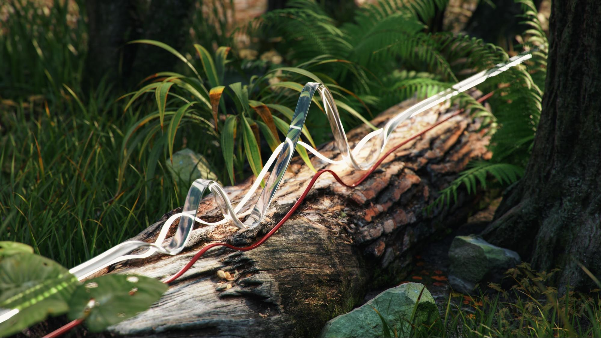

Det är ganska enkelt att skapa utomhusbelysning och det beror på att använda ett ljussystem av typen Sun och Sky (se ovan). Det är viktigt att solskenet överensstämmer med det himmelsbaserade omgivningsljuset - med hänsyn till både riktning och molnvärde.

Själva scenen spelar en stor roll i detta. För att skapa övertygande resultat använder du objekt i scenen som katalysatorer som interagerar med ljuset. I den skogsåtergivning som visas ovan placeras föremålen (olika växter, stockar och träd) nära varandra.

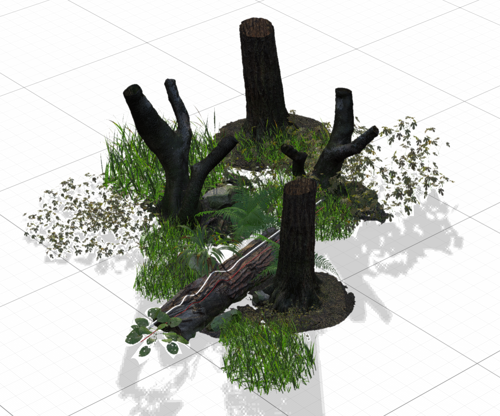

Det innebär att det kommer att finnas mycket komplex raytracing-interaktion, eftersom ljuset studsar mellan objekten. Skuggade fläckar blir mörka (som förväntat), medan exponerade områden förblir ljusa.

![Använda Global Rotation i Adobe  [!DNL Dimension] för att orientera om ljussystemet i Sun och Sky i en 3D-scen](assets/Mastering3dlighting_34.gif)

Jag hoppas att den här översikten visar vikten av att behärska 3D-ljus i olika situationer. Du bör vara redo att börja producera mer övertygande resultat.

Glad belysning! Hämta [den senaste utgåvan](https://creativecloud.adobe.com/apps/download/[!DNL Dimension]) av Dimensionen idag.
