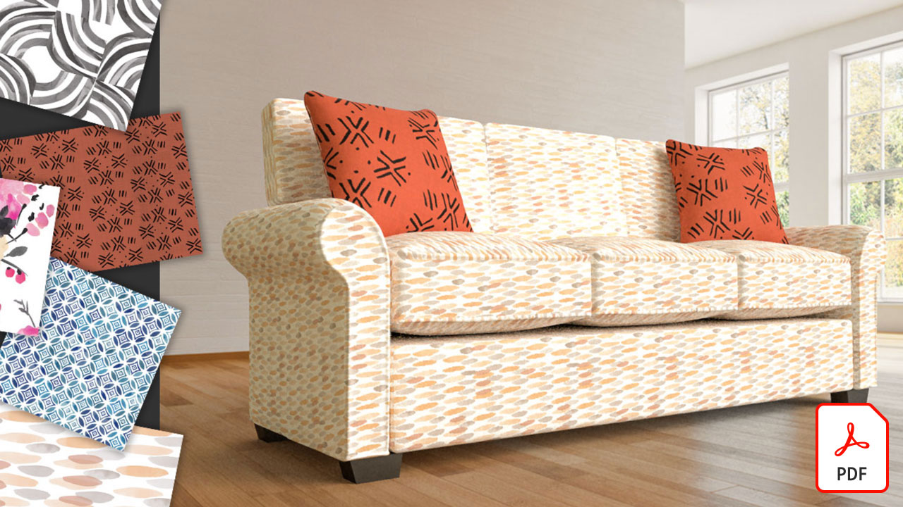
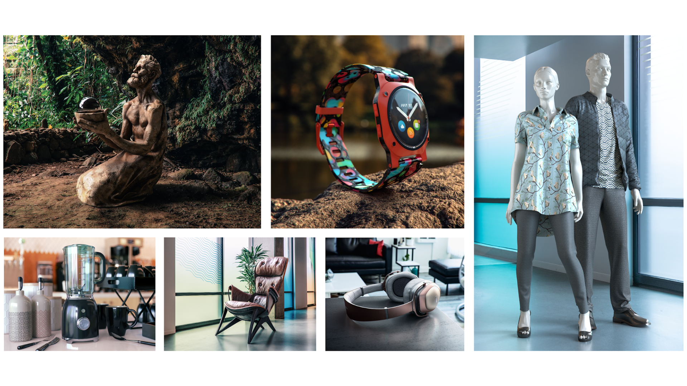

# Adobe 3D- och VR-självstudiekurser

Skapa engagerande 3D-material snabbare med modeller, material och ljus av hög kvalitet. [!DNL Dimension] gör det enkelt att bygga varumärkesvisualiseringar, illustrationer, produktdummies, förpackningsdesign och annat kreativt arbete.

## Klicka för att visa en 3D- och VR-självstudiekurs för Adobe

<table>
<tr>
 <td>
   
    

   <a href="assets/CreateRealistic3DMockupswithAdobeStockandDimension.pdf"><strong>Skapa realistiska 3D-modeller med Adobe [!DNL Stock] och [!DNL Dimension] (PDF)</strong></a>
    

    <em>Kombinera enkelt en 2D-design med en 3D-modell med Adobe [!DNL Stock] och monterade bilder i Adobe [!DNL-Dimension]</em>
     
  </td>
  <td>
   
    

   <a href="assets/VisualizeTextileDesignsorPatternson3DObjectswithAdobeDimension.pdf"><strong>Visualisera textil- och mönster på 3D-objekt med Adobe [!DNL-Dimension] (PDF)</strong></a>
    

    <em>Skapa en ultrarealistisk representation av slutprodukten på några minuter</em>
     
  </td>
  <td>
   
    

   <a href="../cce/assets/VisualizeyourProductinaRealisticEnvironment.pdf"><strong>Visualisera din produkt i en realistisk miljö (PDF)</strong></a>
    

    <em>När du vill se hur dina produkter kommer att se ut i verkligheten är Adobe [!DNL Dimension] din favorit</em>
     
  </td>
</tr>
   <tr>
 <td>
   
    

   <a href="mastering3dlighting.md"><strong>Tips och tekniker för att mastra 3D-ljus i CGI</strong></a>
    

    <em>Lär dig mer om 3D-belysning och hur du skapar olika ljusförhållanden som helt kan ändra en datorgenererad scen och hur objekten ser ut i den</em>
     
  </td>
  <td>
   
    

   <a href="photorealistic.md"><strong>Skapa fotorealistiska virtuella foton med 3D-rendering och 3D-montage</strong></a>
    

    <em>Lär dig hur du skapar enastående bedrägliga, fotorealistiska virtuella fotografier med 3D-bildmontage och -rendering i Adobe [!DNL-Dimension]</em>
     
  </td>
  <td>
   
    

   <a href="3ddimensionstock.md"><strong>Anpassa och märk upp en 3D-modell med [!DNL-Dimension] och Adobe [!DNL Stock]</strong></a>
    

    <em>Anpassa och märk upp en 3D-modell i [!DNL-Dimension] med material, miljöegenskaper, ljus och fotografi för att skapa fotorealistiska bilder för alla slags designprojekt</em>
     
  </td>
</tr>
</table>
