# Skapa fotorealistisk virtuell fotografering med 3D-rendering och komposition

![Ett kollage av exempel med fotorealistiska virtuella fotografier designade med Adobe [!DNL Dimension]](assets/Photorealistic_1.png)

Om man tittar på bilderna ovan skulle man bli förlåten om man antar att allt man ser är verkligt. Med de tekniska framstegen i återgivningen av fotorealistiska 3D-bilder är det dock svårare än någonsin att avgöra vad som är verkligt och vad som är virtuellt. I det här fallet är bilderna en blandning av verkligt innehåll, fotografi och renderat 3D-innehåll - och det är exakt den här typen av 3D-design som företagen investerar i.

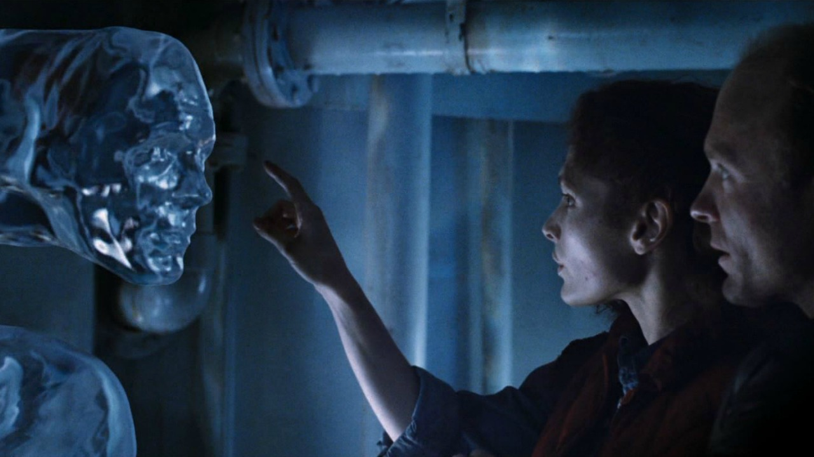

Den här tekniken för att skapa lager eller &quot;sätta samman&quot; 3D-modeller till en bild eller video är inte ny, och dess ursprung går i själva verket tillbaka till de tidiga åren med VFX (så långt tillbaka som på 1980-talet). Det nya och spännande är att denna teknik har blivit ett kraftfullt verktyg för [Adobe [!DNL Dimension]](https://www.adobe.com/products/dimension.html) användare och ett spännande nytt arbetsflöde för fotografer.

## Tekniken bakom bildskapande i Adobe [!DNL Dimension]

![Redigera planet för en metallsfärsmodell i en Adobe [!DNL Dimension] sammansatt](assets/Photorealistic_3.png)

Adobe [!DNL Dimension] har gjort det möjligt för användare att sömlöst kombinera 2D- och 3D-element direkt i programmet genom att använda den Adobe Sensei-drivna matchningsbildfunktionen. Den största fördelen med att sätta samman element på det här sättet är att det i turbo går att skapa en bild med realistiskt utseende genom att ersätta en fullt realiserad 3D-scen med en bakgrundsbild, som kan fångas upp från verkligheten.

![Funktionen Matcha bild i Adobe [!DNL Dimension] analyserar bakgrundsbilden och uppskattar brännvidd och position för kameran som användes för att ta fotot](assets/Photorealistic_4.gif)

Funktionen Matcha bild analyserar bakgrundsbilden och uppskattar brännvidden och positionen för kameran som användes för att ta bilden. En 3D-kamera skapas sedan i [!DNL Dimension] scen som kan användas för att återge 3D-element i samma perspektiv som bakgrundsbilden så att de sätts samman.

Men hur är det med allt som inte tagits med i kamerans ram?  Hela miljön som en bild fångas upp i spelar roll eftersom den definierar hur allt ser ut i den. Ett objekt i en bild återspeglar ljuset från världen runt omkring, vilket omfattar allt bakom kameran också. För att 3D-element med lager verkligen ska smälta in med bildens bakgrund måste de spegla ljuset i den miljö där bilden togs.

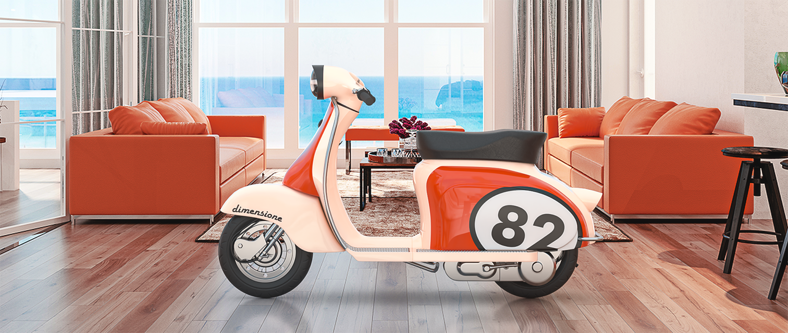

Med Matcha bild görs ett försök att &quot;hallucinera&quot; den belysningsmiljö där en bakgrundsbild togs. Den gör ett imponerande arbete som kommer att ge utmärkta resultat i kort ordning, men att fånga miljön tillsammans med bakgrundsbilden kommer att ge ännu mer realistiska resultat. Det här är till och med den metod som används för att träna Adobe Sensei-funktionen så att den fungerar på egen hand.

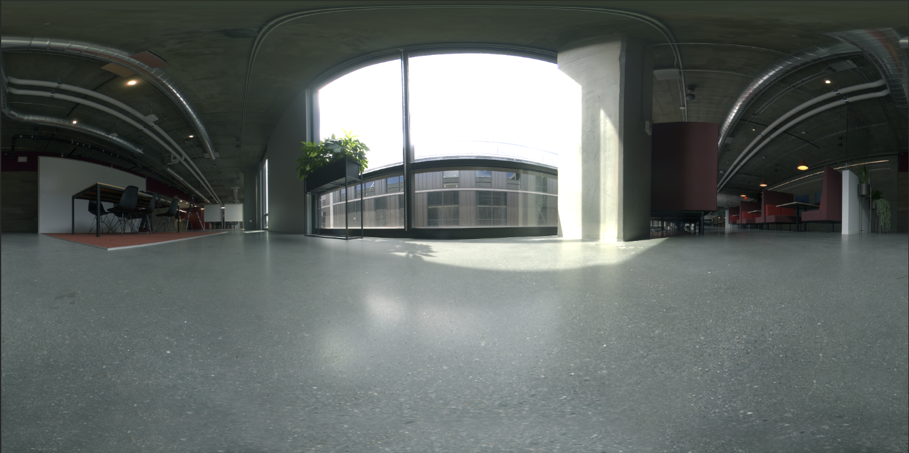

Ta del av en värld med 360° HDR-panoramabilder. De här bilderna har länge använts i 3D-grafik för att förstärka ljuseffekterna i en belysningsmiljö med hela världen. Processen för att fånga dem i det förflutna har varit ganska komplicerad på grund av den höga nivån av kunskap och specialiserad utrustning som behövs för att göra dem. Med 360°-kameror är det nu mer möjligt än någonsin att skapa de här bilderna.

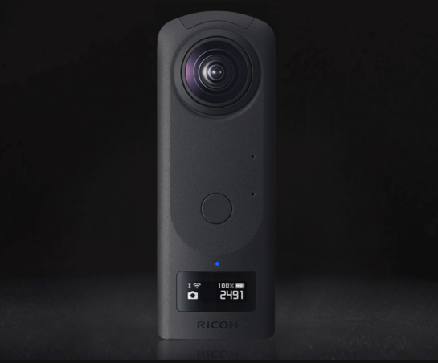

Kameror som Ricoh Theta, Gopro MAX och Insta 360 kan fånga 360 panoramor. Ricoh Theta har inbyggda automatiska exponeringsgafflar som är en viktig del av hämtningsprocessen. Det minskar tiden och arbetet med att hämta HDR-bilder och gör det mer tillgängligt för fotografer.

## Processen för att skapa fotorealistiska sammansatta bilder

### [!DNL Capture]

Om du vill komma igång med att ta miljöer för sammansättning behöver du två huvudelement: en bakgrundsbild eller bilder med hög kvalitet och ett 360° HDR-panorama över den miljö som den togs i.

En av de viktigaste aspekterna av att effektivt fånga den här typen av innehåll är att dra nytta av fotografens befintliga färdigheter och verktyg. Att skapa en vacker bakgrundsbild kräver ett öga för komposition och uppmärksamhet på detaljer. Bakgrundsbilderna kräver också ett särskilt tänkesätt för att kunna skapa något som är användbart för att sätta samman 3D-element i.

### Välja en plats

Leta efter platser som är intressanta för både deras kontext och belysning. När du funderar på kontexten kan det vara bra att föreställa sig ett motivs potentiella användning. Du kan till exempel använda vyn av en tom väg för att lägga till i en 3D-bil och vyn av ett bord på ett kafé för att [visa förpackning](https://www.adobe.com/products/dimension/packaging-design-mockup.html) av livsmedelsprodukter.

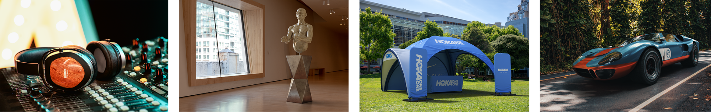

När det gäller att ta bakgrundsbilden är det viktigt att komma ihåg att 3D-element kommer att sättas samman i den. Det bör finnas ett tomt fokusområde för att lämna plats för dessa objekt. 3D-innehållet är ofta det primära fokus som den slutliga kompositionen har, så det är viktigt att bakgrunden inte sticker ut för mycket på egen hand.

Lika viktigt är ljussituationen i bilden eftersom det i hög grad kommer att påverka det sammansatta 3D-innehållet. Ljus bör komma in i bilden från över axeln eller från sidan - det ger bäst resultat eftersom det fungerar som ett nyckelljus när 3D-objekt placeras i motivet. Det kan vara frestande att fotografera mot ljuset när det inte finns något fokus i vyn, men kom ihåg att det kommer att resultera i innehåll som alltid är bakgrundsbelyst. Att lägga till ett tillfälligt, fristående objekt i motivet kan vara användbart för att komponera och bedöma belysningen.

## Fånga HDR-panoramat

### Kamerans placering

Placera 360°-kameran i mitten av det område där du vill fokusera för att ta bilder av bakgrunderna. Det kan vara idealiskt i fall där bakgrunden visar ett bredare motiv för att lyfta kameran från marken med ett monopodmotiv, annars kan kameran ställas in direkt på marken.

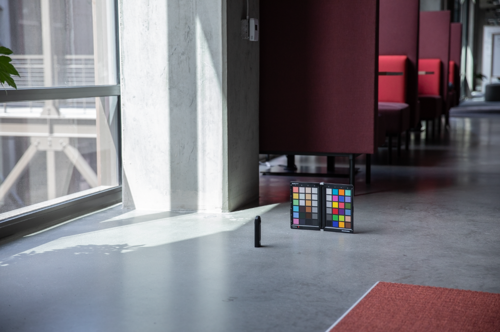

### Färg

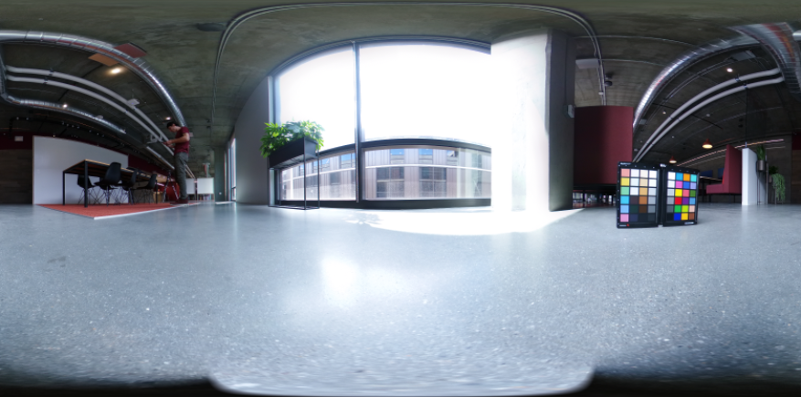

Det är mycket viktigt att behålla färgen mellan den kamera som användes för att fotografera miljön och den kamera som användes för att fotografera bakgrunden, eftersom bilderna kommer att användas tillsammans. Här har vi båda kamerornas färgtemperatur inställd på 5000k och tog ett foto av ett färgschema med båda kamerorna för ytterligare justering i post.

### Exponeringsvärden inom parentes

Om du vill skapa en HDR-miljö med 360°-kameran måste flera EV-filer fångas för att kombineras till en HDR-bild i post. Mängden EV är inte standardiserad, men i allmänhet vill du att den högre delen av exponeringsintervallet ska gå till en punkt där det inte finns mer information i skuggorna och den nedre delen av exponeringsintervallet till en punkt där det inte finns mer information i högdagrarna.

Helst ska 360°-kameran ha en automatisk hakparentesfunktion som gör att de olika exponeringarna kan grupperas av kameran. De bästa inställningarna är att använda det lägsta tillgängliga ISO-värdet för att undvika brus och ett högt bländarvärde för skärpa. Exponeringsvärdena kan sedan varieras med hjälp av slutartiden och delas upp med stopp så att exponeringen halveras eller fördubblas.

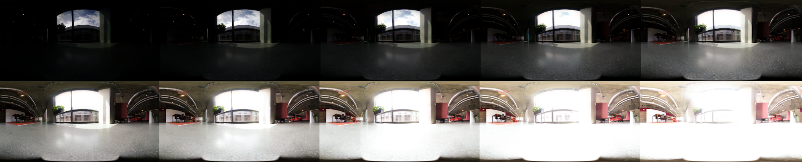

Här följer ett exempel på elfordon som används för att ta en IBL utomhus:

01 - F 5.6, ISO 80, slutartid 1/25000, WB 5000 K

02 - F 5.6, ISO 80, slutartid 1/12500, WB 5000 K

03 - F 5.6, ISO 80, slutartid 1/6400, WB 5000 K

...

16 - F 5.6, ISO 80, slutartid 1, WB 5000 K

Om den 360°-modell som används kan mata ut RAW-bilder, kan EV-filerna delas upp i steg om 2-4 stopp eftersom de behåller mer information än 8-bitarsbilder som JPEG.

När du har gjort färgjusteringar i EV-filerna kan du exportera dem tillfälligt till enskilda filer och sedan sammanfoga dem i Photoshop. Filtypen bör bero på källan, men använd inte ett komprimerat format som JPEG i något av fallen. I Photoshop använder du Arkiv > Automatisera > Lägg samman till HDR Pro... och markerar alla exporterade EV:er.

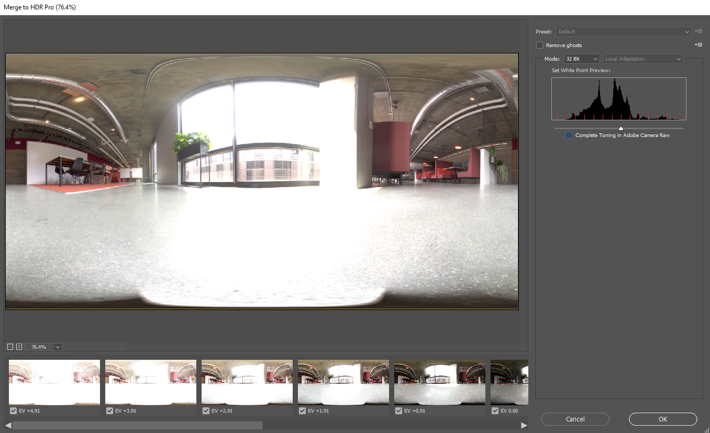

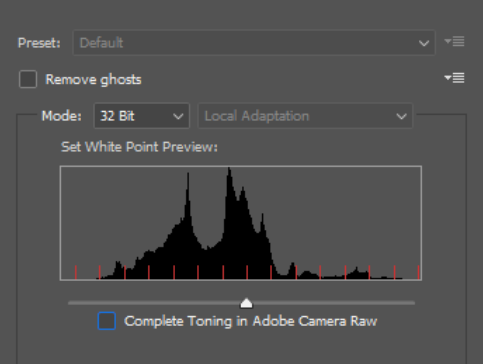

Kontrollera att Läge är inställt på 32 bitar. Med hjälp av &quot;ta bort spöken&quot; kan hjälpa till att ta bort detaljer som ändrats mellan EV, men inte använda den om du inte behöver det. Skjutreglaget under histogrammet påverkar bara förhandsvisningsexponeringen, så ignorera det. Avmarkera Complete Toning in Adobe Camera Raw (Fullständig toning i) och tryck på OK.

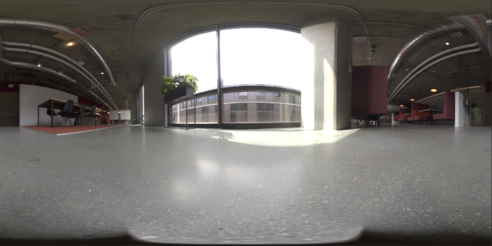

Resultatet är en HDR-bild som kan användas för att belysa scener i 3D.

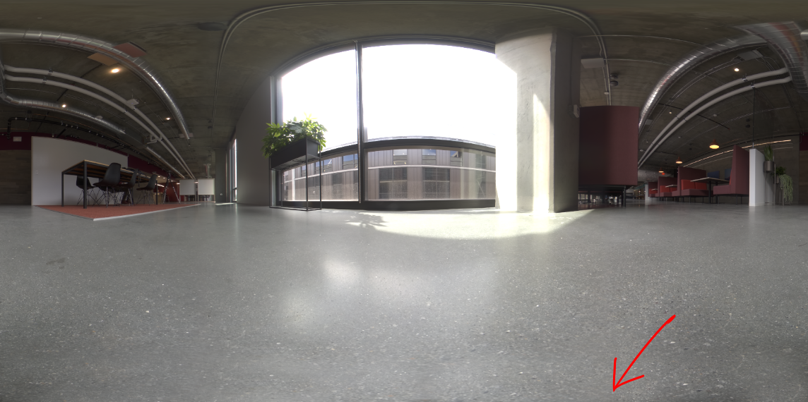

De sista stegen är att ta bort alla skuggor och stativben som syns längst ned i bilden och justera bildens standardexponering för att belysa motivet korrekt. Detaljerna kan tas bort med klonverktyget i Photoshop. Justeringen av exponeringen bör göras i anslutning till bakgrunderna i [!DNL Dimension], eftersom exponeringsvärdet för HDR IBL är belysningsvärdena för 3D-objekten.

### Fånga bakgrunderna

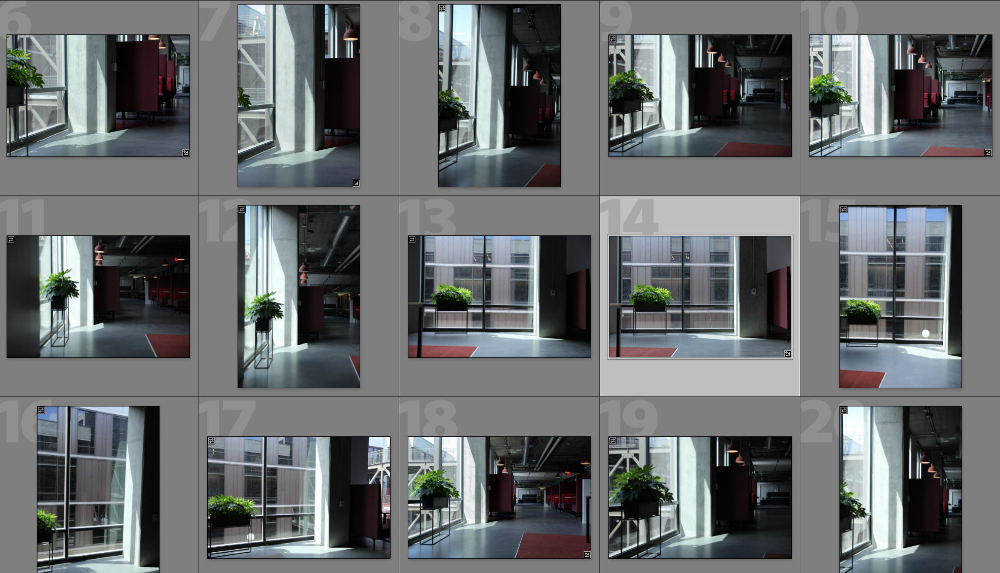

När du har hämtat miljön kan du nu hämta bakgrunder med hjälp av en kamera som du väljer. Ju högre kvalitet och upplösning desto bättre. Det här, tillsammans med ett öga för komposition som fotografer har, är den största fördelen med den här processen. Bilderna ovan är tagna med en Canon 5D MK IV.

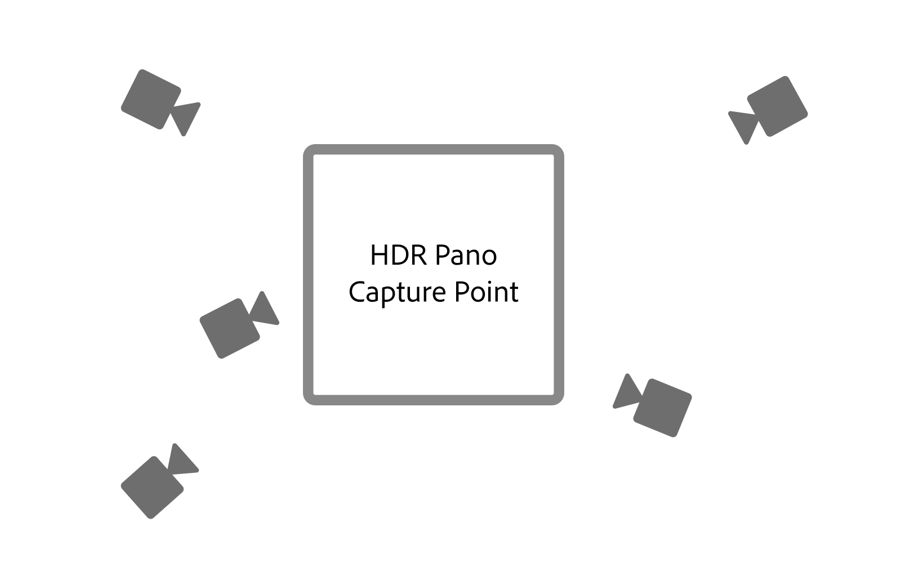

Det finns stort utrymme för inramning och komposition med bakgrunderna. Kameran kan ha höga eller låga öppningar för olika skärpedjup, använda långa eller korta brännvidder och vara vinklad uppåt eller nedåt. Huvudkravet är att kameran är riktad mot mittpunkten där omgivningen togs med 360-kameran.

När hämtningen är klar ska bilderna efterbearbetas för att matcha miljöns färg så nära som möjligt. Färgen och exponeringen bör vara så neutral och naturlig som möjligt. Alla stiliserade utseenden bör användas efter att 3D-element har satts samman i bilden med Adobe [!DNL Dimension].

## Sätta samman din sammansatta bild i [!DNL Dimension]

När dessa element är samlade och klara kan de nu sättas samman i en scen i Adobe [!DNL Dimension]. Det är lika enkelt som att dra bakgrunden in i motivet, där den sedan ska användas på bakgrunden. Lägg sedan till HDR-panoramat i miljöns ljusplats.

Dra och släpp bakgrundsbilden i ett tomt område på arbetsytan eller välj Miljö på scenpanelen och lägg till bilden i bakgrundsinmatningen.

![Du kan välja bakgrundsbilden för ett virtuellt foto på menyn Egenskaper i Adobe [!DNL Dimension]](assets/Photorealistic_20.png)

Lägg till HDR-panoramat genom att välja Miljöljus och lägga till det i bildindata.

![Ljuskällan Miljö kan läggas till i bakgrundsbilden för ett virtuellt foto på menyn Scen i Adobe [!DNL Dimension]](assets/Photorealistic_21.png)

Du kan sedan använda Matcha bild i bakgrunden för att matcha upplösning och aspekt samt kameraperspektiv. I stället för att skapa miljön från bakgrundsbilden används den tagna HDR-panoramabilden för att belysa scenen, så alternativet &quot;skapa ljus&quot; kan lämnas avmarkerat.

![Använda funktionen Matcha bild i Adobe [!DNL Dimension] för att återge en 3D-metallsfärisk bild med miljöbelysning från ett HDR-panorama](assets/Photorealistic_22.png)

Nu kommer objekt som läggs till i scenen att sättas samman på ett realistiskt sätt i bakgrunden eftersom de lyses upp av miljön där bilden togs.

Om du snabbt vill bedöma orientering och exponering för HDR-panoramat i förhållande till bakgrunden, en sfär som är primitiv med ett metallmaterial, hämtas från den kostnadsfria resurspanelen i [!DNL Dimension], kan placeras i scenen. Miljöljusets rotation kan sedan placeras så att reflektionerna ser korrekta ut. Om ljuset från HDR-panoramat över eller under exponerar sfären bör HDR-panoramans exponering ökas eller minskas för att kompensera.

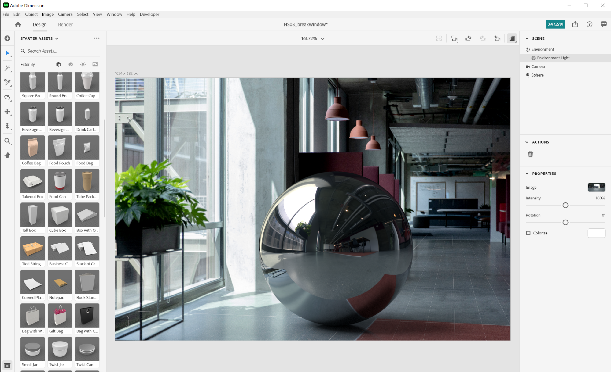

Om du snabbt vill bedöma orientering och exponering för HDR-panoramat i förhållande till bakgrunden, en sfär som är primitiv med ett metallmaterial, hämtas från den kostnadsfria resurspanelen i [!DNL Dimension], kan placeras i scenen. Miljöljusets rotation kan sedan placeras så att reflektionerna ser korrekta ut. Om ljuset från HDR-panoramat över eller under exponerar sfären bör HDR-panoramans exponering ökas eller minskas för att kompensera.

## Slutresultatet: En fotorealistisk sammansatt bild

![En tidsfördröjning av komposition och återgivning av 3D för en virtuell produktbild i Adobe [!DNL Dimension]](assets/Photorealistic_24.gif)

När scenen är klar är arbetsflödet för slutanvändaren okomplicerat. Dra och släpp din egen modell eller någon [Adobe [!DNL Stock] 3D](https://stock.adobe.com/3d-assets) innehåll direkt i bilden så att det återges som om det fanns där när fotot togs. Detta öppnar nya möjligheter att skapa mycket realistiskt annonsinnehåll, eller möjligheten att upprepa design i många olika sammanhang.

Slutresultatet är en övertygande kombination av verklighet och 3D som hjälper slutanvändarna att uppnå målet att skapa fotorealistiska bilder på ett enkelt sätt. Pröva själv med lite [gratis [!DNL Dimension] scener](https://assets.adobe.com/public/3926726a-2a17-43d4-4937-6d84a4d29338) vi skapade för att demonstrera arbetsflödet.

[Hämta den senaste versionen](https://creativecloud.adobe.com/apps/download/dimension) av [!DNL Dimension] och börja skapa fotorealistiska bilder.
