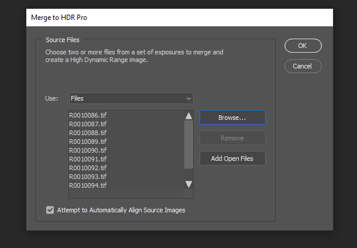

# Skapa fotorealistisk virtuell fotografering med 3D-rendering och montage

![Ett kollage med exempel på fotorealistiska virtuella foton som utformats med Adobe [!DNL Dimension]](assets/Photorealistic_1.png)

Om man tittar på bilderna ovan skulle man bli förlåten om allt man ser är verkligt. Tack vare de tekniska framstegen i renderingen av fotorealistiska 3D-bilder är det dock svårare än någonsin att avgöra vad som är verkligt och vad som är virtuellt. I det här fallet är bilderna en blandning av verkligt, fotografiskt och renderat 3D-innehåll - och det är exakt den typen av 3D-design som företagen investerar i.

Denna teknik, av lager, eller &quot;sätta samman&quot; 3D-modeller till en bild eller video, är inte ny, och i själva verket dess ursprung går tillbaka till de tidiga dagarna av VFX (så långt tillbaka som 1980-talet). Vad som är nytt och spännande är att denna teknik har blivit ett kraftfullt verktyg för [Adobe [!DNL Dimension]](https://www.adobe.com/products/dimension.html) och ett spännande nytt arbetsflöde för fotografer.

## Tekniken bakom bildmontage i Adobe [!DNL Dimension]

![Redigera planet för en metallsfärsmodell i en Adobe [!DNL Dimension] sammansatt](assets/Photorealistic_3.png)

Adobe [!DNL Dimension] har gjort det möjligt för användare att smidigt kombinera 2D- och 3D-element direkt i appen med hjälp av den Adobe Sensei-drivna matchningsbildfunktionen. Den största fördelen med att sätta samman element på det här sättet är att turboläget ökar processen att skapa en realistisk bild genom att ersätta en helt realiserad 3D-scen med en bakgrundsbild, som kan fångas från verkligheten.

![Funktionen Matcha bild i Adobe [!DNL Dimension] analyserar bakgrundsbilden och uppskattar brännvidden och positionen för kameran som användes för att ta den](assets/Photorealistic_4.gif)

Funktionen Matcha bild analyserar bakgrundsbilden och uppskattar brännvidden och positionen för kameran som användes för att ta bilden. En 3D-kamera skapas sedan i [!DNL Dimension] scen som kan användas för att återge 3D-element i samma perspektiv som bakgrundsbilden så att de sätts samman.

Men hur är det med allt som inte tagits med i kamerans ram?  Hela miljön som en bild sparas i har betydelse eftersom den definierar hur allt ser ut i den. Ett objekt i en bild reflekterar ljuset från omvärlden, vilket även omfattar allt bakom kameran. För att de 3D-element med lager verkligen ska smälta in i bildens bakgrund måste de återspegla belysningen i den miljö där bilden togs.

Match Image kommer att försöka &quot;hallucinera&quot; den ljusmiljö där en bakgrundsbild togs. Det är ett imponerande arbete som kommer att ge utmärkta resultat i kort ordning, men att fånga miljön tillsammans med bakgrundsbilden kommer att ge ännu mer realistiska resultat. Det här är till och med den metod som används för att träna Adobe Sensei-funktionen att göra det på egen hand.

Visa upp en värld av 360° HDR-panoramabilder. Dessa bilder har länge använts i 3D-grafik för att snabba på ljuseffekterna i en fullvärdig ljusmiljö. Processen för att fånga dem i det förflutna har varit ganska komplex på grund av den höga kunskapsnivån och specialiserad utrustning som behövs för att göra dem. Med 360°-kameror är det nu mer möjligt än någonsin att skapa dessa bilder.

Kameror som Ricoh Theta, Gopro MAX och Insta 360 kan fånga 360 panoramor. Ricoh Theta har inbyggda automatiska exponeringsgafflingar som är en viktig del av hämtningsprocessen. Detta minskar tiden och arbetet med att hämta HDR-bilder och gör dem mer lättillgängliga för fotografer.

## Processen för att skapa fotorealistiska sammansatta bilder

### [!DNL Capture]

För att komma igång med inspelningsmiljöer för kompositioner behöver du två huvudelement; en bakgrundsbild eller bilder av hög kvalitet och ett 360° HDR-panorama över den miljö där bilden togs.

En av de viktigaste aspekterna med att effektivt fånga in den här typen av innehåll är att utnyttja fotografens befintliga kunskaper och verktyg. Att skapa en vacker bakgrundsbild kräver ett öga för komposition och uppmärksamhet på detaljer. Bakgrundsbilderna kräver också ett särskilt tänkesätt för att skapa något som är användbart för att sätta samman 3D-element i.

### Välja en plats

Leta efter platser som är intressanta för både sitt sammanhang och belysning. När du tar hänsyn till sammanhanget kan det vara bra att föreställa sig scenens potentiella användning. Till exempel kan en vy över en tom väg användas för att lägga till i en 3D-bil medan en vy av ett bord på ett kafé kan användas för [visa förpackning](https://www.adobe.com/products/dimension/packaging-design-mockup.html) livsmedelsprodukter.

När det gäller att ta bakgrundsbilden är det viktigt att komma ihåg att 3D-element kommer att sättas in i den. Det bör finnas ett tomt fokusområde för att lämna plats för dessa objekt. 3D-innehållet kommer ofta att vara huvudfokus i den slutliga kompositionen, så det är viktigt att bakgrunden inte alltför sticker ut på egen hand.

Lika viktigt är belysningssituationen i bilden eftersom det i hög grad kommer att påverka det sammansatta 3D-innehållet. Ljuset bör komma in i bilden från över axeln eller från sidan - det ger bäst resultat eftersom det fungerar som en nyckellampa när 3D-objekt placeras på scenen. Det kan vara frestande att fotografera mot ljuset när det inte finns något fokus i sikte, men kom ihåg att detta kommer att resultera i innehåll som alltid är bakgrundsbelyst. Det kan vara bra att lägga till ett tillfälligt fristående objekt i motivet för att komponera och bedöma belysningen.

## Fånga HDR-panoramat

### Kameraplacering

Placera 360°-kameran i mitten av området där du vill fokusera för att hämta bakgrunderna. Det kan vara idealiskt i fall där bakgrunden visar ett bredare motiv för att lyfta upp kameran från marken med en monopod, annars kan kameran ställas in direkt på marken.

### Färg

Det är mycket viktigt att bevara färgen mellan den kamera som används för att fotografera miljön och den kamera som används för att fotografera bakgrunden, eftersom bilderna används tillsammans. Här har vi båda kamerornas färgtemperatur inställd på 5000k och tagit ett foto av ett färgschema med båda kamerorna för ytterligare justering i post.

### Exponeringsvärden inom parentes

Om du vill skapa en HDR-miljö med 360°-kameran måste flera EV-filer tas för att kombineras till en HDR-bild i post. Mängden EV är inte standardiserad, men i allmänhet vill du att den högre änden av exponeringsintervallet ska gå till en punkt där det inte finns mer information i skuggorna och den lägre änden av exponeringsintervallet till en punkt där det inte finns mer information i högdagrarna.

Det bästa är om 360°-kameran har en automatisk hakparentesfunktion som gör att de olika exponeringarna kan grupperas med kameran. De idealiska inställningarna är att använda det lägsta tillgängliga ISO-värdet för att undvika brus och ett högt bländarvärde för skärpa. Exponeringsvärdena kan sedan varieras med hjälp av slutartiden och brytas med stopp. halvera eller fördubbla exponeringen.

Här är ett exempel på elfordon som används för att skjuta en IBL utomhus:

01 - F 5,6, ISO 80, slutartid 1/25000, WB 5000 K

02 - F 5.6, ISO 80, slutartid 1/12500, WB 5000 K

03 - F 5.6, ISO 80, slutartid 1/6400, WB 5000 K

...

16 - F 5,6, ISO 80, slutartid 1, WB 5000 K

Om 360°-processorn som används klarar av att skicka ut RAW-bilder kan EV-filerna delas upp i steg om 2-4 steg eftersom de behåller mer information än 8bitarsbilder som JPEG.

När du har gjort färgjusteringar i EV-filerna kan du tillfälligt exportera dem till enskilda filer och sedan sammanfoga dem i Photoshop. Filtypen bör bero på källfilen, men inte i något av fallen använda ett komprimerat format som JPEG. I Photoshop använder du Arkiv > Automatisera > Lägg samman till HDR Pro... och markerar alla exporterade EV:er.

Kontrollera att läget är inställt på 32 bitar. Genom att ta bort spöken kan du ta bort detaljer som har ändrats mellan EV-filerna, men du kan inte använda dem om du inte behöver dem. Skjutreglaget under histogrammet påverkar bara förhandsvisningsexponeringen, så ignorera det. Avmarkera ‘Complete Toning in Adobe Camera Raw’ och tryck på OK.

Resultatet är en HDR-bild som kan användas för att belysa scener i 3D.

De sista stegen är att ta bort alla skuggor och stativben som syns längst ned på bilden och justera standardexponeringen för bilden för att belysa scenen korrekt. Du kan ta bort detaljer med klonverktyget i Photoshop. Exponeringen bör justeras i samband med bakgrunderna i [!DNL Dimension], eftersom exponeringsvärdet för HDR IBL är ljusvärdena för 3D-objekten.

### Hämta bakgrunder

När du har hämtat miljön kan du nu hämta bakgrunder med en valfri kamera. Ju högre kvalitet och upplösning desto bättre. Detta, tillsammans med ett öga för komposition som fotografer har är den största fördelen med denna process. Bilderna ovan togs med en Canon 5D MK IV.

Det finns mycket utrymme för inramning och komposition med bakgrunder. Kameran kan ha höga eller låga bländare för olika skärpedjup, använda långa eller korta brännvidder och vinklas uppåt eller nedåt. Huvudkravet är att kameran är riktad mot mittpunkten där miljön togs med 360-kameran.

När hämtningen är klar ska bilderna efterbearbetas så att de matchar miljöns färg så nära som möjligt. Färgen och exponeringen bör vara så neutral och naturlig som möjligt. Alla stiliserade stilar ska användas efter att 3D-element har satts samman med Adobe [!DNL Dimension].

## Sammanställ din sammansatta bild i [!DNL Dimension]

Med dessa element samlade och kompletta, kan de nu monteras i en scen i Adobe [!DNL Dimension]. Det är så enkelt som att dra bakgrunden till scenen, där den sedan kommer att användas på bakgrunden. Lägg sedan till HDR-panoramabilden i miljöns ljusbildfack.

Dra och släpp bakgrundsbilden i ett tomt område på arbetsytan eller välj Miljö på scenpanelen och lägg till bilden i bakgrundsindata.

![Du kan välja bakgrundsbilden för ett virtuellt foto på menyn Egenskaper i Adobe [!DNL Dimension]](assets/Photorealistic_20.png)

Lägg till HDR-panoramabilden genom att markera miljöljusen och lägga till den i bildindata.

![Miljöljuskällan kan läggas till i bakgrundsbilden av ett virtuellt foto på menyn Scen i Adobe [!DNL Dimension]](assets/Photorealistic_21.png)

Sedan kan du använda &quot;Matcha bild&quot; i bakgrunden för att matcha upplösningen och proportionerna samt kameraperspektivet. I stället för att skapa miljön från bakgrundsbilden används den hämtade HDR-panoramabilden för att belysa scenen, så alternativet &quot;skapa ljus&quot; kan lämnas avmarkerat.

![Använda funktionen Matcha bild i Adobe [!DNL Dimension] för att återge en bild i en 3D-metallsfär med miljöbelysningen från en HDR-panoramabild](assets/Photorealistic_22.png)

Nu kommer objekt som läggs till i scenen att sättas ihop realistiskt i bakgrunden eftersom de lyses av miljön där bilden togs.

Om du snabbt vill bedöma orientering och exponering för HDR-panoramat i förhållande till bakgrunden, tar en sfär som är primitiv med ett metallmaterial från den fria resurspanelen i [!DNL Dimension], kan placeras i scenen. Omgivningsljusets rotation kan sedan placeras så att reflektionen ser korrekt ut. Om ljuset från HDR-panoramabilden överexponerar eller underexponerar sfären bör HDR-panoramans exponering ökas eller minskas för att kompensera.

Om du snabbt vill bedöma orientering och exponering för HDR-panoramat i förhållande till bakgrunden, tar en sfär som är primitiv med ett metallmaterial från den fria resurspanelen i [!DNL Dimension], kan placeras i scenen. Omgivningsljusets rotation kan sedan placeras så att reflektionen ser korrekt ut. Om ljuset från HDR-panoramabilden överexponerar eller underexponerar sfären bör HDR-panoramans exponering ökas eller minskas för att kompensera.

## Slutresultatet: En fotorealistisk sammansatt bild

![Tidsfördröjning av 3D-montage och -återgivning för ett virtuellt produktfoto i Adobe [!DNL Dimension]](assets/Photorealistic_24.gif)

När scenen är klar är arbetsflödet för slutanvändaren enkelt. Dra och släpp din egen modell eller någon [Adobe [!DNL Stock] 3D](https://stock.adobe.com/3d-assets) innehåll direkt i bilden för att återge den som om den fanns där när fotot togs. Detta öppnar nya vägar för att skapa mycket realistiskt annonsinnehåll, eller möjligheten att iterera om design i många olika sammanhang.

Slutresultatet är en övertygande kombination av verklighet och 3D som hjälper slutanvändarna att uppnå målet att skapa fotorealistiska bilder med minimal ansträngning. Prova själv med några [gratis [!DNL Dimension] scener](https://assets.adobe.com/public/3926726a-2a17-43d4-4937-6d84a4d29338) vi skapade för att demonstrera arbetsflödet.

[Hämta den senaste versionen](https://creativecloud.adobe.com/apps/download/dimension) av [!DNL Dimension] och börja skapa fotorealistiska bilder.
