# Självstudiekurser för Creative Cloud for enterprise

Som kreatör i ett företag måste du samarbeta med distribuerade team, upprätta skalbara processer och följa företagets system och riktlinjer. Dessa självstudiekurser hjälper dig att lära dig nya funktioner i Creative Cloud - ur ett företagsperspektiv.

## Klicka här om du vill se en självstudiekurs

### Creative Cloud for enterprise

<table style="table-layout:fixed">
<tr>
 <td>
   <a href="assets/FromHandLetteringtoIllustratorviaCreativeCloud.pdf">
      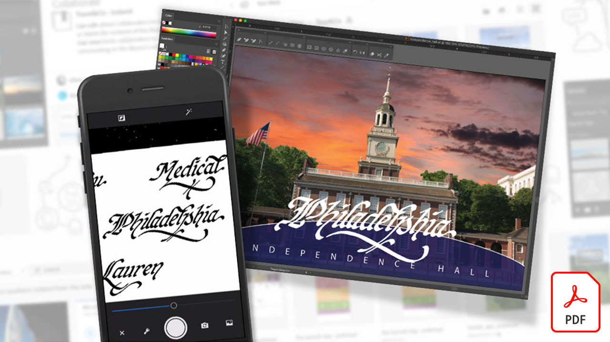
   </a>
    

   <a href="assets/FromHandLetteringtoIllustratorviaCreativeCloud.pdf"><strong>Från handskrift till Illustrator via Creative Cloud (PDF)</strong></a>
    

    <em>Med hjälp av funktionerna i mobilapparna och datorapparna Creative Cloud Adobe for enterprise kan du spela in, konvertera och skapa från vilken plats som helst - på vilken enhet som helst</em>
     
  </td>
  <td>
   <a href="assets/FromLightroomWebtoInDesignviaCreativeCloud.pdf">
      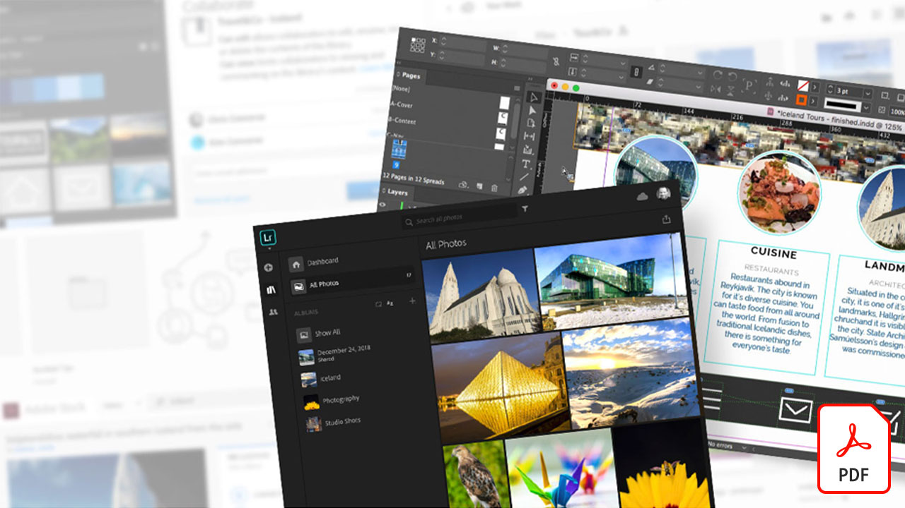
   </a>
    

   <a href="assets/FromLightroomWebtoInDesignviaCreativeCloud.pdf"><strong>Från Lightroom på webben till InDesign via Creative Cloud (PDF)</strong></a>
    

    <em>Ta kreativiteten från kameran till slutresultatet med filer och bibliotek från Creative Cloud</em>
     
  </td>
  <td>
    
    

     
  </td>
</tr>
</table>

### Spark

<table style="table-layout:fixed">
<tr>
 <td>
   <a href="assets/AddingaGlideshowtoyourSparkPageAdobeBlog.pdf">
      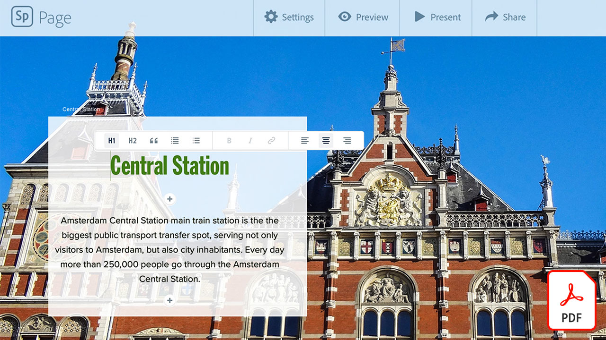
   </a>
    

   <a href="assets/AddingaGlideshowtoyourSparkPageAdobeBlog.pdf"><strong>Lägga till ett bildspel i din Spark Page (PDF)</strong></a>
    

    <em>Adobe Spark Page har några fantastiska och lättanvända layoutkomponenter som ger liv åt dina webbberättelser</em>
     
  </td>
  <td>
   
    

   <a href="assets/CreatingYourBrandinAdobeSpark.pdf"><strong>Skapa ditt varumärke i Adobe Spark (PDF)</strong></a>
    

    <em>Adobe Spark gör det enkelt att definiera ert varumärke</em>
     
  </td>
  <td>
   <a href="assets/MeetYourNewProductionArtistAdobeSparkPost.pdf">
      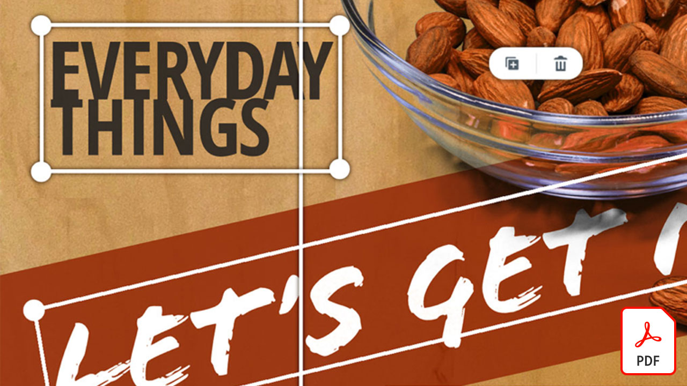
   </a>
    

   <a href="assets/MeetYourNewProductionArtistAdobeSparkPost.pdf"><strong>Träffa din nya produktionskonstnär: Adobe Spark Post (PDF)</strong></a>
    

    <em>Adobe Spark lär sig av dig när du skapar layouter, definierar färger, importerar grafik och ordnar element i dina kompositioner</em>
     
  </td>
</tr>
</table>

### Photoshop

<table style="table-layout:fixed">
<tr>
   <td>
    <a href="alphabetsoup.md">
      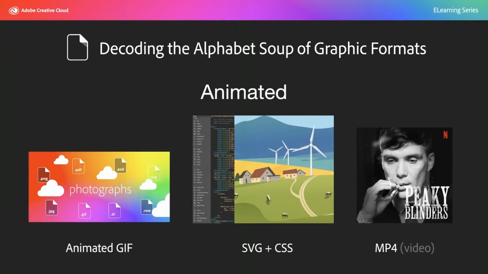
    </a>
    

    <a href="alphabetsoup.md"><strong>Avkodning av alfabetet soppa av grafiska format</strong></a>
    

    <em>JPG-, PNG-, SVG-, GIF- och EPS-filer används ofta inom design, vissa för webbsidor, andra för presentationer, publikationer och projekt. Men vad betyder de, och vad ska du välja?</em>
     
  </td>
  <td>
    <a href="compositepsipad.md">
      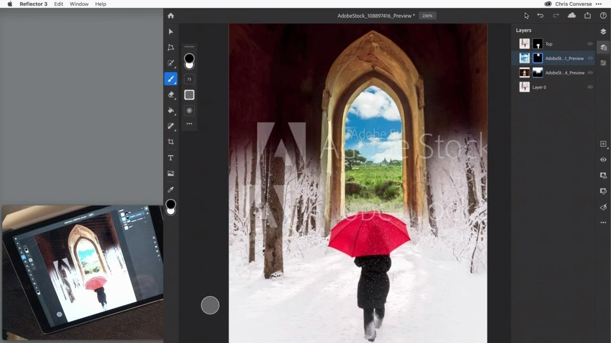
    </a>
    

    <a href="compositepsipad.md"><strong>Skapa unika montage med Adobe [!DNL Stock] och Photoshop för iPad</strong></a>
    

    <em>Ha kraften i Photoshop nära till hands. Lär dig att använda ett av dina favoritprogram från Creative Cloud på ett helt nytt sätt, med ett omgjort, touchbaserat gränssnitt</em>
     
  </td>
  <td>
    <a href="cinemagraphps.md">
      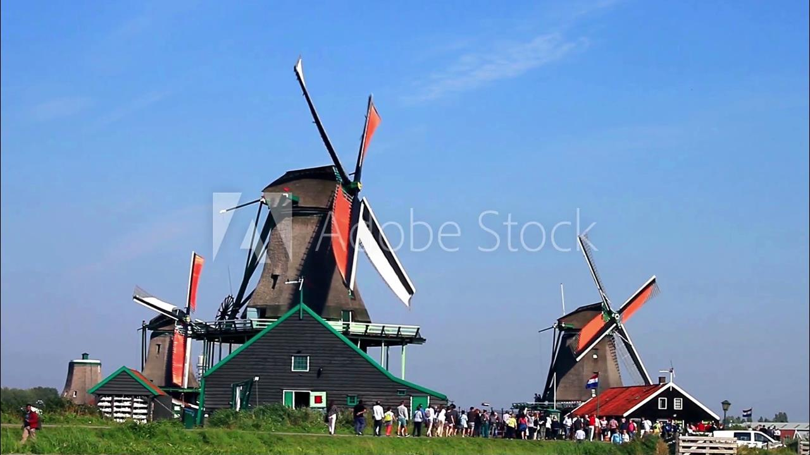
    </a>
    

    <a href="cinemagraphps.md"><strong>Skapa filmstycken med Photoshop</strong></a>
    

    <em>I den här stegvisa videosjälvstudiekursen skapar du ett levande foto genom att kombinera videoklipp från Adobe [!DNL Stock] med smarta maskningstekniker i Photoshop</em>
     
  </td>
</tr>
<tr>
   <td>
    
    

    <a href="assets/AddRemarkableLightingtoaPhotowithPhotoshopandAfterEffects.pdf"><strong>Lägg till anmärkningsvärd belysning i ett foto med Photoshop och After Effects (PDF)</strong></a>
    

    <em>Läs om hur du använder effekten Ljusexplosion i Adobe After Effects till att dramatiskt förbättra ett foto</em>
     
   </td>
   <td>
    
    

    <a href="assets/CreateCinemagraphsinaSnapwithPhotoshopandAdobeStock.pdf"><strong>Skapa bilder i en handvändning med Photoshop och Adobe [!DNL Stock] (PDF)</strong></a>
    

    <em>Söka efter videofilmer som loopar sömlöst på Adobe [!DNL Stock] för att snabbt sätta ihop iögonfallande filmstycken i Photoshop</em>
     
  </td>
   <td>
    
    

    <a href="assets/CreatingaLivingPhotographwithPhotoshopPart1.pdf"><strong>Creating a living photograph with Photoshop - Part 1 (PDF)</strong></a>
    

    <em>Med Adobe Photoshop kan du snabbt förvandla kortfilmer till levande foton som fascinerar åskådarna på alla sociala medier</em>
     
  </td>
</tr>
<tr>
   <td>
    <a href="assets/CreatingaLivingPhotographwithPhotoshopPart2.pdf">
      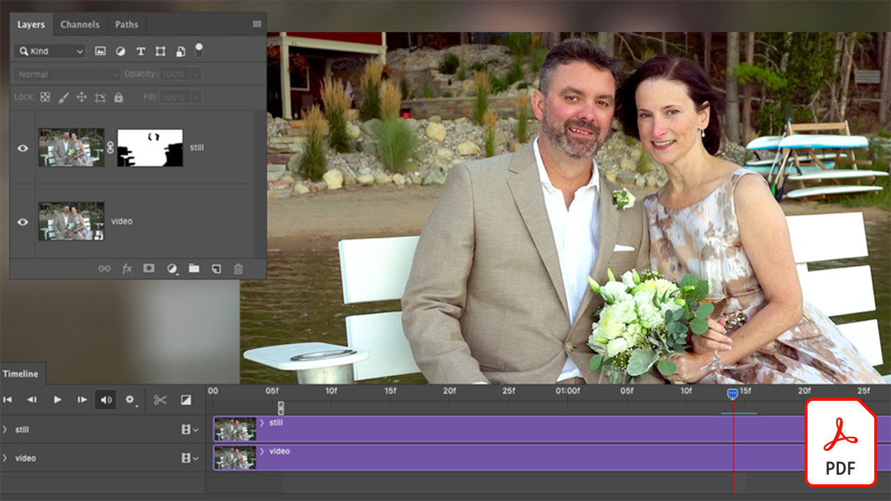
    </a>
    

    <a href="assets/CreatingaLivingPhotographwithPhotoshopPart2.pdf"><strong>Creating a living photograph with Photoshop - Part 2 (PDF)</strong></a>
    

    <em>Att kombinera foton med video är ett kraftfullt sätt att lägga till en engagerande kvalitet till dina foton utan att göra avkall på originalbildens budskap och ton</em>
     
  </td>
  <td>
    
    

    <a href="assets/PhotoshopAfterEffectsAwesomenessAdobeMAX2018LabRecap.pdf"><strong>Photoshop + After Effects = Kunskap: Adobe MAX 2018 Lab Recap (PDF)</strong></a>
    

    <em>I detta praktiska, steg-för-steg-labb kan du kombinera Photoshop med After Effects och skapa häpnadsväckande bilder och effekter som passar för användning i alla medier</em>
     
  </td>
  <td>
    
    

    <a href="assets/QuicklyBrandYourInstagramPhotoswithAdobePhotoshopActions.pdf"><strong>Varumärk snabbt dina Instagram-foton med Adobe Photoshop Actions (PDF)</strong></a>
    

    <em>Slipp tråkigt och spara massor av tid med funktionsmakron i Photoshop</em>
     
  </td>
</tr>
<tr>
    <td>
    <a href="assets/WorkSmarterNotHarderwithPhotoshop.pdf">
      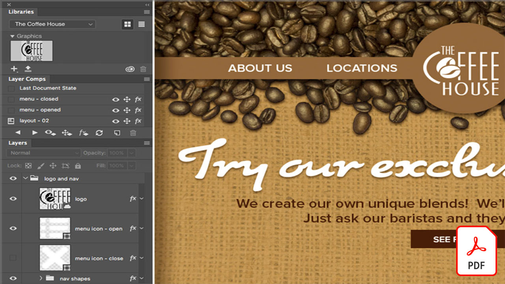
    </a>
    

    <a href="assets/WorkSmarterNotHarderwithPhotoshop.pdf"><strong>Arbeta smartare, inte hårdare, med Photoshop (PDF)</strong></a>
    

    <em>Förändringar i Photoshop kan vara tidskrävande, men det behöver inte</em>
     
  </td>
   <td>
    <a href="assets/AnyoneCanBeCreativewithAdobeCreativeCloud.pdf">
      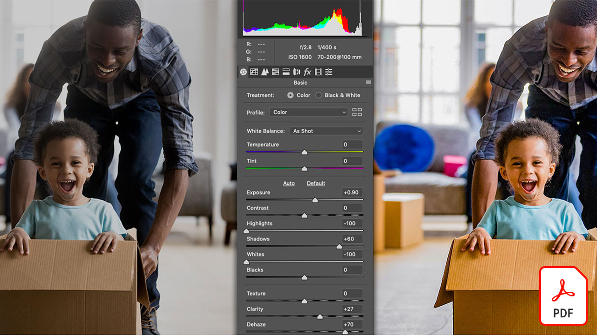
    </a>
    

    <a href="assets/AnyoneCanBeCreativewithAdobeCreativeCloud.pdf"><strong>Lägg till lite Adobe Photoshop i dina kreativa färdigheter (PDF)</strong></a>
    

    <em>Ge dina kreativa kunskaper lite Adobe Photoshop</em>
     
  </td>
  <td>
    <a href="assets/GreenScreenisNotJustforVideo.pdf">
      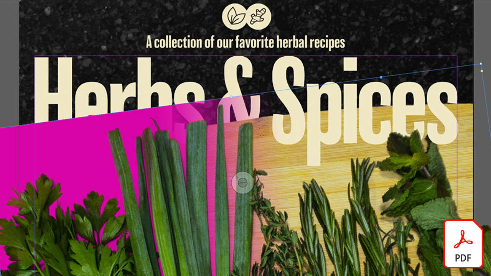
    </a>
    

    <a href="assets/GreenScreenisNotJustforVideo.pdf"><strong>Grön skärm är inte bara för video (PDF)</strong></a>
    

    <em>Du kan använda en grön skärm i en fotostudio och använda After Effects för att förbereda fotot för användning i Photoshop</em>
     
  </td>
</tr>  
</table>

### Fresco

<table>
<tr>
 <td>
   <a href="frescoworkshop.md">
      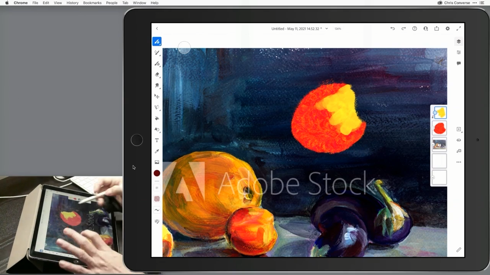
   </a>
    

   <a href="frescoworkshop.md"><strong>Prova på Fresco på iPad (och iPhone)</strong></a>
    

    <em>Utforska en helt ny värld av digitalteckning och målning med Adobe Fresco i denna 15 minuter långa praktiska verkstad</em>
     
  </td>
  <td>
    
    

     
  </td>
  <td>
    
    

     
  </td>
</tr>
</table>

### Adobe Portfolio

<table  style="table-layout:fixed">
<tr>
   <td>
   <a href="assets/GettingStartedWithAdobePortfolio.pdf">
      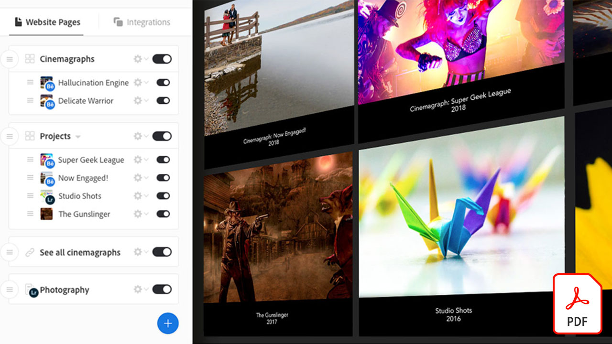
   </a>
    

   <a href="assets/GettingStartedWithAdobePortfolio.pdf"><strong>Komma igång med Adobe Portfolio (PDF)</strong></a>
    

    <em>Att dela med dig av dina bästa verk med Adobe Portfolio är ett effektivt sätt att dela dina framgångar och locka nya kreatörer</em>
     
  </td>
   <td>
   <a href="assets/ConnectingLightroomandBehancetoYourAdobePortfolio.pdf">
      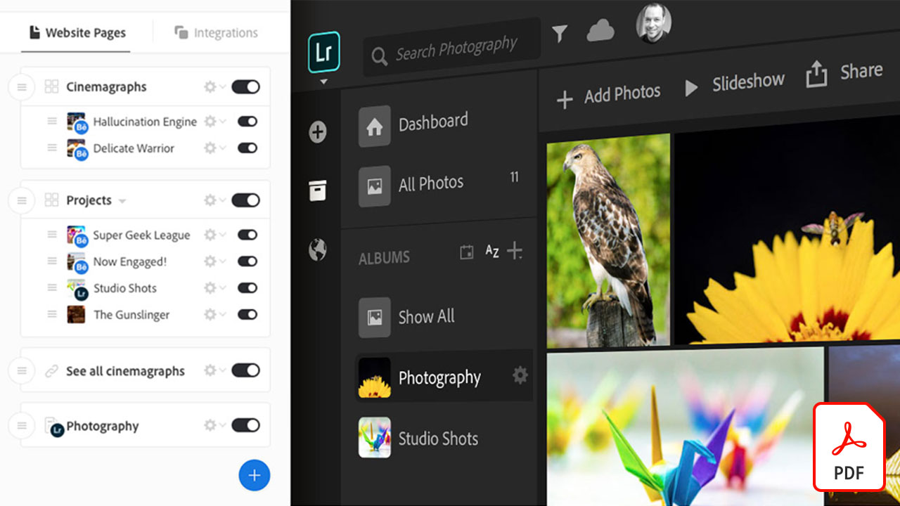
   </a>
    

   <a href="assets/ConnectingLightroomandBehancetoYourAdobePortfolio.pdf"><strong>Ansluta Lightroom och Bēhance till din Adobe Portfolio (PDF)</strong></a>
    

    <em>Använd Bēhance-projekt som sidor i din portfolio</em>
     
  </td>
  <td>
   
    

   <a href="assets/ShowYourBestWorkwithAdobePortfolio.pdf"><strong>Visa dina bästa resultat med Adobe Portfolio (PDF)</strong></a>
    

    <em>Med Adobe Portfolio kan du ladda upp, ordna och dela dina verk med personal och kunder över hela världen</em>
     
  </td>
 </tr>
 </table>

### CC Libraries

<table  style="table-layout:fixed">
<tr>
  <td>
   
   

   <a href="ccteamlibraries.md"><strong>Skapa Creative Cloud Libraries för team</strong></a>
    

    <em>Lär dig dela resurser i en grupp eller ett team med hjälp av Creative Cloud Libraries for teams</em>
     
  </td>
  <td>
   <a href="sharecclibraries.md">
      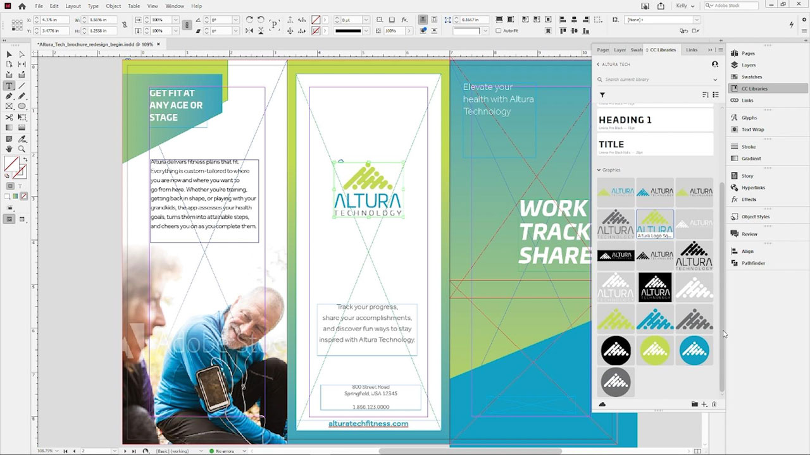
   </a>
   

   <a href="sharecclibraries.md"><strong>Dela varumärkesresurser med Creative Cloud Libraries for teams</strong></a>
    

    <em>Lär dig hur du skapar, använder och delar varumärkesresurser för en grupp eller ett team med hjälp av Creative Cloud Libraries for teams</em>
     
  </td>
  <td>
   
    

   <a href="assets/CreateAddandShareYourBrandAssetswithCreativeCloudLibraries.pdf"><strong>Skapa, lägg till och dela dina varumärkesresurser med Creative Cloud Libraries (PDF)</strong></a>
    

    <em>Creative Cloud Libraries har ett inbyggt varumärkessystem som gör att designers kan dela varumärkesresurser mellan olika team</em>
     
  </td>
</tr>
<tr>
  <td>
   <a href="assets/ShareTextStylesFromIllustratorwithCreativeCloudLibraries.pdf">
      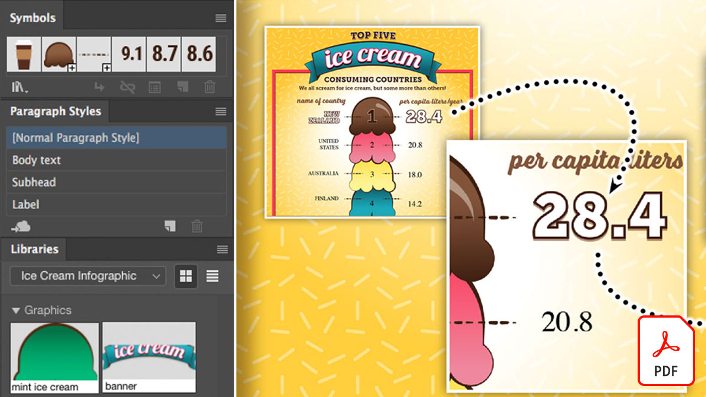
   </a>
    

   <a href="assets/ShareTextStylesFromIllustratorwithCreativeCloudLibraries.pdf"><strong>Dela textformat från Illustrator med Creative Cloud Libraries (PDF)</strong></a>
    

    <em>Arbeta smartare, inte hårdare, i Illustrator</em>
     
  </td>
  <td>
    
    

     
  </td>
  <td>
    
    

     
  </td>
</tr>
</table>

### Teckensnitt

<table  style="table-layout:fixed">
<tr>
  <td>
   <a href="assets/CreatingBeautifulTypographywithCreativeCloud.pdf">
      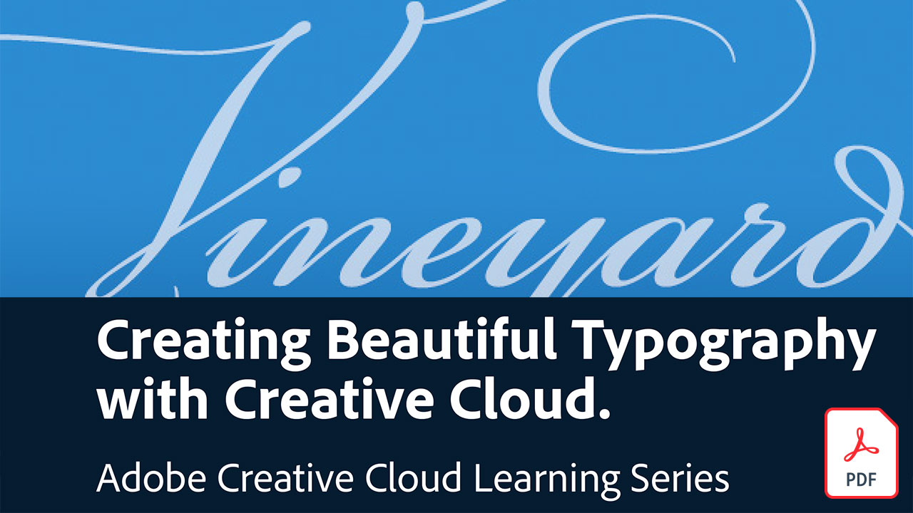
   </a>
    

   <a href="assets/CreatingBeautifulTypographywithCreativeCloud.pdf"><strong>Skapa vacker typografi med Creative Cloud (PDF)</strong></a>
    

    <em>Lär dig hur du använder de avancerade typografiska kontrollerna i dina favoritverktyg</em>
     
  </td>
   <td>
   
    

   <a href="assets/DiscoveringFontswithCreativeCloud.pdf"><strong>Identifiera teckensnitt med Creative Cloud (PDF)</strong></a>
    

    <em>Att hitta rätt teckensnitt till ett projekt kan ibland verka överväldigande. Med olika program och tjänster från Creative Cloud är det nu roligt och inspirerande att hitta rätt typsnitt</em>
     
  </td>
  <td>
   <a href="assets/UnleashHiddenGemsinOpenTypefonts.pdf">
      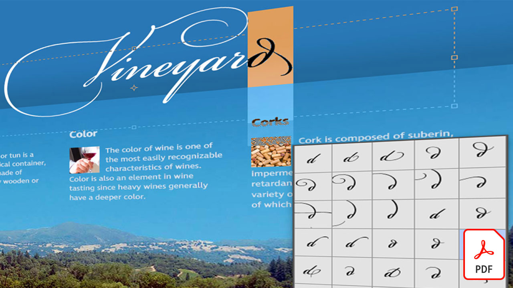
   </a>
    

   <a href="assets/UnleashHiddenGemsinOpenTypefonts.pdf"><strong>Frigör dolda pärlor i OpenType fonts (PDF)</strong></a>
    

    <em>OpenTypens format tillåter att ett teckensnitt innehåller upp till 65 536 tecken</em>
     
  </td>
</tr>
</table>

### InDesign

<table  style="table-layout:fixed">
<tr>
  <td>
   <a href="assets/CreatingInteractivePDFsfromInDesign.pdf">
      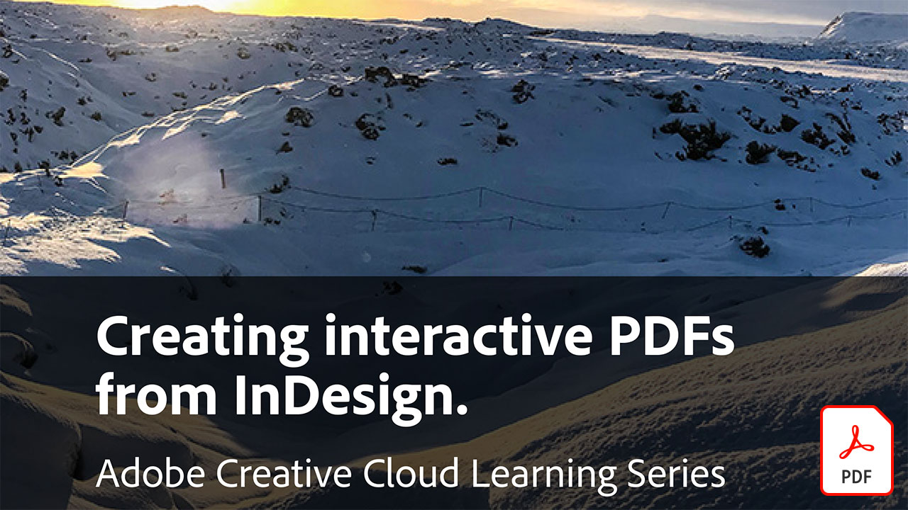
   </a>
    

   <a href="assets/CreatingInteractivePDFsfromInDesign.pdf"><strong>Skapa interaktivt PDF från InDesign (PDF)</strong></a>
    

    <em>I InDesign finns många funktioner för att formatera, formatera, hantera och spåra innehåll i dina dokument</em>
     
  </td>
   <td>
   <a href="assets/EasilyGatherandIncorporateDesignFeedbackwithAdobeAcrobatandInDesign.pdf">
      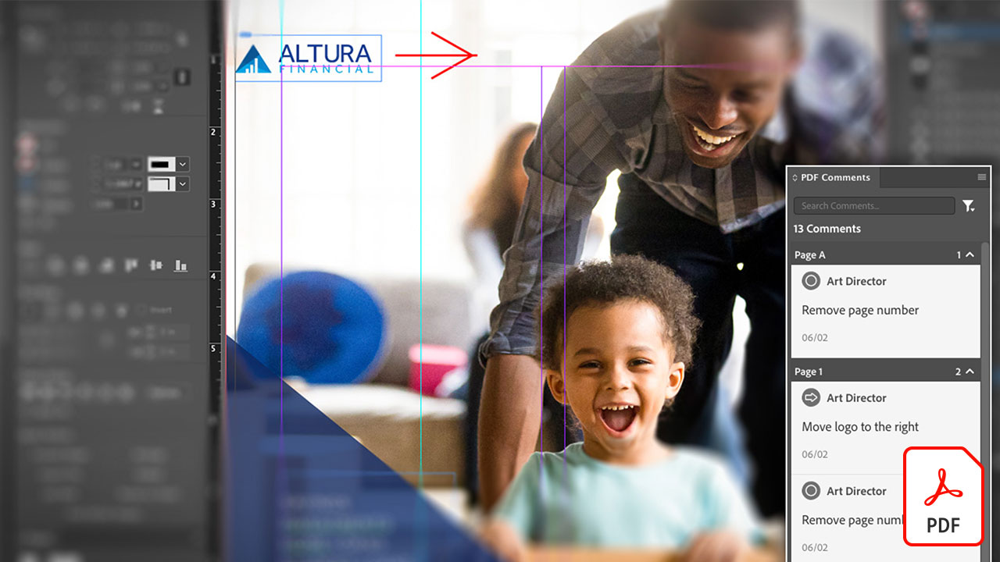
   </a>
    

   <a href="assets/EasilyGatherandIncorporateDesignFeedbackwithAdobeAcrobatandInDesign.pdf"><strong>Samla enkelt in och införliva feedback med Adobe Acrobat och InDesign (PDF)</strong></a>
    

    <em>Intressenter kan använda Acrobat för att lägga till detaljerade kommentarer och anteckningar, och sedan kan du snabbt föra tillbaka dessa markeringar till Adobe InDesign för att se dem i layoutens sammanhang</em>
     
  </td>
  <td>
   
    

   <a href="assets/StyleWebContentwithInDesign.pdf"><strong>Formatera webbinnehåll med Adobe InDesign CC (PDF)</strong></a>
    

    <em>Visste du att du kan utnyttja kraften i InDesign för att skapa HTML- och webbgrafik?</em>
     
  </td>
</tr>
<tr>
   <td>
   <a href="assets/InteractivePDFBookmarksandLinkedTOCsfromInDesign.pdf">
      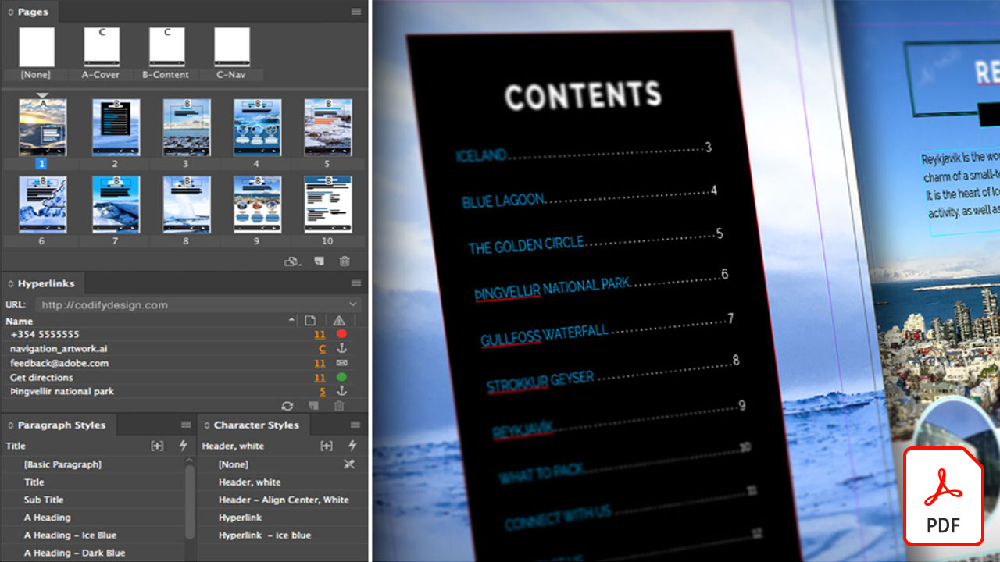
   </a>
    

   <a href="assets/InteractivePDFBookmarksandLinkedTOCsfromInDesign.pdf"><strong>Interactive PDF: Bokmärken och länkade innehållsförteckningar från InDesign (PDF)</strong></a>
    

    <em>Lär dig hur du använder innehållsförteckningsfunktionen i InDesign för att generera både bokmärken och hyperlänkar som hjälper läsarna att snabbt hitta information i PDF-filer</em>
     
  </td>
   <td>
   <a href="assets/InteractivePDFGraphicalHyperlinksandNestedMasterPagesinInDesign.pdf">
      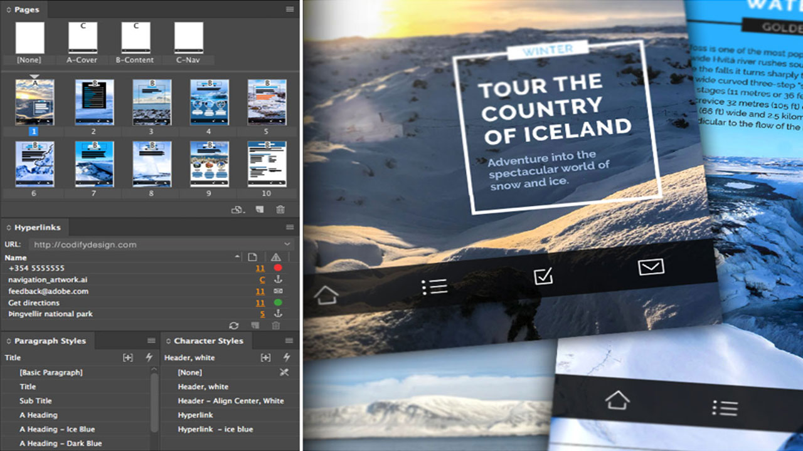
   </a>
    

   <a href="assets/InteractivePDFGraphicalHyperlinksandNestedMasterPagesinInDesign.pdf"><strong>Interactive PDF: Grafiska hyperlänkar och kapslade mallsidor i InDesign (PDF)</strong></a>
    

    <em>Genom att använda hyperlänkar på mallsidor kan du snabbt hantera ett navigeringssystem för alla sidor</em>
     
  </td>
  <td>
    
    

     
  </td>
</tr>
</table>

### Illustrator

<table  style="table-layout:fixed">
<tr>
   <td>
   <a href="assets/GettoKnowGraphicStylesinIllustrator.pdf">
      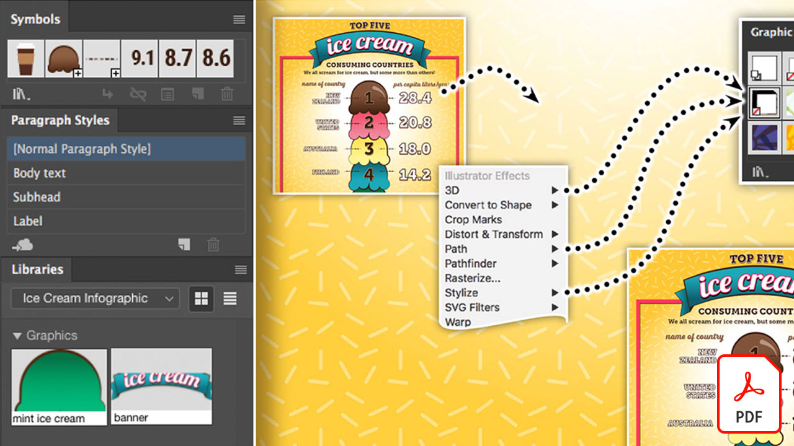
   </a>
    

   <a href="assets/GettoKnowGraphicStylesinIllustrator.pdf"><strong>Lär känna grafikformat i Illustrator (PDF)</strong></a>
    

    <em>Med Illustrator kan du formatera teckningar på ungefär samma sätt som du formaterar text</em>
     
  </td>
   <td>
   <a href="assets/WorkSmarterNotHarderwithIllustrator.pdf">
      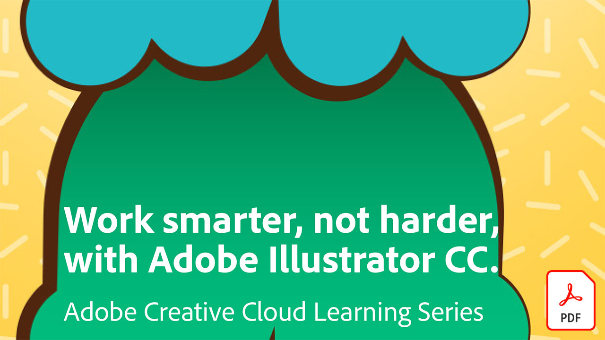
   </a>
    

   <a href="assets/WorkSmarterNotHarderwithIllustrator.pdf"><strong>Arbeta smartare, inte hårdare, med Adobe Illustrator CC (PDF)</strong></a>
    

    <em>Snabba upp dina vektorteckningar i Illustrator</em>
     
  </td>
  <td>
   <a href="assets/IllustratorSymbolsandLayersequalsPerfectStructureforResponsiveSVG.pdf">
      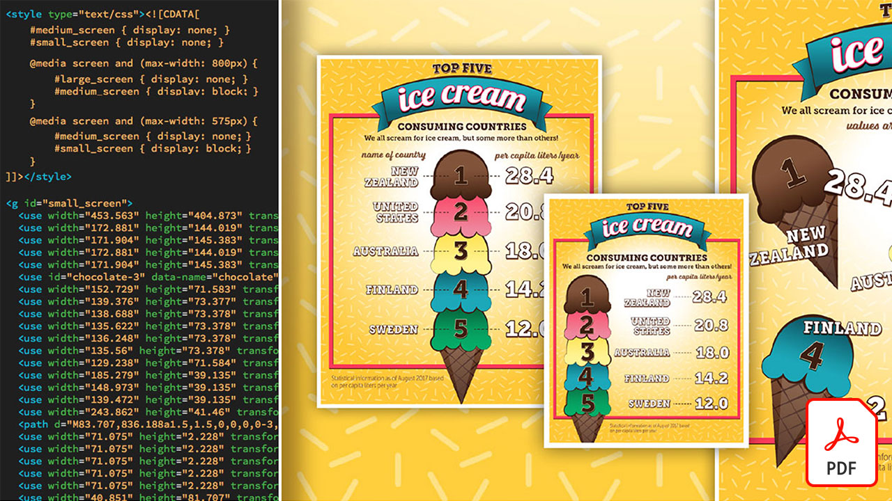
   </a>
    

   <a href="assets/IllustratorSymbolsandLayersequalsPerfectStructureforResponsiveSVG.pdf"><strong>Illustrator Symbols + Layers = Perfekt struktur för responsiva SVG! (PDF)</strong></a>
    

    <em>Illustrator har oöverträffat stöd för SVG-formatet, inklusive möjligheten att skapa symboler, grupper, ID:n och exakta vektordefinitioner av dina bilder</em>
     
  </td>
</tr>
</table>

### [!DNL Dimension]

<table  style="table-layout:fixed">
<tr>
   <td>
   
    

   <a href="assets/VisualizeyourProductinaRealisticEnvironment.pdf"><strong>Visualisera produkten i en realistisk miljö (PDF)</strong></a>
    

    <em>När du vill se hur dina produkter ser ut i verkligheten, Adobe [!DNL Dimension] är din go-to-app</em>
     
  </td>
  <td>
    
    

     
  </td>
  <td>
    
    

     
  </td>
</tr>
</table>
