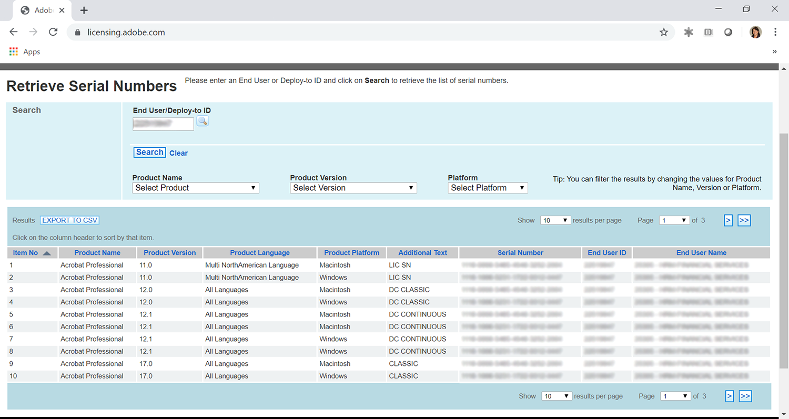
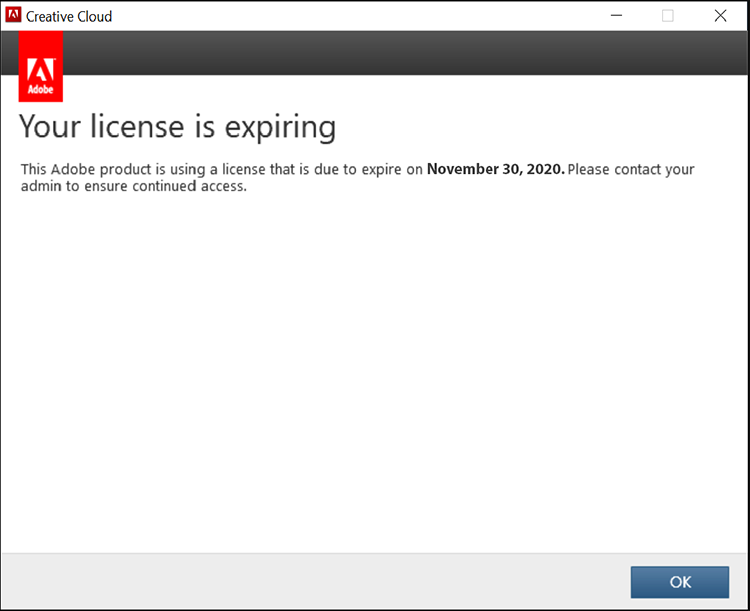
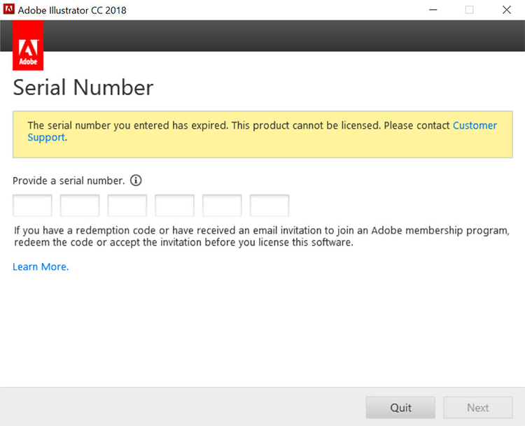
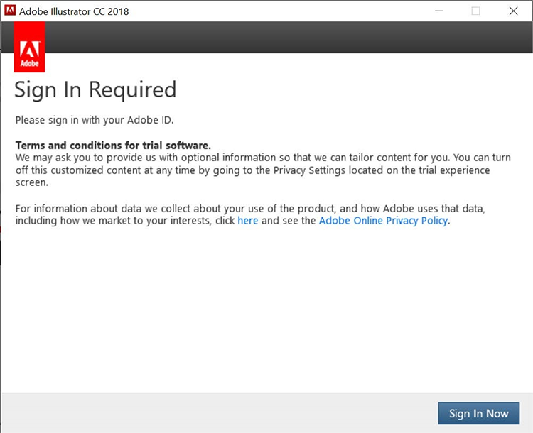
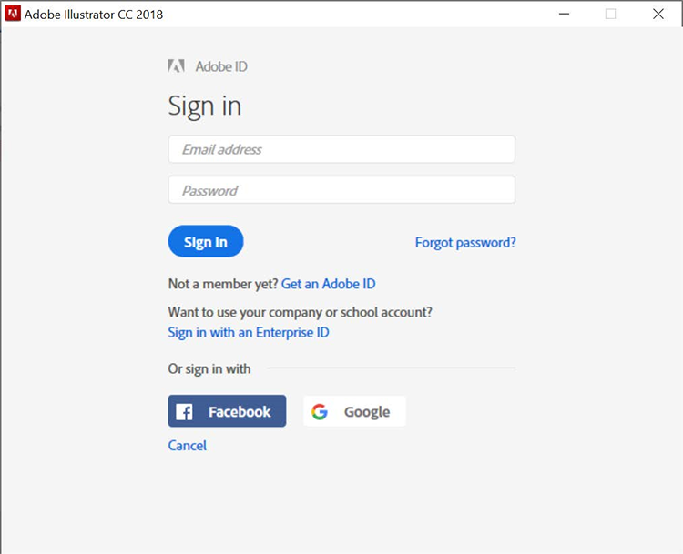
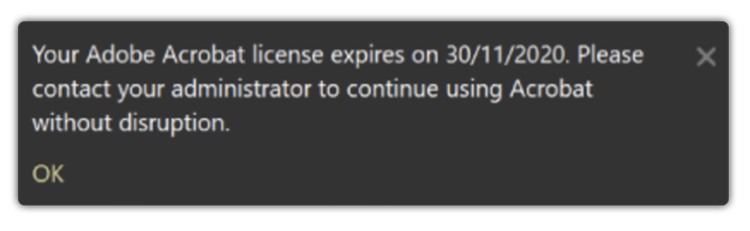
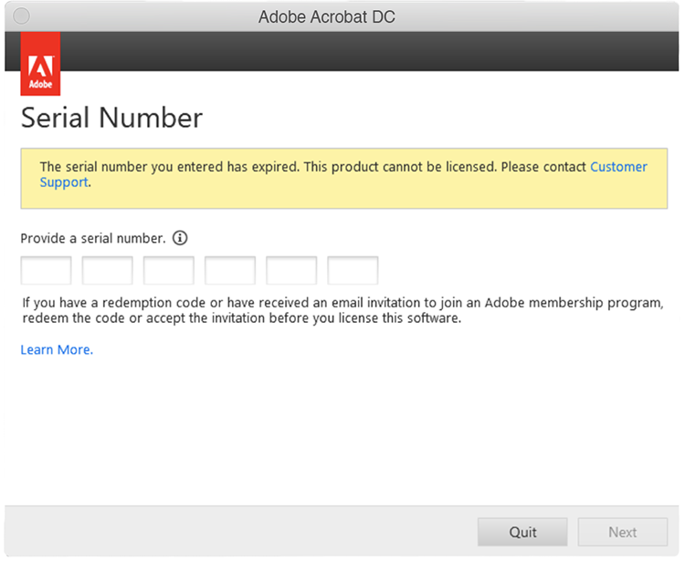
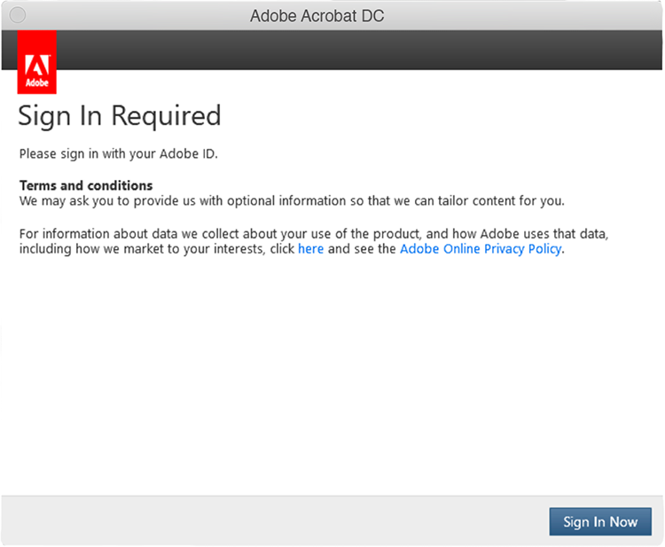
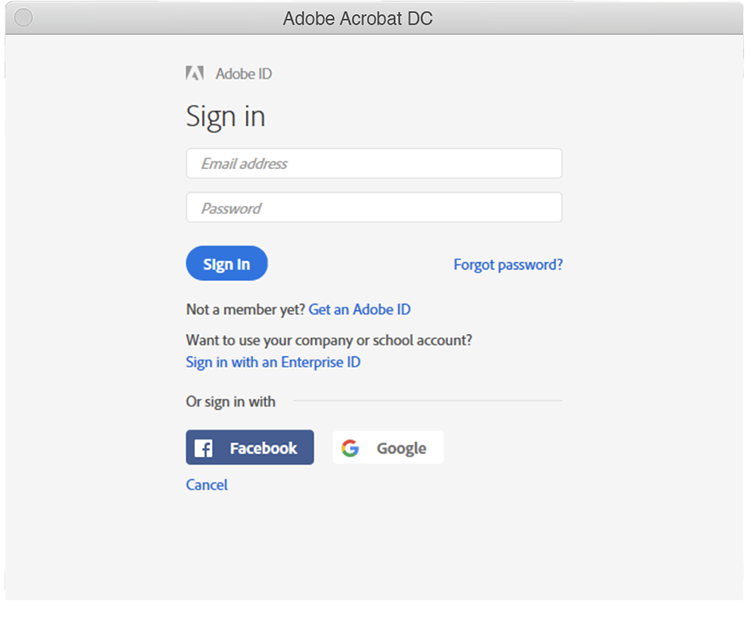

# Förstå när serienummer för Creative Cloud for enterprise och Acrobat upphör att gälla

Historiskt har Adobe gett ut serienummer med våra appar (dvs. Creative Suite, Creative Cloud for enterprise, Acrobat XI, Acrobat DC) till kunder som har Enterprise Term License Agreements (ETLA). Serienumren har ett utgångsdatum. När utgångsdatumet har passerat fungerar inte produkten längre, så det är viktigt att planera migreringen innan serienumren löper ut. På den här sidan beskrivs de steg som krävs för att se till att slutanvändarna har fortsatt tillgång till sina Adobe-program och -tjänster.

## Kontrollera serienumren efter utgångsdatumet

### Hitta dina serienummer

Serienummerlicenserna som är kopplade till ditt ETLA-avtal är tillgängliga via [Adobe licensieringswebbplats](https://licensing.adobe.com/) (LWS). Följ dessa instruktioner för att visa och hämta:

1. Logga in på [Adobe licensieringswebbplats](https://licensing.adobe.com/) (LWS) med ditt Adobe ID och lösenord.
1. Välj **Licenser > Hämta serienummer**.
1. Ange ditt **Slutanvändar-ID** eller **Distributions-ID**.
1. (Valfritt) Välj en **Produktnamn**, **Produktversion** eller **Plattform** för att filtrera resultat.
1. Klicka på Search (Sök). 
1. Produktens namn och serienummer visas.
1. (Valfritt) Välj &quot;EXPORTERA TILL CSV&quot; för att hämta listan med serienummer.

### Kontrollera förfallodatumet

Den [AdobeExpiryCheck](https://helpx.adobe.com/enterprise/kb/volume-license-expiration-check.html) är ett kommandotolksverktyg som IT-administratörer kan använda för att kontrollera om Adobe-produkter på en dator använder serienummer som har löpt ut eller snart löper ut. Verktyget visar information som produktlicensidentifieraren (LEID), det krypterade serienumret och utgångsdatumet. Detta [sida](https://helpx.adobe.com/enterprise/kb/volume-license-expiration-check.html) innehåller instruktioner för hur du hämtar och använder verktyget på en Mac- eller Windows-dator.

## Förstå slutanvändarupplevelsen innan och efter att serienumret upphör att gälla

Både Acrobat- och Creative Cloud for enterprise-program börjar visa meddelanden (i programmen) 60 dagar före förfallodatum. När serienumret har gått ut slutar produkterna att fungera och användaren uppmanas att vidta åtgärder.

### Creative Cloud för företag

Följande information beskriver slutanvändarupplevelsen. Nedan visas en kort video som följs av en genomgång av slutanvändarupplevelsen.

>[!VIDEO](https://video.tv.adobe.com/v/331746?hidetitle=true)

**Före förfallodatum**

Från 60 dagar innan serienumret upphör visas en produktdialogruta för slutanvändaren i alla Creative Cloud for enterprise-program. Det här meddelandet visas varje vecka, upp till 30 dagar innan det upphör att gälla. Det visas sedan dagligen fram till det utgångsdatum som anges *Din licens går ut. Adobe använder en licens som upphör att gälla den 29 november 2020. Kontakta administratören för att säkerställa fortsatt åtkomst*.

**Efter utgångsdatum**

När serienumret har gått ut har användarna inte längre tillgång till Creative Cloud för företagsprogram. Vid den första starten efter förfallodatum visas en dialogruta med information om *Serienumret du angav har upphört att gälla. Den här produkten kan inte licensieras. Kontakta kundsupporten*.

Vid alla efterföljande försök att starta programmen uppmanas slutanvändaren att **Logga in nu** följt av möjligheten att skapa ett eget Adobe ID och gå in i testversionsläge. Nya Adobe ID som skapas av slutanvändaren kopplas dock inte till organisationens licenser och kommer att orsaka ytterligare förvirring hos användarna. Migrera dina användare till namngiven användare-licensiering innan dina serienummer löper ut för att undvika störningar i verksamheten och/eller onödig förvirring.

### Acrobat

Följande information beskriver slutanvändarupplevelsen. Nedan visas en kort video som följs av en genomgång av slutanvändarupplevelsen.

>[!VIDEO](https://video.tv.adobe.com/v/331749?hidetitle=true)

**Före förfallodatum**

Acrobat Från 60 dagar innan serienumret upphör visas ett popup-meddelande i produkten för slutanvändaren. Detta visas en gång i veckan tills 7 dagar före utgångsdatum. Det kommer då att börja visas dagligen *Din Adobe Acrobat-licens löper ut 2020-30-11. Kontakta administratören för att fortsätta använda Acrobat utan avbrott.*

**Efter utgångsdatum**

När serienumret har gått ut har användarna inte längre tillgång till Acrobat. Vid den första starten efter förfallodatum visas en dialogruta med information om *Serienumret du angav har upphört att gälla. Den här produkten kan inte licensieras. Kontakta kundsupporten.*

Vid alla efterföljande försök att starta Acrobat uppmanas slutanvändaren att **Logga in nu** följt av möjligheten att skapa ett eget Adobe ID och gå in i testversionsläge. Nya Adobe ID som skapas av slutanvändaren kopplas dock inte till organisationens licenser och kommer att orsaka ytterligare förvirring hos användarna.

## Kontakta oss om du behöver hjälp

Om du har några frågor om hur du använder [AdobeExpiryCheck](https://helpx.adobe.com/enterprise/kb/volume-license-expiration-check.html) eller behöver hjälp med att migrera från serienummerdistribution till namngiven användare, finns det några alternativ:
* Skicka e-post till Adobe Enterprise Onboarding-teamet - **entonb@adobe.com**
* Öppna ett supportärende i [Admin Console](https://adminconsole.adobe.com/support)
* Kontakta din kundansvarige på Adobe eller en Customer Success Manager
