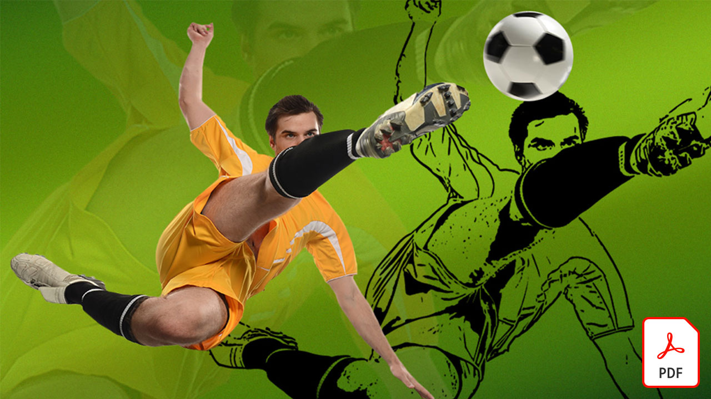
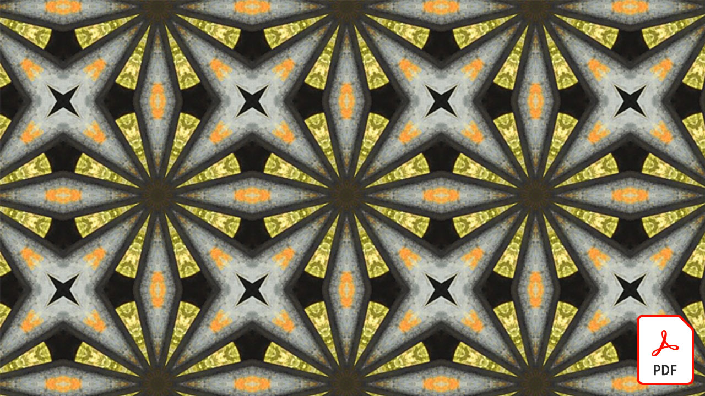
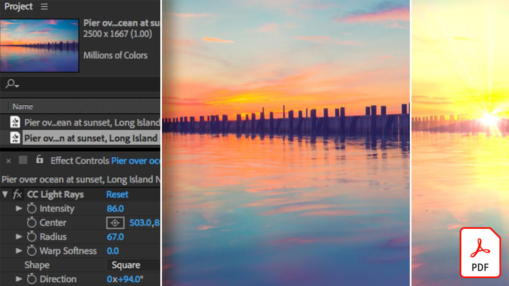
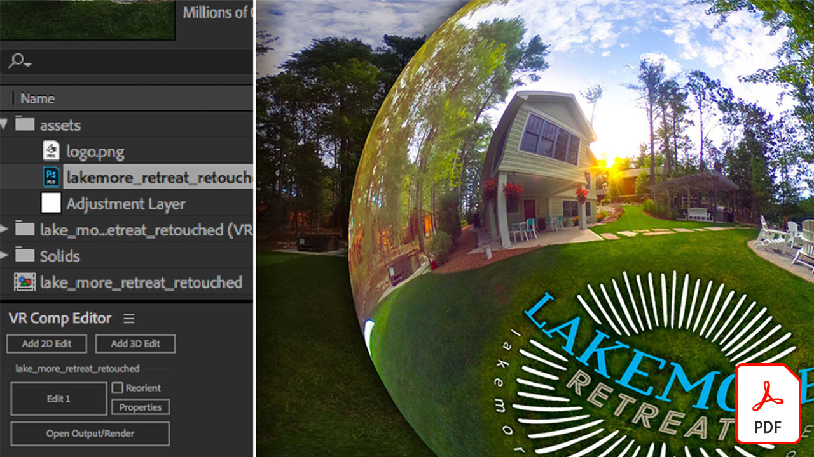

# Videosjälvstudiekurser för Adobe

Förverkliga dina idéer med Adobe och appar för videoredigering, rörlig grafik, visuella effekter, animering med mera.

## Klicka för att visa en Adobe-videosjälvstudie

<table>
<tr>
 <td>
   
    

   <a href="assets/AfterEffectsforPhotography.pdf"><strong>After Effects for Photography (PDF)</strong></a>
    

    <em>Lär dig använda de fantastiska effekterna i After Effects för att förbättra dina foton</em>
     
  </td>
  <td>
   
    

   <a href="assets/CinemagraphsTheMesmerizingPlaceBetweenaPhotoandaVideo.pdf"><strong>Filmstycken: Mesmerizing Place Between a Photo and a Video (PDF)</strong></a>
    

    <em>Läs mer om filmerna - de iögonfallande hybrider som finns någonstans mellan ett foto och en video</em>
     
  </td>
  <td>
   
    

   <a href="assets/CreateanIllustrationfromanAdobeStockPhotowithAfterEffects.pdf"><strong>Skapa en illustration från ett Adobe [!DNL Stock]-foto med After Effects (PDF)</strong></a>
    

    <em>Kombinera Nyans/mättnad och Nivåer med tecknade effekter i After Effects för att skapa en unik, stiliserad illustration från ett Adobe [!DNL Stock]-foto</em>
     
  </td>
</tr>
<tr>
 <td>
   
    

   <a href="assets/CreateAnimatedTitlesUsingMotionGraphicsTemplatesinAdobePremiereRush.pdf"><strong>Skapa animerade titlar med Motion Graphics-mallar i Adobe Premiere [!DNL Rush] (PDF)</strong></a>
    

    <em>Få dina videor att se ännu mer fantastiska ut genom att lägga till professionellt utformade mallar för rörlig grafik som passar din historia eller ditt eget varumärke</em>
     
  </td>
  <td>
   
    

   <a href="assets/CreateBeautifulKaleidoscopePatternswithAfterEffects.pdf"><strong>Skapa vackra Kalejdoskopmönster med After Effects PDF)</strong></a>
    

    <em>Skapa ett oändligt antal mönster och texturer från valfri bild med CC Kaleida-effekten i Adobe After Effects</em>
     
  </td>
  <td>
   
    

   <a href="assets/CreateIntricateTransparencyinyourPhotographswithKeyinginAfterEffects.pdf"><strong>Skapa inkrementell genomskinlighet i dina foton med keying i After Effects (PDF)</strong></a>
    

    <em>Keying används ofta för video och kan också vara till stor hjälp när du behöver dina foton för designprojekt</em>
     
  </td>
</tr>
<tr>
 <td>
   
    

   <a href="assets/DazzlingLightEffectsforPhotographywithAfterEffects.pdf"><strong>Dazzling Light Effects for Photography with After Effects (PDF)</strong></a>
    

    <em>Ljuseffekter i Adobe After Effects kan dramatiskt ändra utseendet på dina foton</em>
     
  </td>
  <td>
   
    

   <a href="assets/EditingVRPhotography360photoswithAfterEffects.pdf"><strong>Redigera VR-fotografi (360-gradersbilder) med After Effects (PDF)</strong></a>
    

    <em>Även om mer engagerande interaktiva spel och upplevelser inte är helt lika vanliga så finns det redan 360-gradersfotografering här</em>
     
  </td>
  <td>
   
    

   <a href="assets/QuicklyRemoveUnwantedAudioContentwiththeSpotHealingBrushinAdobeAudition.pdf"><strong>Ta snabbt bort oönskat ljudmaterial med Punktlagningspenseln i Adobe Audition (PDF)</strong></a>
    

    <em>Visste du att du kan ta bort distraherande ljud från dina ljudfiler i Adobe Audition med hjälp av Adobe Photoshop Punktlagningspensel?</em>
     
  </td>
</tr>
<tr>
   <td>
   
    

   <a href="assets/ShowcaseyourSparkVideoinyourSparkPage.pdf"><strong>Visa Spark Video på Spark Page (PDF)</strong></a>
    

    <em>Med Adobe Spark Page kan du läsa in video från en mängd olika källor, inklusive videoklipp som du skapar med Spark Video!</em>
     
  </td>
  <td>
   
    

   <a href="assets/SmoothlyCombineMusicandDialogueorNarrationwithAutoduckinginAdobePremiereRush.pdf"><strong>Kombinera musik, dialog eller berättarröst med autosänkning i Adobe Premiere [!DNL Rush] Adobe (PDF)</strong></a>
    

    <em>Adobe Premiere [!DNL Rush] har avancerade videoredigeringsfunktioner i en lättanvänd app, så att alla kan skapa en video med proffskvalitet på bara några minuter</em>
     
  </td>
</tr>
</table>
