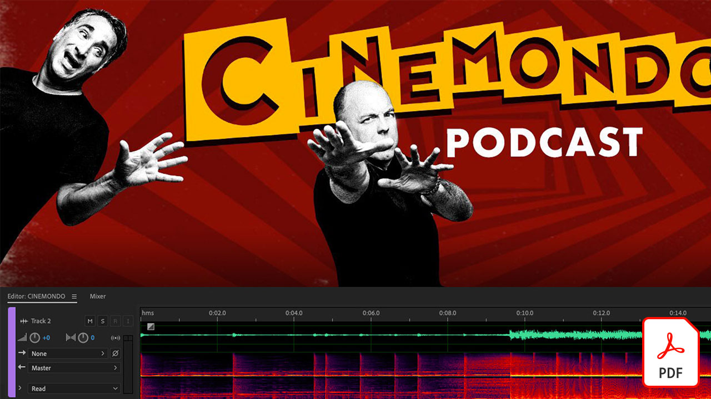

# Videosjälvstudiekurser om Adobe

Förverkliga dina idéer med Adobe-program för videoredigering, rörlig grafik, specialeffekter, animering med mera.

## Klicka här om du vill se en självstudievideo från Adobe

<table>
<tr>
 <td>
   
    

   <a href="assets/AfterEffectsforPhotography.pdf"><strong>After Effects för fotografi (PDF)</strong></a>
    

    <em>Läs om hur du använder specialeffekterna i After Effects till att förbättra dina foton</em>
     
  </td>
  <td>
   
    

   <a href="assets/CinemagraphsTheMesmerizingPlaceBetweenaPhotoandaVideo.pdf"><strong>Kinostycken: Den fascinerande platsen mellan ett foto och ett videoklipp (PDF)</strong></a>
    

    <em>Läs mer om cinemagraphs - de iögonfallande hybrider som finns någonstans mellan ett foto och en video</em>
     
  </td>
  <td>
   
    

   <a href="assets/CreateanIllustrationfromanAdobeStockPhotowithAfterEffects.pdf"><strong>Skapa en illustration från en Adobe [!DNL Stock] Foto med After Effects (PDF)</strong></a>
    

    <em>Kombinera nyans/mättnad och nivåer med teckningseffekterna i After Effects för att skapa en unik stiliserad bild av ett Adobe [!DNL Stock] foto</em>
     
  </td>
</tr>
<tr>
 <td>
   
    

   <a href="assets/CreateAnimatedTitlesUsingMotionGraphicsTemplatesinAdobePremiereRush.pdf"><strong>Skapa animerade förtexter med Motion Graphics-mallar i Adobe Premiere [!DNL Rush] (PDF)</strong></a>
    

    <em>Gör dina videor ännu mer fantastiska genom att lägga till professionellt utformade Motion Graphics-mallar som passar din berättelse eller ditt eget varumärke</em>
     
  </td>
  <td>
   
    

   <a href="assets/CreateBeautifulKaleidoscopePatternswithAfterEffects.pdf"><strong>Skapa vackra Kaleidoscope-mönster med After Effects (PDF)</strong></a>
    

    <em>Skapa ett oändligt antal mönster och texturer från valfri bild med hjälp av CC Kaleida-effekten i Adobe After Effects</em>
     
  </td>
  <td>
   
    

   <a href="assets/CreateIntricateTransparencyinyourPhotographswithKeyinginAfterEffects.pdf"><strong>Skapa intrikat genomskinlighet i dina foton med Transparens i After Effects (PDF)</strong></a>
    

    <em>Keying används ganska mycket för video, det kan också vara en stor hjälp när dina foton behövs för designprojekt</em>
     
  </td>
</tr>
<tr>
 <td>
   
    

   <a href="assets/DazzlingLightEffectsforPhotographywithAfterEffects.pdf"><strong>Fantastiska ljuseffekter vid fotografering med After Effects (PDF)</strong></a>
    

    <em>Ljuseffekter i Adobe After Effects kan dramatiskt förändra utseendet på dina foton</em>
     
  </td>
  <td>
   
    

   <a href="assets/EditingVRPhotography360photoswithAfterEffects.pdf"><strong>Redigera VR-fotografering (360-gradersfoton) med After Effects (PDF)</strong></a>
    

    <em>Även om mer engagerande interaktiva spel och upplevelser inte är lika vanligt är 360-gradersfotografering redan här</em>
     
  </td>
  <td>
   
    

   <a href="assets/QuicklyRemoveUnwantedAudioContentwiththeSpotHealingBrushinAdobeAudition.pdf"><strong>Ta snabbt bort oönskat ljudinnehåll med Punktlagningspenseln i Adobe Audition (PDF)</strong></a>
    

    <em>Visste du att du med Adobe Photoshop Punktlagningspensel kan ta bort störande ljud från ljudfiler i Adobe Audition?</em>
     
  </td>
</tr>
<tr>
   <td>
   
    

   <a href="assets/ShowcaseyourSparkVideoinyourSparkPage.pdf"><strong>Visa upp ditt Spark Video i din Spark Page (PDF)</strong></a>
    

    <em>Med Adobe Spark Page kan du läsa in video från en mängd olika källor, inklusive videoklipp som du skapar med Spark Video!</em>
     
  </td>
  <td>
   
    

   <a href="assets/SmoothlyCombineMusicandDialogueorNarrationwithAutoduckinginAdobePremiereRush.pdf"><strong>Kombinera smidigt musik och dialog eller berättarröst med automatisk duckning i Adobe Premiere [!DNL Rush] (PDF)</strong></a>
    

    <em>Adobe Premiere [!DNL Rush] innehåller avancerade videoredigeringsfunktioner i en lättanvänd app så att alla kan skapa en video med proffskvalitet på några minuter</em>
     
  </td>
</tr>
</table>
