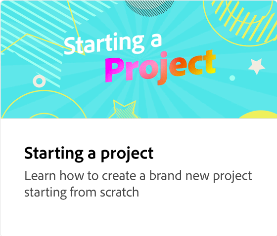
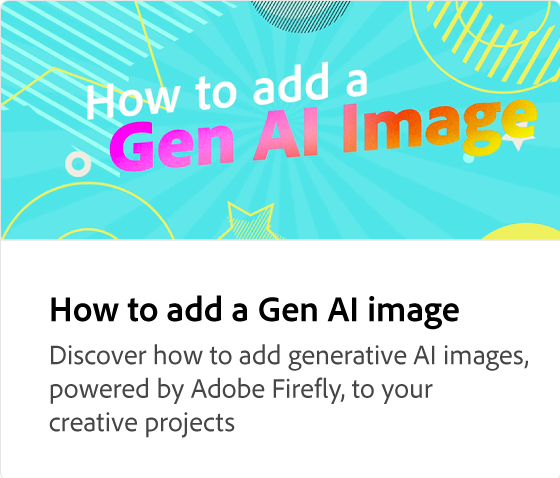
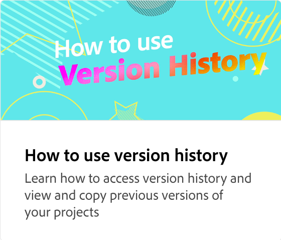

# Använda element

Lär dig lägga till visuella designelement i dina projekt för att göra dem mer attraktiva och engagerande. Det finns fyra typer av element: designresurser, bakgrunder, former och ikoner. Varje elementtyp har hundratals olika komponenter att välja mellan. Varje element är professionellt utformat och redo att läggas till i projekt.

>[!VIDEO](https://video.tv.adobe.com/v/3426935?quality=12&learn=on&hidetitle=true)

## Fler videor i den här serien

<table style="table-layout:fixed">
<tr>
 <td>
      
  </td>
   <td>
      
  </td>
   <td>
      
  </td>
  <td>
      
  </td>
</tr>
<tr>
   <td>
      
  </td>
   <td>
      
  </td>
   <td>
      
  </td>
  <td>
         
   </td>
</tr>
<tr>
  <td>
   
   </td>
   <td>
   
   </td>
   <td>
   
   </td>
   <td>
      
      

       
   </td>
</tr>
</table>
