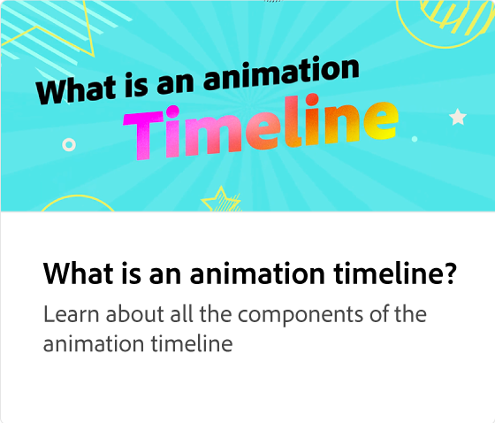

# Lägga till avsnitt i en animering

Gör animeringen bättre genom att lägga till element som bilder och rubriker i en animering. Lär dig hur du lägger till, duplicerar, ordnar om eller byter ut element i en scen samtidigt som animeringarna förblir intakta.

>[!VIDEO](https://video.tv.adobe.com/v/3426982?quality=12&learn=on&hidetitle=true)

## Fler videor i den här serien

<table style="table-layout:fixed">
<tr>
   <td>
         
   </td>
  <td>
         
   </td>
   <td>
         
   </td>
   <td>
         
   </td>
</tr>
<tr>
    <td>
         
   </td>
   <td>
         
   </td>
   <td>
         
   </td>
   <td>
         
   </td>
</tr>
</table>

