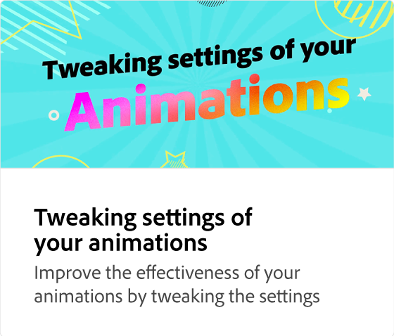
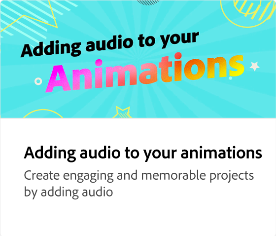
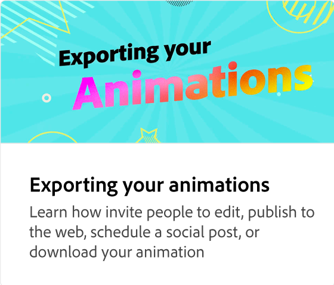

# Vad är animeringstidslinjen?

Läs om hur du navigerar på och justerar tidslinjen för animering. Tidslinjen är en övergripande vy över hela animeringen, där du kan förhandsvisa och minska/öka animeringslängden.

>[!VIDEO](https://video.tv.adobe.com/v/3426978?quality=12&learn=on&hidetitle=true)

## Fler videor i den här serien

<table style="table-layout:fixed">
<tr>
   <td>
         
   </td>
   <td>
         
   </td>
   <td>
         
   </td>
   <td>
         
   </td>
</tr>
<tr>
   <td>
         
   </td>
   <td>
         
   </td>
   <td>
         
   </td>
   <td>
         
   </td>
</tr>
</table>
