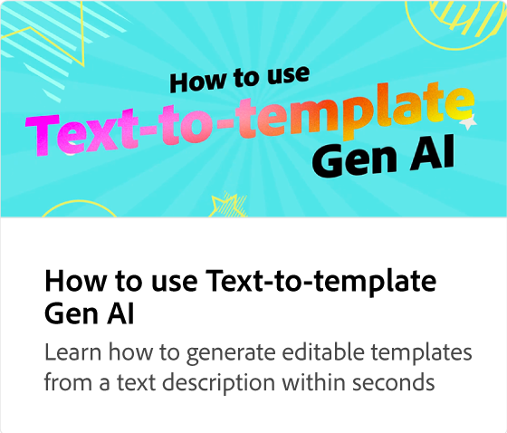

# Översätta ditt innehåll gruppvis

Lär dig skapa språkvariationer av dina projekt genom att automatiskt översätta innehållet till 46 olika språk. Du kan välja önskat språk, duplicera och översätta innehållet och behålla alla animeringar.

>[!NOTE]
>
>Det är viktigt att kontrollera att översättningarna är korrekta innan du delar eller hämtar dem.

>[!VIDEO](https://video.tv.adobe.com/v/3427023?quality=12&learn=on&hidetitle=true)

## Fler videor i den här serien

<table style="table-layout:fixed">
<tr>
   <td>
         
   </td>
   <td>
         
   </td>
   <td>
         
   </td>
   <td>
         
   </td>      
</tr>
<tr>
   <td>
      
   </td>
   <td>
      
   </td>
   <td>
      
   </td>
   <td>
      
   </td>
</tr>
</table>
