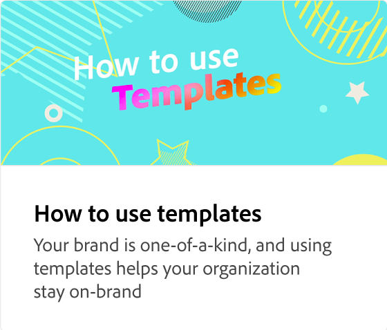

# Skapa en mall

Lär dig hur du skapar en mall där vissa lager är låsta medan andra är upplåsta för team så att de kan göra ändringar. Du kan även inkludera instruktioner till teamen med den här mallen.

>[!VIDEO](https://video.tv.adobe.com/v/3420208?quality=12&learn=on&hidetitle=true)

## Fler videor i den här serien

<table style="table-layout:fixed">
<tr>
    <td>
            
    </td>
    <td>
            
    </td>
    <td>
            
    </td>
    <td>
      
      

       
    </td>
</tr>
</table>
