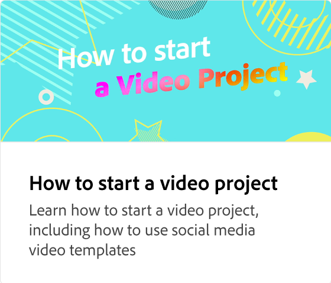
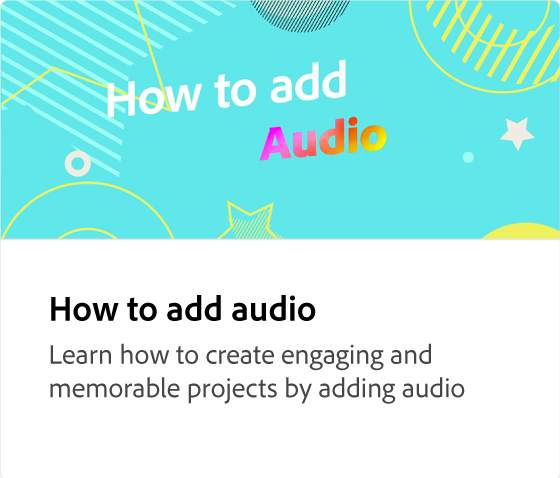

# Exportera video

Lär dig hur du ställer in din videoupplösning, hämtar och delar videon direkt till sociala kanaler.

>[!VIDEO](https://video.tv.adobe.com/v/3427093?quality=12&learn=on&hidetitle=true)

<table style="table-layout:fixed">
<tr>
   <td>
         
   </td>
  <td>
         
   </td>
   <td>
         
   </td>
   <td>
         
   </td>
</tr>
<tr>
  <td>
         
   </td>
   <td>
    
    

     
   </td>
   <td>
    
    

     
   </td>
   <td>
    
    

     
   </td>
</tr>
</table>