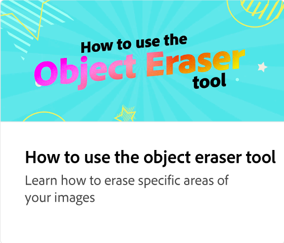
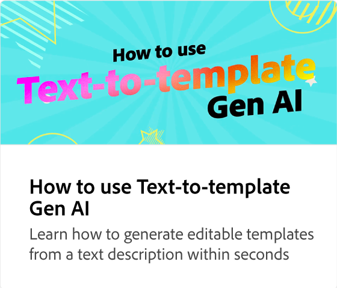
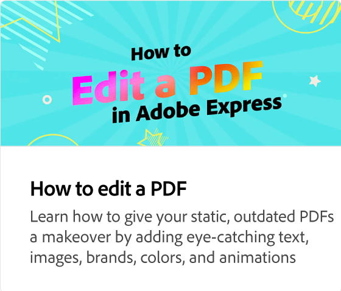

# Vilka är de nya Gen AI-funktionerna i Adobe Express?

Läs mer om den nya generationen AI-funktioner i Adobe Express. Med en textprompt kan du enkelt skapa designer och mallar, lägga till element i bilder och använda specialeffekter på text.

>[!VIDEO](https://video.tv.adobe.com/v/3427018?quality=12&learn=on&hidetitle=true)

## Fler videor i den här serien

<table style="table-layout:fixed">
<tr>
   <td>
         
   </td>
    <td>
         
   </td>
   <td>
         
   </td>     
   <td>
          
</tr>
<tr>
    <td>
      
   </td>
   <td>
      
   </td>
   <td>
      
   </td>
   <td>
      
</tr>
</table>
