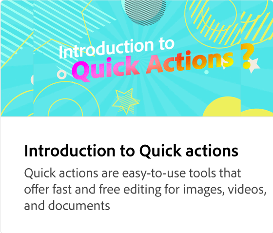

# Introduktion till mallar

Utforska tusentals professionellt utformade mallar för alla dina behov inom sociala medier och marknadsföring. Mallar är ett snabbt sätt att skapa anpassat innehåll genom att remixa med dina egna ord och foton.

>[!VIDEO](https://video.tv.adobe.com/v/3426927?quality=12&learn=on&hidetitle=true)

## Fler videor i den här serien

<table style="table-layout:fixed">
<tr>
 <td>
      
 </td>
 <td>
      
 </td>
 <td>
      
      

       
   </td>
    <td>
      
      

       
   </td>
</tr>
</table>
