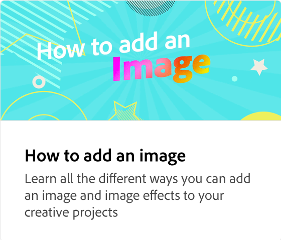

# Adobe [!DNL Express] självstudiekurser

Kom igång med att skapa fantastiska verk som sticker ut med generativ AI från Adobe Firefly. Designa flygblad, TikToks, cv:n och Reels med Adobe Express.

## Självstudiekurser om Adobe Expresser

<table style="table-layout:fixed">
<tr>
 <td>
      
 </td>
 <td>
      
  </td>
  <td>
   
  </td>
  <td>
      
  </td>
</tr>  
<tr>
  <td>
   
  </td>
 <td>
         
 </td>
  <td>
         
   </td>
  <td>
         
   </td>
</tr>
<tr>
  <td>
      
  </td>
  <td>
      
   </td>
  <td>
      
  </td>
   <td>
      
  </td>
</tr>
<tr>
   <td>
      
  </td>
  <td>
      
  </td>
  <td>
      
  </td>
  <td>
      
  </td>
</tr>
<tr>
  <td>
         
   </td>
  <td>
      
      

       
   </td>
   <td>
      
      

       
   </td>
   <td>
      
      

       
   </td>
</tr>
</table>
