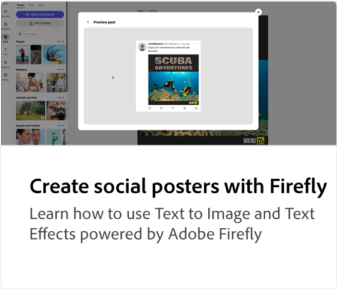
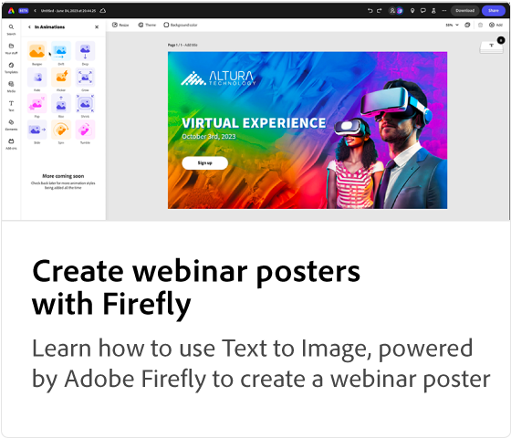

# Adobe [!DNL Express] självstudiekurser om användningsfall

Upptäck hur olika team i organisationen kan dra nytta av Adobe Expressen.

## Självstudiekurser om Adobe Expresser

<table style="table-layout:fixed">
<tr>
   <td>
      
  </td>
  <td>
      
   </td>     
   <td>
      
   </td>
    <td>
      
   </td>
</tr>
<tr>
   <td>
      
   </td>
   <td>
      
   </td>
   <td>
      
   </td>
   <td>
    
    

     
  </td>
</tr>
</table>
