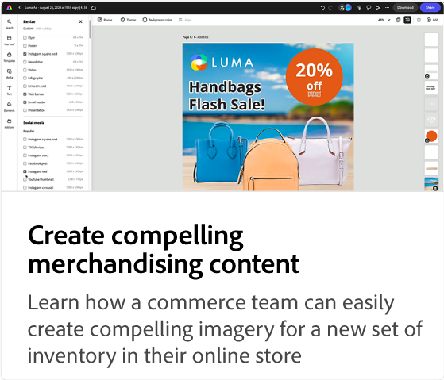
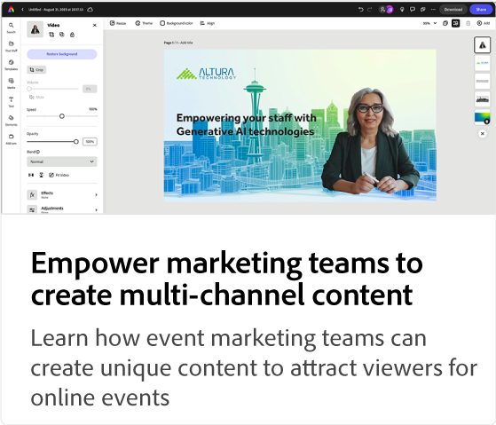
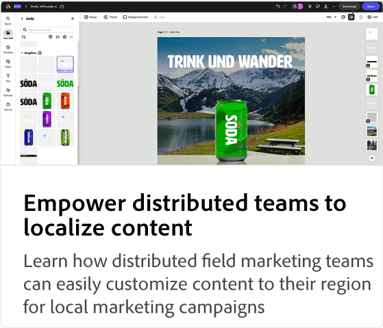

# Adobe [!DNL Express] självstudiekurser om användningsfall

Upptäck hur olika team i organisationen kan dra nytta av Adobe Expressen.

## Nyheter

* [Skapa fängslande marknadsföringsmaterial](compelling-merchandise.md)
Lär dig hur ett handelsteam enkelt kan skapa övertygande bilder för en ny uppsättning inventarier i sin onlinebutik
* [Ge marknadsföringsteam möjlighet att skapa innehåll för flera kanaler](multi-channel-marketing-content.md)
Lär dig hur team för evenemangsmarknadsföring kan skapa unikt innehåll som lockar tittare till onlineevenemang
* [Ge distribuerade team möjlighet att lokalisera innehåll](localized-marketing-content.md)
Lär dig hur distribuerade marknadsföringsteam enkelt kan anpassa innehåll till sin region för lokala marknadsföringskampanjer

## Självstudiekurser om Adobe Expresser

<table style="table-layout:fixed">
<tr>
   <td>
      
  <td>
      
  <td>
      
  </td>
  <td>
      
   </td>
</tr>
<tr>
   <td>
      
   </td>
   <td>
      
   </td>
   <td>
      
   </td>
   <td>
      
   </td>
</tr>
<tr>
      <td>
      
   </td>
<td>
      
      

       
   </td>
   <td>
      
      

       
   </td>
   <td>
      
      

       
   </td>
</tr>
</table>
