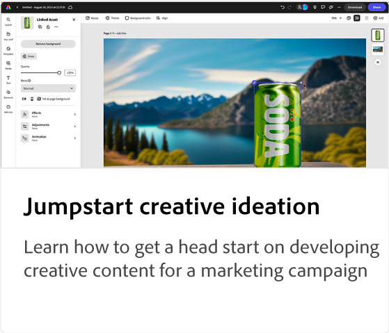
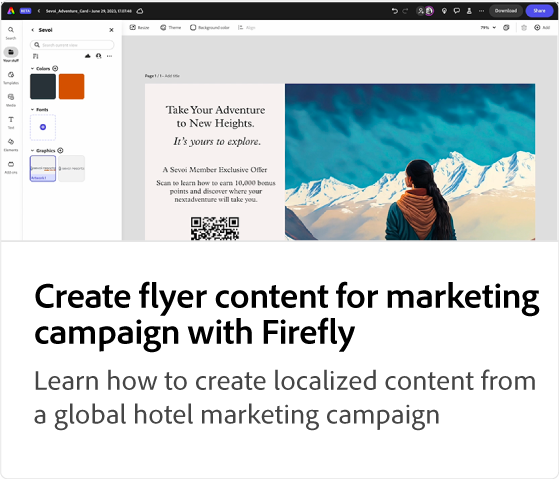
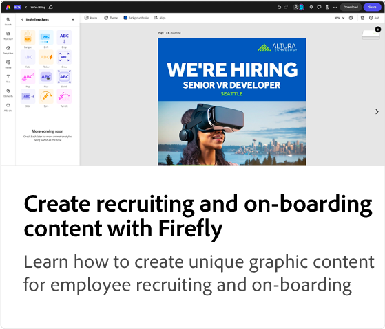

# Adobe [!DNL Express] självstudiekurser om användningsfall

Upptäck hur olika team i organisationen kan dra nytta av Adobe Expressen.

## Nyheter

* [Skapa en kampanjbild för en onlinekurs](promo-visual.md)
Lär dig skapa en engagerande bild för en onlinekurs
* [Skapa en video i slutet av året](end-of-year-video.md)
Lär dig hur du skapar en inspirerande årsslutsvideo
* [Skapa ett nyhetsbrev](newsletter.md)
Lär dig skapa förstasidan av ett nyhetsbrev som kan användas för utskrift, e-post eller publicering på webben

<table style="table-layout:fixed">
<tr>
   <td>
      
   </td>
   <td>
      
   </td>
   <td>
      
   </td>
   <td>
      
   </td>
</tr>
<tr>
   <td>
      
   </td>
   <td>
      
   </td>
   <td>
      
   </td>
   <td>
      
   </td>
</tr>
<tr>
   <td>
      
   </td>
   <td>
      
   </td>
   <td>
      
   </td>
   <td>
      
   </td>
</tr>
<tr>
   <td>
      
   </td>
   <td>
      
   </td>
   <td>
      
   </td>
   <td>
      
      

       
   </td>
</tr>
</table>
