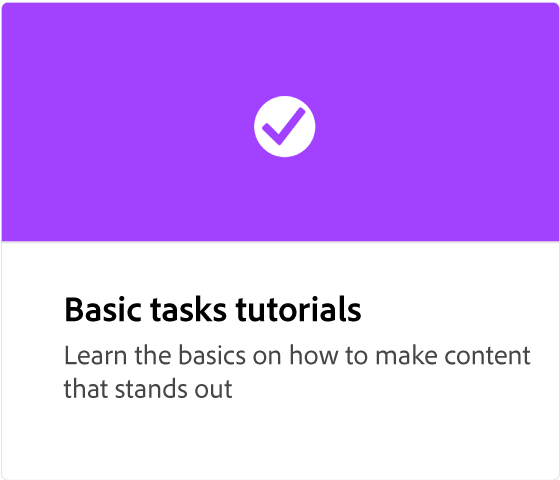
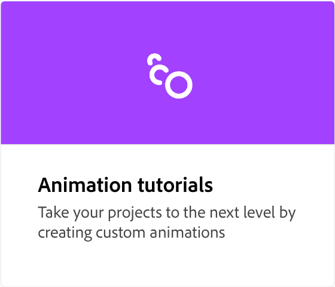
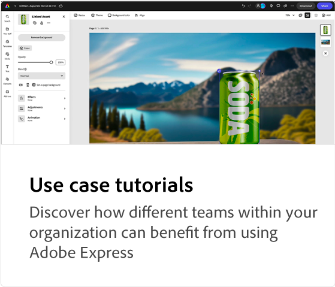

# Adobe [!DNL Express] översikt

Designa rullar och videor, flygblad, cv:n, banners, logotyper och annat från TikTok med den nya, allt-i-ett-appen för Adobe Express av snabbt och enkelt skapande av innehåll. Gör fantastiska verk som sticker ut med generativa AI-funktioner som drivs av Adobe Firefly.

## Vad är Adobe Express?

>[!VIDEO](https://video.tv.adobe.com/v/3420225?quality=12&learn=on&hidetitle=true)

## Adobe [!DNL Express] självstudiekurser

<table style="table-layout:fixed">
<tr>
   <td>
      
   </td>
   <td>
      
   </td>
   <td>
      
  </td>
   <td>
      
  </td>
</tr>
<tr>
   <td>
      
   </td>
   <td>
      
   </td>
  <td>
      
   </td>
  <td>
    
    

     
  </td>
</tr>
</table>