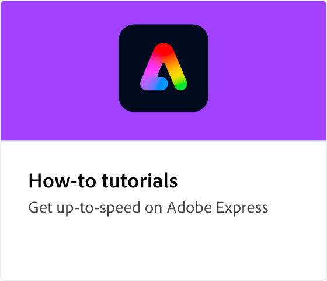

# Adobe [!DNL Express] översikt

Adobe Express är ett lättanvänt verktyg utan behov av erfarenhet.

## Utbildningsvägar

<table style="table-layout:fixed">
<tr>
   <td>
      
  </td>
  <td>
      
   </td>
   <td>
    
    

     
  </td>
  <td>
    
    

     
  </td>
</tr>
</table>

## Skapa din första design med Adobe Express

>[!VIDEO](https://video.tv.adobe.com/v/3420225?quality=12&learn=on&hidetitle=true)
