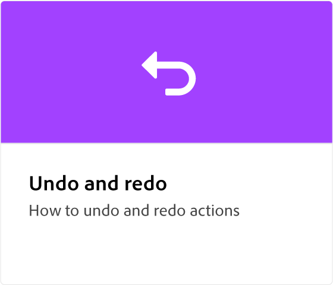
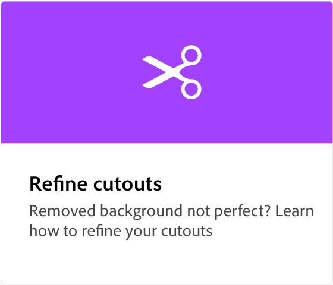

# Adobe [!DNL Express] översikt

Adobe Express är ett lättanvänt verktyg utan någon erfarenhet.

  

## Kom igång med Adobe Express

  

>[!VIDEO](https://video.tv.adobe.com/v/3420204?quality=12&learn=on&hidetitle=true)

## Självstudiekurser för Adobe Expresser

<table>
<tr>
   <td>
      
      

      <a href="get-started.md"><strong>Kom igång med Adobe Express</strong></a>
      

      <em>Lär dig grunderna i Adobe Express</em>
       
  </td>
  <td>
      
      

      <a href="adobe-express-beginners.md"><strong>Adobe Express för nybörjare</strong></a>
      

      <em>Uttryck dig genom att lära dig skapa din första design</em>
       
  </td>
  <td>
      
      

      <a href="get-inspiration.md"><strong>Få snabb inspiration</strong></a>
      

      <em>Inte en designer? Inga problem. Lär dig hur du blir inspirerad snabbt i Adobe Express</em>
       
  </td>
  <td>
   
    

   <a href="create-templates.md"><strong>Skapa mallar</strong></a>
    

    <em>Lär dig hur du använder samma projektlayout igen</em>
     
  </td>
</tr>
<tr>
   <td>
      
      

      <a href="add-design-assets.md"><strong>Lägga till designresurser</strong></a>
      

      <em>Lär dig hur du anpassar Instagram klistermärken och inlägg</em>
       
  </td>
  <td>
      
      

      <a href="group-objects.md"><strong>Gruppera objekt</strong></a>
      

      <em>Lär dig hur du ändrar storlek på text och bilder</em>
       
  </td>
  <td>
      
      

      <a href="layers.md"><strong>Markera och flytta lager</strong></a>
      

      <em>Flytta, ändra ordning på eller överlappa klistermärken och text med lager</em>
       
  </td>
  <td>
      
      

      <a href="multiple-pages.md"><strong>Skapa flera sidor</strong></a>
      

      <em>Lär dig hur du lägger till flera sidor i ett projekt</em>
       
  </td>
</tr>
<tr>
   <td>
      
      

      <a href="undo-redo.md"><strong>Ångra och gör om</strong></a>
      

      <em>Lär dig ångra och göra om åtgärder</em>
       
  </td>
  <td>
      
      

      <a href="cc-libraries.md"><strong>Använd CC Libraries</strong></a>
      

      <em>Lär dig dela resurser i CC-biblioteket med ditt team</em>
       
  </td>
  <td>
      
      

      <a href="brand.md"><strong>Använd ert varumärke</strong></a>
      

      <em>Lär dig hur du lägger till din logotyp och varumärkesfärg i en mall</em>
       
  </td>
  <td>
      
      

      <a href="google-drive.md"><strong>Integrering med Google Drive</strong></a>
      

      <em>Läs om hur du importerar bilder från Google Drive</em>
       
  </td>
</tr>
<tr>
    <td>
      
      

      <a href="remove-background.md"><strong>Ta bort bakgrund</strong></a>
      

      <em>Lär dig hur du tar bort bakgrunden från dina bilder</em>
       
  </td>
  <td>
      
      

      <a href="refine-cutout.md"><strong>Finjustera ett urklipp</strong></a>
      

      <em>Lär dig hur du förfinar urklipp</em>
       
  </td>
  <td>
      
      

      <a href="text-effects.md"><strong>Använda texteffekter</strong></a>
      

      <em>Läs om hur du lägger till skuggor, former och konturtext</em>
       
  </td>
  <td>
      
      

      <a href="image-effects.md"><strong>Använda bildeffekter</strong></a>
      

      <em>Lär dig göra bilder ljusare och mörkare</em>
       
  </td>
  <td>
      
      

      <a href="create-curved-text.md"><strong>Skapa böjd text</strong></a>
      

      <em>Lär dig hur du skapar kurvig text i ett projekt</em>
       
  </td>
</tr>
</table>
