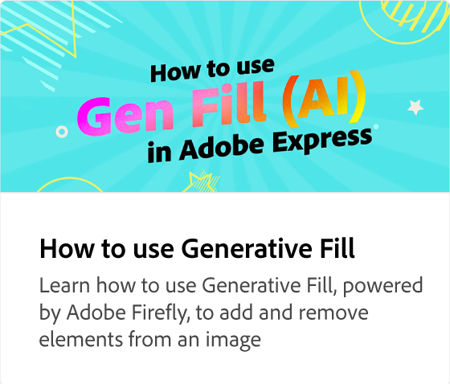

# Ta bort bakgrunden från en bild

Lär dig ta bort bakgrunden från dina bilder med ett klick med en snabbåtgärd. När du har tagit bort bakgrunden kan du hämta och använda bilden för flera olika ändamål.

>[!VIDEO](https://video.tv.adobe.com/v/3420220?quality=12&learn=on&hidetitle=true)

## Fler videor i den här serien

<table style="table-layout:fixed">
<tr>
   <td>
         
   </td>
   <td>
         
   </td>
   <td>
         
   </td>
   <td>
      
   </td>   
</tr>
<tr>
    <td>
      
   </td>
   <td>
      
   </td>
   <td>
      
   </td>
   <td>
      
   </td>
</tr>
</table>
