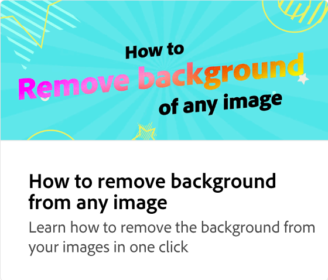

# Så använder du schemaläggaren för publicering

Schemalägg inlägg i sociala medier för Instagram, Facebook, Twitter, Pinterest och LinkedIn. Du kan välja specifika egenskaper för varje plattform. På Instagram kan du till exempel välja om ditt innehåll ska vara ett inlägg, en berättelse eller en reel.

>[!VIDEO](https://video.tv.adobe.com/v/3420242?quality=12&learn=on&hidetitle=true)

## Fler videor i den här serien

<table style="table-layout:fixed">
<tr>
   <td>
         
   </td>
   <td>
         
   </td>
   <td>
         
   </td>
   <td>
         
   </td>      
</tr>
<tr>
   <td>
      
   </td>
   <td>
      
   </td>
   <td>
      
   </td>
   <td>
      
   </td>
</tr>
</table>
