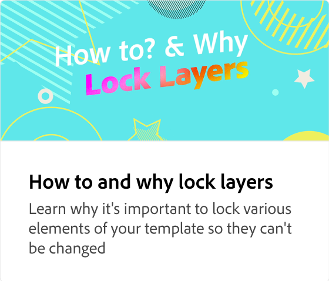

# Spara och dela mallar

Lär dig spara och dela mallar i ett varumärkespaket eller bibliotek för teamet.

>[!VIDEO](https://video.tv.adobe.com/v/3427098?quality=12&learn=on&hidetitle=true)

## Fler videor i den här serien

<table style="table-layout:fixed">
<tr>
    <td>
            
    </td>
    <td>
         
    </td>
    <td>
            
    </td>
    <td>
      
      

       
    </td>
</tr>
</table>
