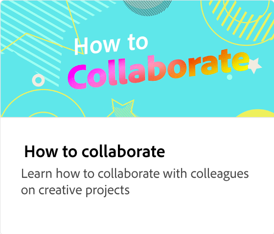

# Dela och hämta

Lär dig alternativen för att hämta och dela projekt i olika filformat som PNG, JPEG eller PDF. Publicera projekt på webben och generera en länk för enkel åtkomst, eller schemalägg och dela medier direkt till plattformar för sociala medier med alternativ för att anpassa inlägg för varje plattform.

>[!VIDEO](https://video.tv.adobe.com/v/3426936?quality=12&learn=on&hidetitle=true)

## Fler videor i den här serien

<table style="table-layout:fixed">
<tr>
 <td>
      
  </td>
   <td>
      
  </td>
   <td>
      
  </td>
  <td>
      
  </td>
</tr>
<tr>
   <td>
      
  </td>
   <td>
      
  </td>
   <td>
      
  </td>
   <td>
         
   </td>
</tr>
<tr>
   <td>
         
   </td>
   <td>
   
   </td>
   <td>
   <td>
   
   </td>
   <td>
      
      

       
   </td>
</tr>
</table>
