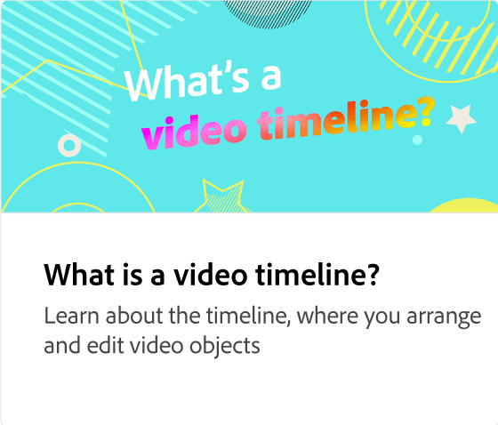

# Starta ett videoprojekt

Lär dig olika sätt att starta ett videoprojekt, inklusive hur du använder videomallar för sociala medier.

>[!VIDEO](https://video.tv.adobe.com/v/3427070?quality=12&learn=on&hidetitle=true)

## Fler videor i den här serien

<table style="table-layout:fixed">
<tr>
  <td>
         
   </td>
   <td>
         
   </td>
   <td>
         
   </td>
   <td>
         
   </td>
</tr>
<tr>
    <td>
         
   </td>
   <td>
    
    

     
   </td>
   <td>
    
    

     
   </td>
   <td>
    
    

     
   </td>
</tr>
</table>