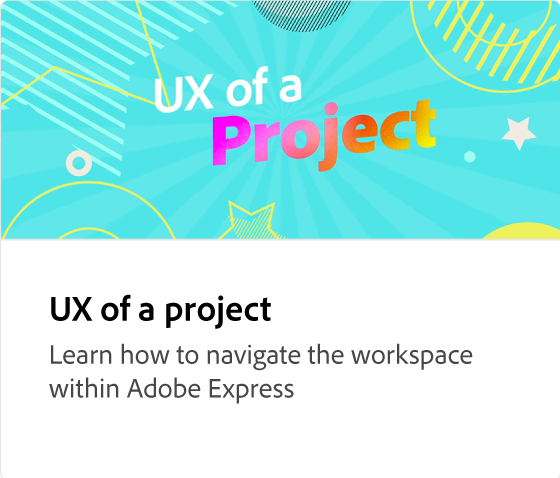
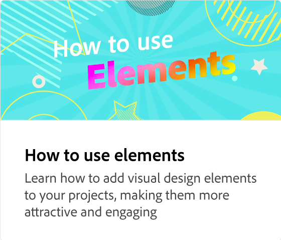

# Lägga till text

Lär dig alla olika sätt att lägga till text i kreativa projekt, inklusive att redigera, flytta och ta bort textlager, ändra teckensnitt, justera textstorlek och layout, justera text, ändra fyllningsfärg och kontur, lägga till skuggor och använda former och klippa ut text. Rekommenderade teckensnitt kan inspirera.

>[!VIDEO](https://video.tv.adobe.com/v/3420222?quality=12&learn=on&hidetitle=true)

## Fler videor i den här serien

<table style="table-layout:fixed">
<tr>
 <td>
      
  </td>
   <td>
      
  </td>
   <td>
      
  </td>
  <td>
      
  </td>
</tr>
<tr>
   <td>
      
  </td>
   <td>
      
  </td>
   <td>
         
   </td>
    <td>
         
   </td>
</tr>
<tr>
   <td>
   
   </td>
   <td>
   
   </td>
   <td>
   
   </td>
   <td>
      
      

       
   </td>
</tr>
</table>