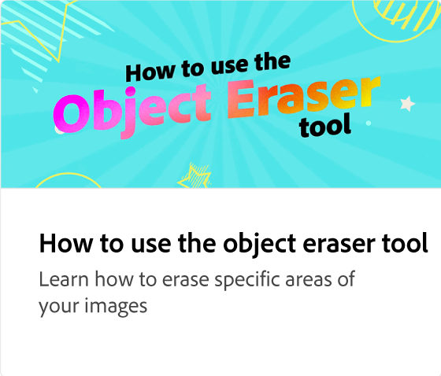

# Så här använder du Text till mall Gen AI

Lär dig hur du genererar redigerbara mallar för sociala inlägg, affischer, flygblad och kort från en textbeskrivning på några sekunder. Du kan redigera designen, ändra teckensnitt och varumärka projektet ytterligare innan du hämtar eller delar det.

>[!VIDEO](https://video.tv.adobe.com/v/3427022?quality=12&learn=on&hidetitle=true)

## Fler videor i den här serien

<table style="table-layout:fixed">
<tr>
   <td>
         
   </td>
   <td>
         
   </td>
   <td>
         
   </td>
   <td>
         
   </td>      
</tr>
<tr>
   <td>
      
   </td>
   <td>
      
   </td>
   <td>
      
   </td>
   <td>
      
   </td>
</tr>
</table>
