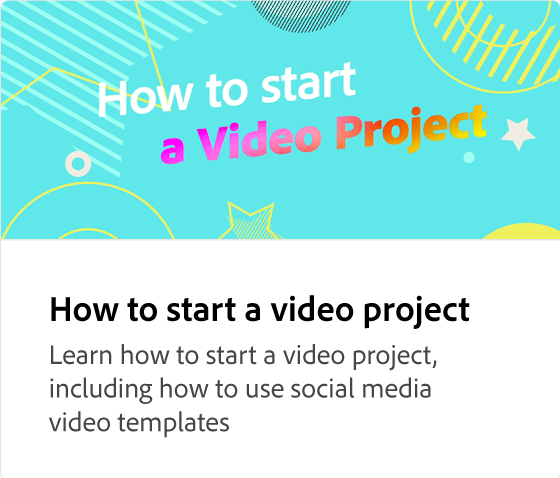
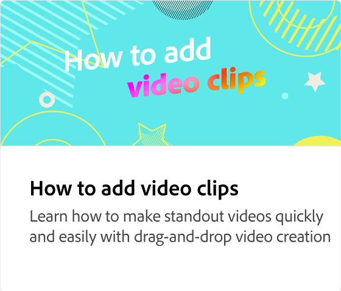
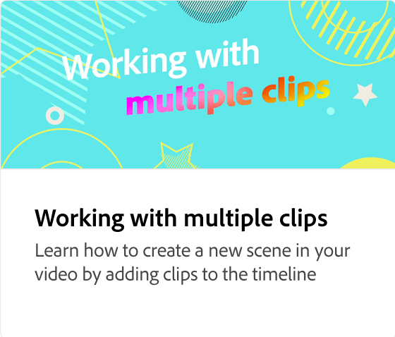
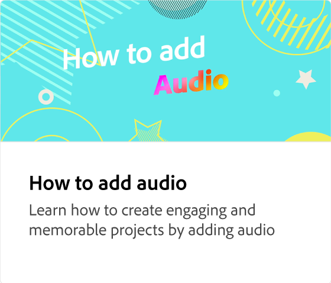

# Vad är en videotidslinje?

Läs mer om tidslinjen där du ordnar och redigerar videoobjekt som videor, bilder, text och grafik i dina projekt. Tidslinjen är en representation av objekten och ordningen på de objekt som utgör en video.

>[!VIDEO](https://video.tv.adobe.com/v/3427090?quality=12&learn=on&hidetitle=true)

<table style="table-layout:fixed">
<tr>
   <td>
         
   </td>
  <td>
         
   </td>
   <td>
         
   </td>
   <td>
         
   </td>
</tr>
<tr>
    <td>
         
   </td>
   <td>
    
    

     
   </td>
   <td>
    
    

     
   </td>
   <td>
    
    

     
   </td>
</tr>
</table>