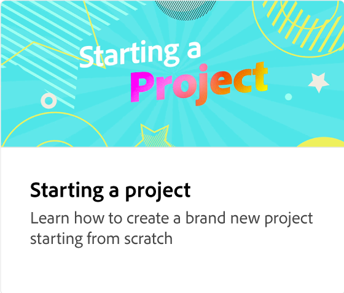
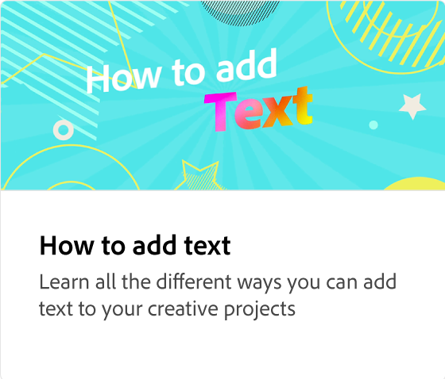
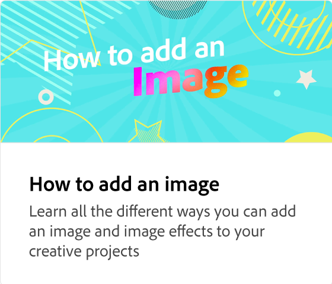
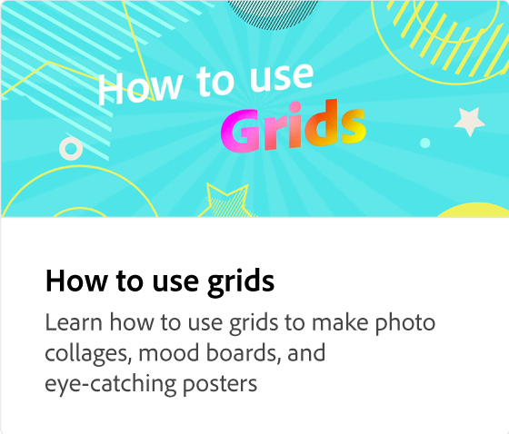
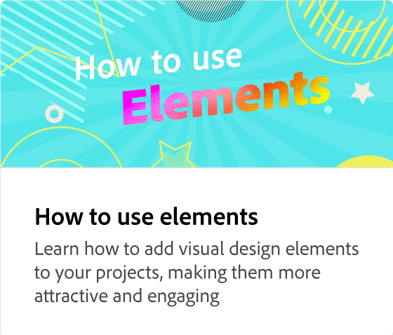
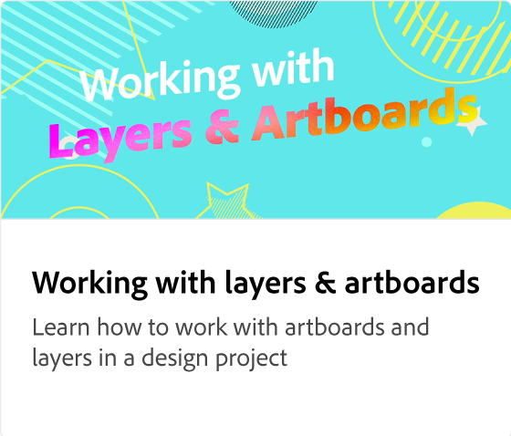
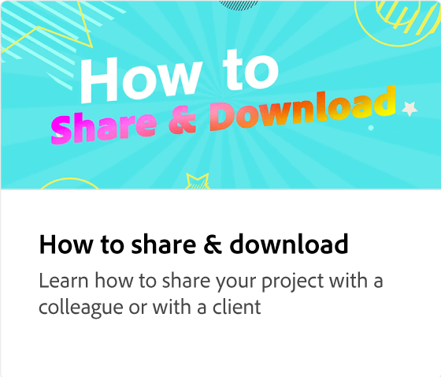
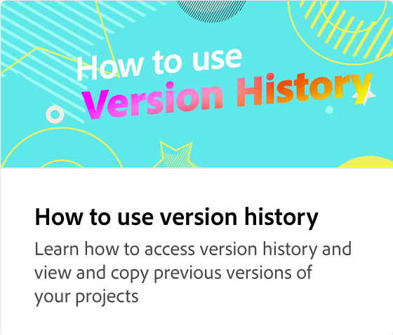

# Användarupplevelse för ett projekt

Lär dig navigera på arbetsytan i Adobe Express. Arbetsytan innehåller kraftfulla sökfunktioner för att hitta bakgrunder, ljudmallar och foton. Du får tillgång till dina egna varumärken och mallar och kan söka efter specifika teman. Media kan överföras från enheter eller väljas från Adobe Stock collection. Designresurser, bakgrunder, former och ikoner är tillgängliga för användning i projekt. Dessutom kan du bjuda in kollegor att samarbeta i projektdesigner.

>[!VIDEO](https://video.tv.adobe.com/v/3426932?quality=12&learn=on&hidetitle=true)

## Fler videor i den här serien

<table style="table-layout:fixed">
<tr>
 <td>
      
  </td>
   <td>
      
  </td>
   <td>
      
  </td>
   <td>
      
  </td>
</tr>
<tr>
   <td>
      
  </td>
   <td>
      
  </td>
   <td>
         
   </td>
    <td>
         
   </td>
</tr>
<tr>
    <td>
   
   </td>
   <td>
   
   </td>
   <td>
   
   </td>
    <td>
      
      

       
   </td>
</tr>
</table>