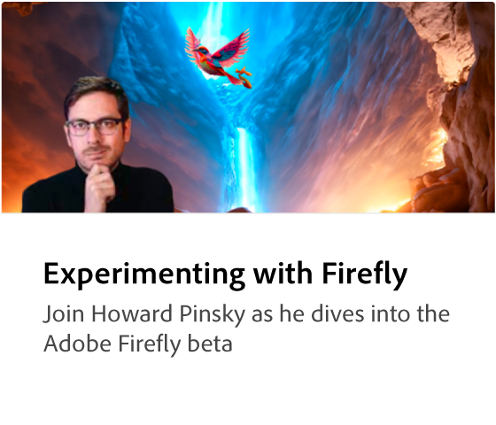

# Adobe [!DNL Firefly] översikt

Firefly är den nya familjen av kreativa generativa AI-modeller som kommer till Adobe och som i första hand fokuserar på att skapa bild- och texteffekter. Firefly erbjuder nya sätt att tänka, skapa och kommunicera samtidigt som de kreativa arbetsflödena förbättras avsevärt.

  

## Se vad du kan göra med Adobe Firefly

  

>[!VIDEO](https://video.tv.adobe.com/v/3416970t1?quality=12&learn=on&hidetitle=true)

## Läs mer om Adobe Firefly

<table>
<tr>
   <td>
      
      

      <a href="https://firefly.adobe.com/" target="_blank"><strong>Adobe Firefly (beta)</strong></a>
      

      <em>Gå med i betaprogrammet för Adobe Firefly.</em>
       
  </td>
  <td>
      
      

      <a href="https://www.adobe.com/sensei/generative-ai/firefly.html" target="_blank"><strong>Utforska Firefly i Photoshop</strong></a>
      

      <em>Firefly finns nu i Photoshop och sättet du skapar kommer aldrig att bli detsamma</em>
       
  </td>
  <td>
      
  </td>
  <td>
    
    

     
  </td>
</tr>
</table>
