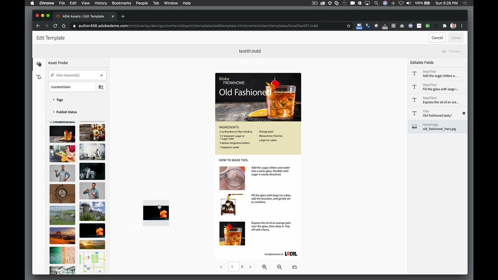

# AEM Assets och Asset Link

Adobe Experience Manager är branschledande inom hantering av digitala upplevelser för företag och medelstora organisationer. Det ger en modern, skalbar grund för att leverera övertygande upplevelser som främjar varumärkesengagemang, driver efterfrågan och ökar kundlojaliteten. I Experience Manager ingår en komplett uppsättning verktyg för att skapa, hantera och leverera digitala upplevelser i alla kanaler.

## Bläddra i Tutorials

<table style="table-layout:fixed">
<tr>
 <td>
   
    

   <a href="aem.md#tutorial1"><strong>AEM och Asset Link</strong></a>
    

    <em>Gör realtidsuppdateringar av resurser som lagras i AEM med Asset Link</em>
     
  </td>
   <td>
   
    

   <a href="aem.md#tutorial2"><strong>InDesign filer som finns i AEM</strong></a>
    

    <em>Ha dina InDesigner som värddokument i AEM så att flera användare kan skapa innehållsvariationer - samtidigt</em>
     
  </td>
  <td>
    
    

     
  </td>
</tr>
</table>

## AEM och Asset Link (5:45) {#tutorial1}

>[!VIDEO](https://video.tv.adobe.com/v/326828?hidetitle=true)

**Beskrivning**
Uppdatera resurser som lagras i AEM med Asset Link i realtid.

I den här självstudiekursen får du lära dig mer om att:
* Hitta det du behöver, när du behöver det med en särskild panel för att söka efter och bläddra bland mediefiler i dina designprogram
* Du kan enkelt överföra mediefiler direkt från dina designprogram
* Checka ut och checka in mediefiler från DAM i ditt designprogram för att göra uppdateringar i realtid

**Presenteras av:**
ERIC ROWSE, KONSULT FÖR SENIORA LÖSNINGAR (DIGITALA MEDIA)

## InDesign-filer som finns i AEM (3:16) {#tutorial2}

>[!VIDEO](https://video.tv.adobe.com/v/326829?hidetitle=true)

**Beskrivning**
Ha dina InDesigner som värddokument i AEM så att flera användare kan skapa innehållsvariationer - på samma gång.

I den här självstudiekursen får du lära dig mer om att:
* InDesign Överför lagringsfilen till AEM för vanlig lagringsåtkomst
* Skapa variationer säkert utan att oroa dig för att förstöra källfilen
* Dokumentfält är förformaterade, vilket gör det möjligt att snabbt redigera eller ändra innehåll

**Presenteras av:**
ERIC ROWSE, KONSULT FÖR SENIORA LÖSNINGAR (DIGITALA MEDIA)

<table style="table-layout:fixed">
<tr>
 <td>
   
    

   <a href="https://www.adobe.com/marketing/experience-manager.html"><strong>Adobe Experience Manager</strong></a>
    

    <em>Ett kraftpaket för hantering av innehåll och digitala resurser</em>
     
  </td>
  <td>
   
    

   <a href="https://www.adobe.com/marketing/experience-manager-assets.html"><strong>AEM Assets</strong></a>
    

    <em>Nästa generations hantering av digitala tillgångar</em>
     
  </td>
  <td>
   
    

   <a href="https://www.adobe.com/marketing/experience-manager-assets/benefits.html"><strong>AEM Assets: Fördelar</strong></a>
    

    <em>Få dina digitala resurser att fungera för dig</em>
     
  </td>
</tr>
</table>

**Asset Link och AEM-resurser**

[Lär dig mer och support](https://helpx.adobe.com/support/experience-manager.html) är navet för ytterligare självstudiekurser, Nyheter och länkar till användarforum.

**Versionen från oktober 2020**

Börja använda dessa funktioner (och mycket mer!) genom att hämta den senaste uppdateringen från Creative Cloud-datorprogrammet.
