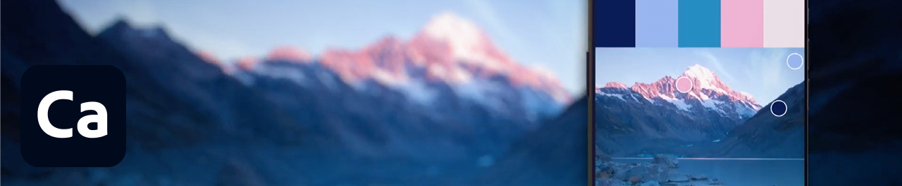
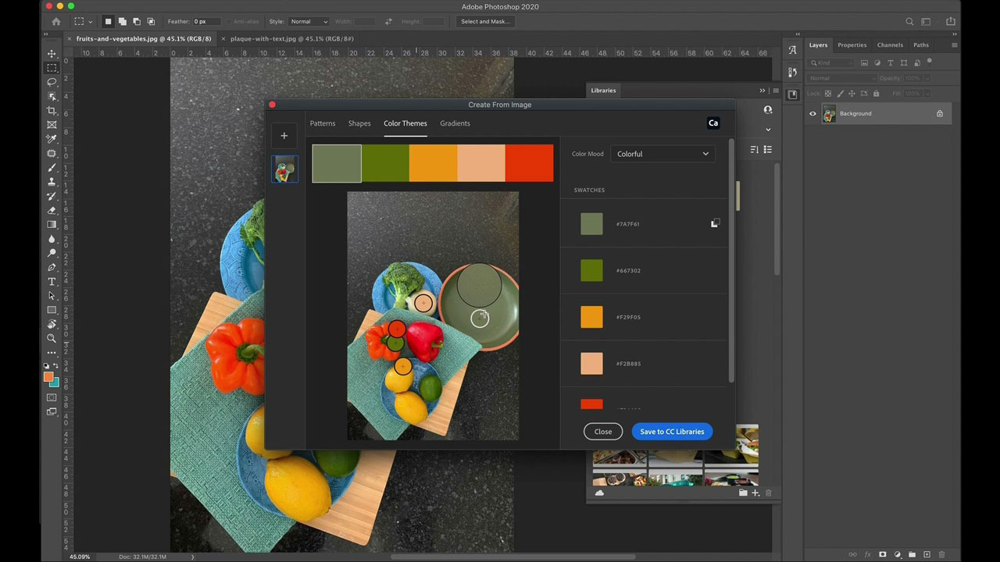

# [!DNL Capture]

Adobe [!DNL Capture] förvandlar mobiltelefoner och surfplattor till ett designverktyg. Användarna kan skapa många olika typer av resurser (enskilda digitala element för bilder).   Dessa resurser synkroniseras automatiskt med andra datorprogram och mobilappar från Adobe. Användarna kan föra in dem i sina kreativa projekt eller enkelt dela dem med medarbetare.

## Bläddra i Tutorials

<table style="table-layout:fixed">
<tr>
 <td>
   
    

   <a href="capture.md#tutorial1"><strong>Hämta inspiration från världen omkring dig</strong></a>
    

    <em>Använd de kraftfulla markerings- och färgredigeringsverktygen i Adobe Capture för att dramatiskt ändra en bild efter företagets grafiska profil</em>
     
  </td>
  <td>
    
    

     
  </td>
  <td>
    
    

     
  </td>
</tr>
</table>

## Hämta inspiration från världen omkring dig (2:56) {#tutorial1}

>[!VIDEO](https://video.tv.adobe.com/v/326825?hidetitle=true)

**Beskrivning**
Förvandla bilder och video på din mobila enhet till kreativa byggstenar för all din design.

I den här självstudiekursen får du lära dig hur du:
* Designa var som helst
* Integrera med datorprogram via CC Libraries
* Få tillgång till tusentals Adobe Fonts

**Presenteras av:**
Emily Palmer, lösningskonsult (Digital Media)

**[!DNL Capture]Resurser**

[Utbildning och support](https://helpx.adobe.com/mobile-apps/help/capture-faq.html) är navet för ytterligare självstudiekurser och länkar till användarforum.

**Oktober 2020-utgåvan**

Börja använda dessa funktioner (och mycket mer!) genom att hämta den senaste uppdateringen från Creative Cloud-datorprogrammet.
