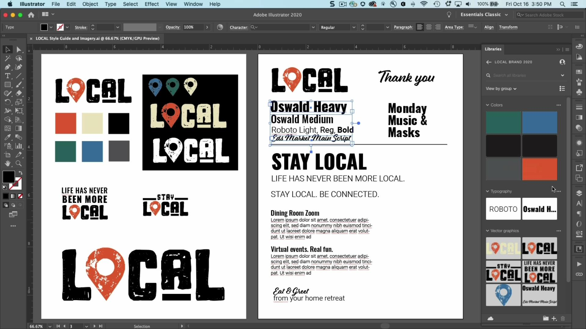
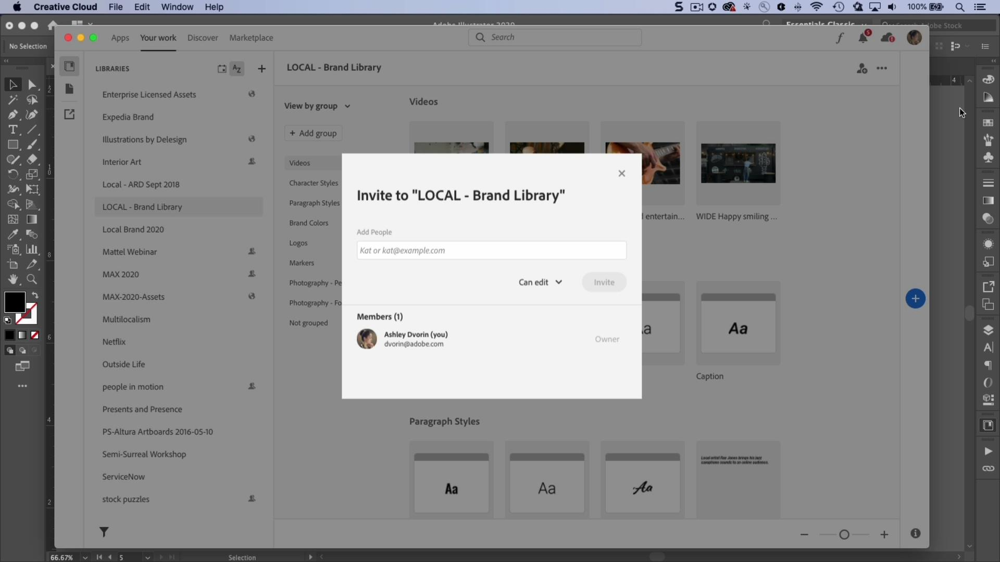

# CC Libraries

Ha dina mediefiler till hands och dina projekt till hands i varumärket.

## Bläddra i Tutorials

<table style="table-layout:fixed">
<tr>
 <td>
   
    

   <a href="cclibraries.md#tutorial1"><strong>Skapa CC Libraries</strong></a>
    

    <em>Med Adobe Creative Cloud Libraries kan du hantera, ordna och få tillgång till dina logotyper, färger och annat i dina Creative Cloud-favoritappar</em>
     
  </td>
   <td>
   
    

   <a href="cclibraries.md#tutorial2"><strong>Dela CC-bibliotek</strong></a>
    

    <em>Arbeta mer effektivt, se till att vara konsekvent och håll dig enkelt synkroniserad med ditt team</em>
     
  </td>
  <td>
    
    

     
  </td>
</tr>
</table>

## Skapa CC-bibliotek (4:38) {#tutorial1}

>[!VIDEO](https://video.tv.adobe.com/v/326802?hidetitle=true)

**Beskrivning**
Med Adobe Creative Cloud Libraries kan du hantera, ordna och få tillgång till dina logotyper, färger och annat i dina Creative Cloud-favoritappar.

I den här självstudiekursen får du lära dig mer om att:
* Ha dina mediefiler till hands och dina projekt till hands på ett varumärke
* Nytt! Fullständig integrering med Adobe XD

**Presenteras av:**
Ashley Dvorin, Senior Solutions Consultant (Digital Media)

## Dela CC-bibliotek (4:14) {#tutorial2}

>[!VIDEO](https://video.tv.adobe.com/v/326803?hidetitle=true)

**Beskrivning**
Arbeta mer effektivt, håll kreativiteten i schack och håll dig enkelt synkroniserad med ditt team.

I den här självstudiekursen får du lära dig mer om att:
* Ha dina mediefiler till hands och dina projekt till hands på ett varumärke
* Samarbeta om projekt enkelt direkt från dina favoritappar

**Presenteras av:**
Ashley Dvorin, Senior Solutions Consultant (Digital Media)

**CC Libraries-resurser**

[Lär dig mer och support](https://helpx.adobe.com/creative-cloud/help/libraries.html) är navet för ytterligare självstudiekurser, Nyheter och länkar till användarforum.

**Versionen från oktober 2020**

Börja använda dessa funktioner (och mycket mer!) genom att hämta den senaste uppdateringen från Creative Cloud-datorprogrammet.
