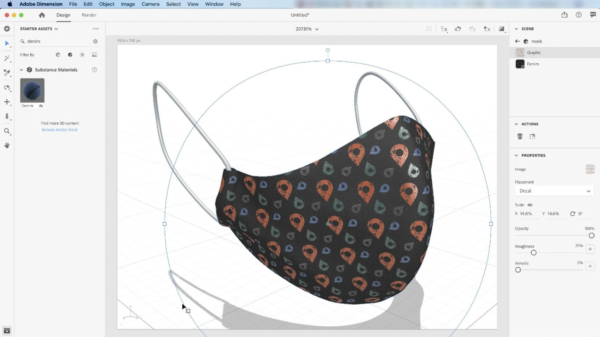

# [!DNL Dimension]

Skapa engagerande innehåll i 3D snabbare med högkvalitativa modeller, material och belysning. [!DNL Dimension] gör det enkelt att skapa varumärkesvisualiseringar, illustrationer, produktmodeller, förpackningsdesign och annat kreativt arbete.

## Bläddra i Tutorials

<table style="table-layout:fixed">
<tr>
 <td>
   
    

   <a href="dimension.md#tutorial1"><strong>Tillämpa Substance-material på 3D-modeller</strong></a>
    

    <em>Substance-material stöder tusentals olika mönster och designvarianter i ett och samma material</em>
     
  </td>
  <td>
    
    

     
  </td>
  <td>
    
    

     
  </td>
</tr>
</table>

## Använd Substance-material på 3D-modeller (11:42) {#tutorial1}

>[!VIDEO](https://video.tv.adobe.com/v/326944?hidetitle=true)

**Beskrivning**
Substance-material stöder tusentals olika mönster och designvarianter i ett och samma material.

I den här självstudiekursen får du lära dig hur du:
* Skapa engagerande innehåll i 3D snabbare med högkvalitativa modeller, material och belysning

**Presenteras av:**
Jim Babbage, Senior Solutions Consultant (Digital Media)

**Dimension**

[Utbildning och support](https://helpx.adobe.com/support/dimension.html) är ditt nav för ytterligare självstudiekurser, [Nyheter](https://helpx.adobe.com/dimension/user-guide.html/dimension/using/whats-new.ug.html)och länkar till användarforum.

**Oktober 2020-utgåvan**

Börja använda dessa funktioner (och mycket mer!) genom att hämta den senaste uppdateringen från Creative Cloud-datorprogrammet.
