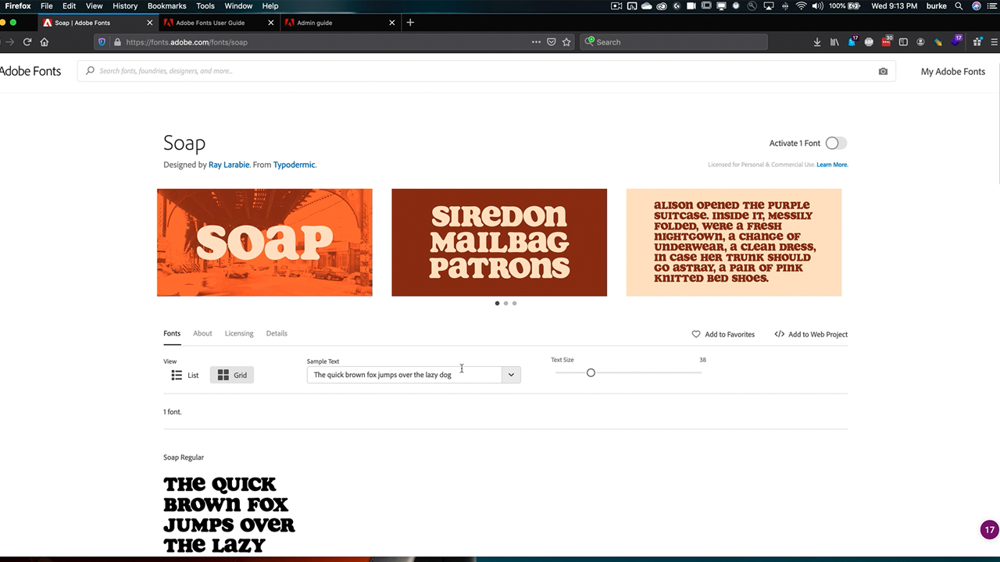

# Företagsadministration

Hantera hela din organisations behörigheter och resurser för Adobe.

## Bläddra i Enterprise Administration Tutorials

<table style="table-layout:fixed">
<tr>
 <td>
   
    

   <a href="enterprise.md#tutorial1"><strong>Adobe Fonts</strong></a>
    

    <em>Utforska de nästan 200 familjerna i Adobe Fonts och hur lättanvänd tjänsten Adobe Fonts är</em>
     
  </td>
  <td>
    
    

     
  </td>
  <td>
    
    

     
  </td>
</tr>
</table>

## Adobe Fonts (5:20) {#tutorial1}

>[!VIDEO](https://video.tv.adobe.com/v/328226?hidetitle=true)

**Beskrivning:**

Utforska de nästan 200 familjerna i Adobe Fonts och hur lättanvänd tjänsten Adobe Fonts är.

I den här självstudiekursen får du lära dig hur du:
* Använd det kraftfulla webbgränssnittet för att snabbt och enkelt hitta rätt teckensnitt
* Spara tid och pengar genom att använda inbyggda Creative Cloud-integreringar
* Hantera alla teckensnitt på ett och samma ställe i Adobe Admin Console

**Presenteras av:**

Todd Burke, Principal Solutions Consultant (Digital Media)

**Resurser för företagsadministration:**

[Användarhandbok för Adobe Fonts](https://helpx.adobe.com/fonts/user-guide.html)

[Handbok för företagsadministratörer](https://helpx.adobe.com/enterprise/admin-guide.html)
