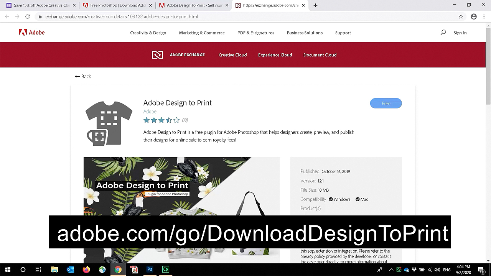
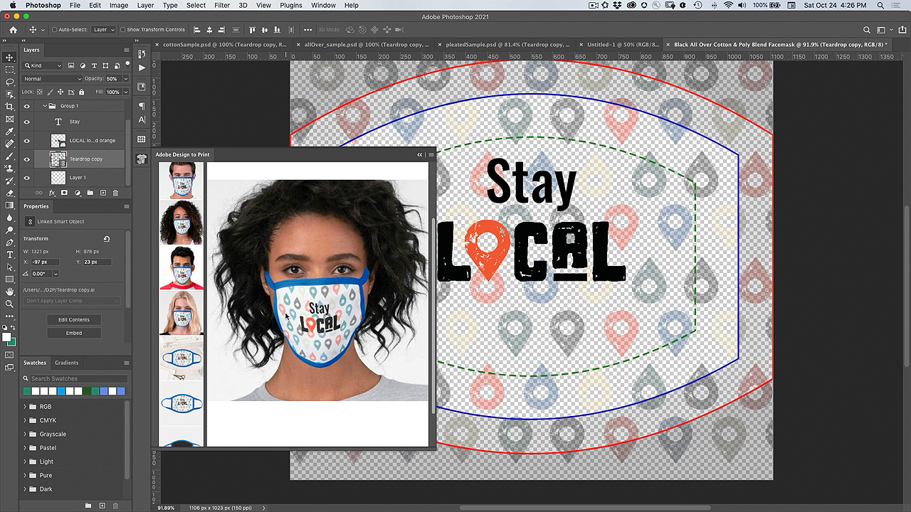
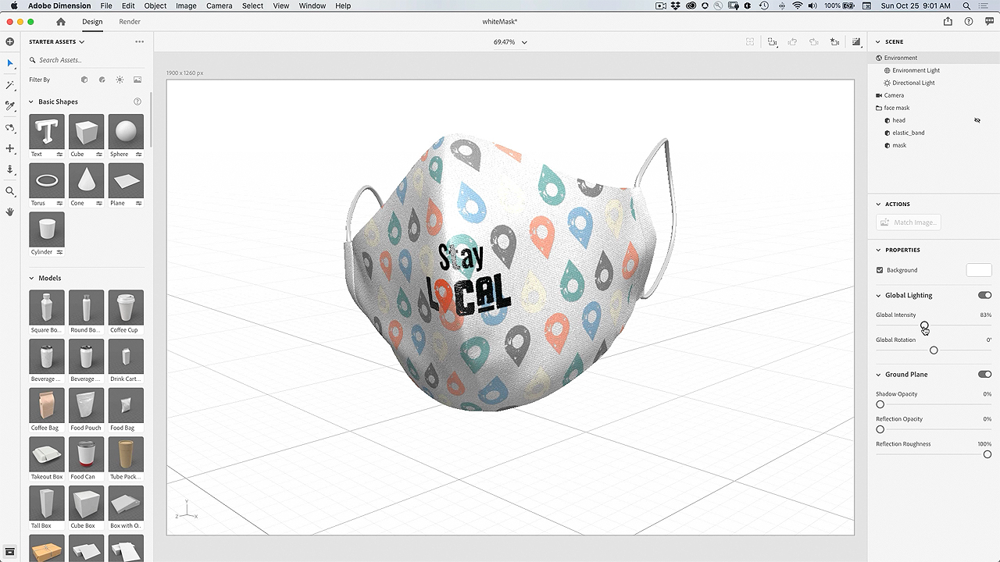

# Plugin-programmet Design to Print - Anpassa en ansiktsmask

Vore det inte coolt om du kunde anpassa en ansiktsmask med dina egna konstverk? Med plugin-programmet Adobe Design to Print kan du visualisera dina mönster på hundratals Zazzle-produkter och publicera direkt på deras onlinemarknad.

## Bläddra bland Facebook-projekt Tutorials

<table style="table-layout:fixed">
<tr>
 <td>
   
    

   <a href="handsonproject.md#tutorial1"><strong>Installera plugin-programmet Photoshop Design to Print</strong></a>
    

    <em>Använd de kraftfulla markerings- och färgredigeringsverktygen i Adobe Photoshop för att dramatiskt ändra en bild så att den passar ditt företags varumärkesbehov</em>
     
  </td>
  <td>
    
    

    <a href="handsonproject.md#tutorial2"><strong>Anpassa en ansiktsmask med design för utskrift</strong></a>
    

    <em>Anpassa din egen Zazzle-ansiktsmask</em>
     
  </td>
  <td>
    
    

   <a href="handsonproject.md#tutorial3"><strong>Skapa en 3D-visualisering av din ansiktsmask</strong></a>
    

    <em>Skapa en 3D-visualisering av din ansiktsmask för evenemangsgalleriet</em>
     
  </td>
</tr>
</table>

## Installera plugin-programmet Photoshop Design to Print (1:50) {#tutorial1}

>[!VIDEO](https://video.tv.adobe.com/v/327096?hidetitle=true)

**Beskrivning**
Lär dig hur du installerar plugin-programmet Design to Print för Photoshop.

I den här självstudiekursen får du lära dig mer om att:
* Visualisera dina designer på produkter som kläder, tillbehör, brevpapper och väggkonst i realtid!
* Publicera på Dazzle Online Marketplace

**Presenteras av:**
Patti Sokol, huvudsaklig lösningskonsult (digitala medier)

## Anpassa en ansiktsmask med design för utskrift (7:54) {#tutorial2}

>[!VIDEO](https://video.tv.adobe.com/v/327097?hidetitle=true)

**Beskrivning**
Anpassa din egen Zazzle-ansiktsmask

I den här självstudiekursen får du lära dig mer om att:
* Visualisera dina designer på produkter som kläder, tillbehör, brevpapper och väggkonst i realtid!
* Publicera på Dazzle Online Marketplace

**Klicka på Bild för att hämta Learn Design to Print PDF**

**Presenteras av:**
Patti Sokol, huvudsaklig lösningskonsult (digitala medier)

## Skapa en 3D-visualisering av ansiktsmask (7:54) {#tutorial3}

>[!VIDEO](https://video.tv.adobe.com/v/327098?hidetitle=true)

**Beskrivning**
Skapa en 3D-visualisering av din ansiktsmask för evenemangsgalleriet

I den här självstudiekursen får du lära dig mer om att:
* Skapa fotorealistiska 3D-visualiseringar på ett enkelt sätt
* Lägg till material och kontrollera ljuset för ett professionellt utseende
* Importera resurser för att använda ditt varumärke eller andra designer

**Klicka på bilden för att hämta [!DNL Dimension] Fil med 3D-modellen av vit mask**

**Presenteras av:**
Patti Sokol, huvudsaklig lösningskonsult (digitala medier)
