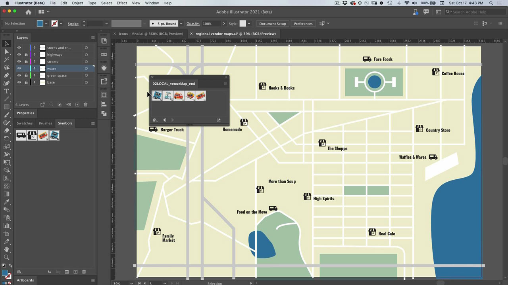

# Illustrator

Det moderna programmet för illustrationer och grafik. Skapa logotyper, ikoner, illustrationer och andra designer som du kan föreställa dig för webben, mobilen eller tryck.

## Bläddra i Tutorials

<table style="table-layout:fixed">
<tr>
 <td>
   
    

   <a href="illustrator.md#tutorial1"><strong>Använda symboler för att uppdatera flera ikoninstanser</strong></a>
    

    <em>Minska det manuella arbetet och håll symbolerna enhetliga</em>
     
  </td>
  <td>
    
    

    <a href="illustrator.md#tutorial2"><strong>Justera text och bilder med Fästning av tecken</strong></a>
    

    <em>Fäst tecken snabbt mot viktiga områden i dokumentet</em>
     
  </td>
  <td>
    
    

     
  </td>
</tr>
</table>

## Använda symboler för att uppdatera flera ikoninstanser (5:08) {#tutorial1}

>[!VIDEO](https://video.tv.adobe.com/v/326816?hidetitle=true)

**Beskrivning**
Minska det manuella arbetet och håll det enhetligt med symboler.

I den här självstudiekursen får du lära dig mer om att:
* Minska det manuella arbetet och håll symbolerna enhetliga

**Presenteras av:**
Patti Sokol, huvudsaklig lösningskonsult (digitala medier)

## Justera text och bilder med teckenfästning (6:48) {#tutorial2}

>[!VIDEO](https://video.tv.adobe.com/v/326817?hidetitle=true)

**Beskrivning**
Fäst tecken snabbt mot viktiga områden i dokumentet.

I den här självstudiekursen får du lära dig mer om att:
* Fäst tecken snabbt mot viktiga områden i dokumentet

**Presenteras av:**
Patti Sokol, huvudsaklig lösningskonsult (digitala medier)

**Resurser för Illustrator**

[Lär dig mer och support](https://helpx.adobe.com/support/illustrator.html) är navet för ytterligare självstudiekurser och länkar till användarforum.

**Versionen från oktober 2020**

Börja använda dessa funktioner (och mycket mer!) genom att hämta den senaste uppdateringen från Creative Cloud-datorprogrammet.
