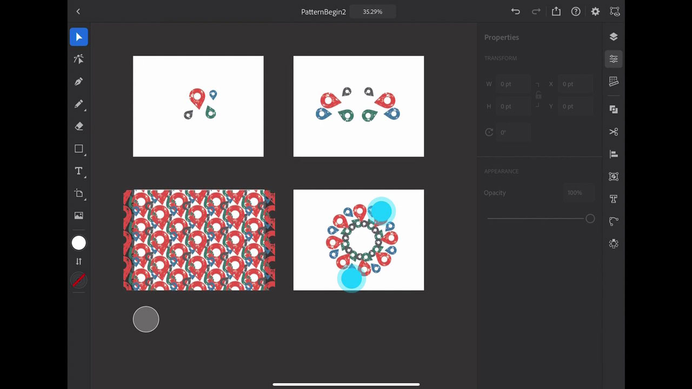

# Illustrator på iPad

Adobe Illustrator på iPad är en ny vektordesignupplevelse för pekskärmar, Apple Pencil och iPad.

## Bläddra i Tutorials

<table style="table-layout:fixed">
<tr>
 <td>
   
    

   <a href="illustratoripad.md#tutorial1"><strong>Introduktion till Illustrator på iPad</strong></a>
    

    <em>Skapa en ikon för en plats där det är svårt och förvandla den till ett mönster som du kan använda på din [!DNL Dimension] och Zazzle-projektet!</em>
     
  </td>
  <td>
    
    

     
  </td>
  <td>
    
    

     
  </td>
</tr>
</table>

## Introduktion till Illustrator på iPad (9:21) {#tutorial1}

>[!VIDEO](https://video.tv.adobe.com/v/326823?hidetitle=true)

**Beskrivning**
Den här korta översikten över Illustrator för iPad hjälper dig att snabbt komma igång med att skapa en ikon för en nödsituation och göra om den till ett mönster som du kan använda på din [!DNL Dimension] och Zazzle-projektet!

I den här självstudiekursen får du lära dig mer om att:
* Illustrator har designats om för iPad och gör datorarbetet mer produktivt, snabbar upp samarbetsmöjligheterna, ger fler kreativa färdigheter och gör alla mer kreativa
* Med pekgränssnittet får du en mer taktil och exakt upplevelse med Apple Pencil
* Få åtkomst till grafik och färger från CC Libraries
* Växla mellan arbetsflöden på mobila enheter och datorer med Illustrator

**Presenteras av:**
Dave Weinberg, Senior Solutions Consultant (Digital Media)

**Resurser för Illustrator på iPad**

[Lär dig mer och support](https://helpx.adobe.com/support/illustrator.html) är ditt nav för ytterligare självstudiekurser, [Nyheter](https://helpx.adobe.com/illustrator/using/whats-new/mobile-2021.html)och länkar till användarforum.

**Versionen från oktober 2020**

Börja använda dessa funktioner (och mycket mer!) genom att hämta den senaste uppdateringen från Creative Cloud-datorprogrammet.
