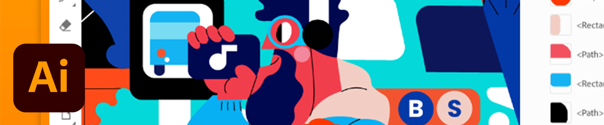

# Illustrator på iPad

Adobe Illustrator på iPad är en ny vektordesignupplevelse för pekskärmar, Apple Pencil och iPad.

## Bläddra i Tutorials

<table style="table-layout:fixed">
<tr>
 <td>
   
    

   <a href="illustratoripad.md#tutorial1"><strong>Introduktion till Illustrator på iPad</strong></a>
    

    <em>Skapa en nödplaceringsikon och förvandla den till ett mönster som du kan använda på din [!DNL Dimension] och Zazzle-projektet!</em>
     
  </td>
  <td>
    
    

     
  </td>
  <td>
    
    

     
  </td>
</tr>
</table>

## Introduktion till Illustrator på iPad (9:21) {#tutorial1}

>[!VIDEO](https://video.tv.adobe.com/v/326823?hidetitle=true)

**Beskrivning**
Med den här snabböversikten över Illustrator för iPad kommer du snabbt igång med att skapa en bekymmersam platsikon och göra om den till ett mönster som du kan tillämpa på dina [!DNL Dimension] och Zazzle-projektet!

I den här självstudiekursen får du lära dig hur du:
* Illustrator har fräschats upp för iPad och gör det produktivare, snabbar upp samarbetet, ger fler kreativa kunskaper och ger alla en kreativ frihet
* Touchgränssnittet ger en mer taktil och exakt upplevelse med Apple Pencil
* Åtkomst till bilder och färger från CC Libraries
* Växla mellan arbetsflöden för mobiler och datorer med Illustrator

**Presenteras av:**
Dave Weinberg, Senior Solutions Consultant (Digital Media)

**Resurser för Illustrator på iPad**

[Utbildning och support](https://helpx.adobe.com/support/illustrator.html) är ditt nav för ytterligare självstudiekurser, [Nyheter](https://helpx.adobe.com/illustrator/using/whats-new/mobile-2021.html)och länkar till användarforum.

**Oktober 2020-utgåvan**

Börja använda dessa funktioner (och mycket mer!) genom att hämta den senaste uppdateringen från Creative Cloud-datorprogrammet.
