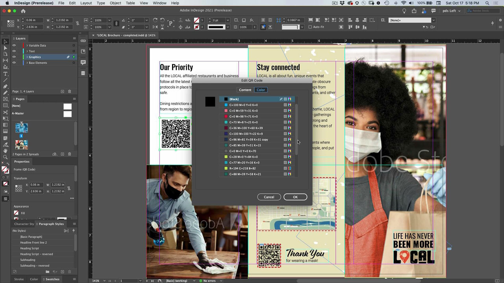
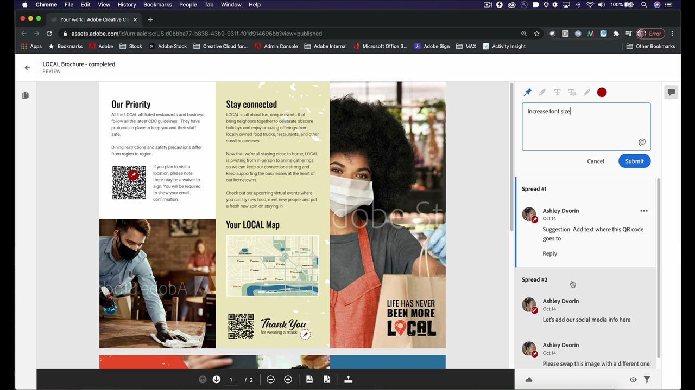
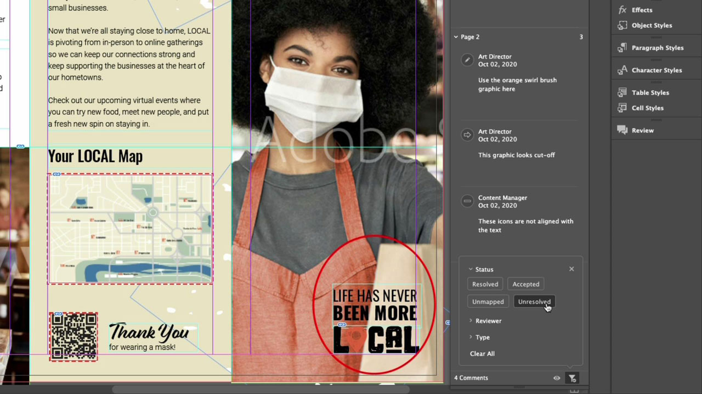
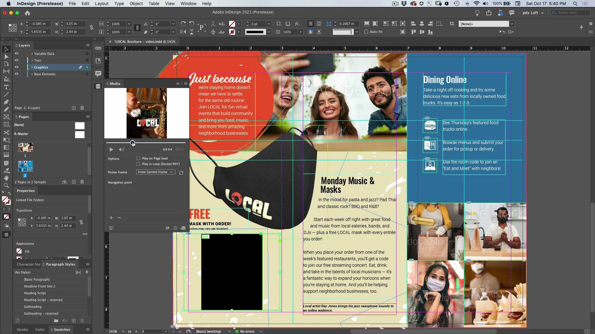
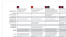

# InDesign

Det branschledande programmet för att skapa snygga dokument för tryckt och digitalt material. Skapa innehållsrika digitala upplevelser och utskriftsupplevelser, från e-böcker och elektroniska tidskrifter till böcker, rapporter och informationsdokument.

## Bläddra i Tutorials

<table style="table-layout:fixed">
<tr>
 <td>
    
    

    <a href="indesign.md#tutorial1"><strong>Generera QR-koder</strong></a>
    

    <em>Generera QR-kod som länkar till en webbplats</em>
     
  </td>
  <td>
   
    

   <a href="indesign.md#tutorial2"><strong>Dela för granskning från InDesign</strong></a>
    

    <em>Smidig kreativ granskning för designers och deras teammedlemmar</em>
     
  </td>
  <td>
    
    

    <a href="indesign.md#tutorial3"><strong>Importera PDF-kommentarer från en Document Cloud-granskning</strong></a>
    

    <em>Importera kommentarer från en PDF direkt till InDesign och tillämpa begärda ändringar snabbt</em>
     
  </td>
</tr>
<tr>
<td>
   
    

   <a href="indesign.md#tutorial4"><strong>Lägga till videofil i InDesign-dokument</strong></a>
    

    <em>Lägg till videoklipp i InDesign. Skicka utdata till PDF och publicera online</em>
     
  </td>
 <td>
    
    

     
 </td>
 <td>
    
    

     
 </td>
</tr>
</table>

## Generera QR-koder (2:34) {#tutorial1}

>[!VIDEO](https://video.tv.adobe.com/v/326818?hidetitle=true)

**Beskrivning**
Generera QR-kod som länkar till en webbplats.

I den här självstudiekursen får du lära dig hur:
* Ge praktisk åtkomst till webbinnehåll via mobila enheter
* Få dina kunder att känna sig säkra
* Digitalt innebär att det är enkelt att hålla innehållet uppdaterat

**Presenteras av:**
Patti Sokol, huvudsaklig lösningskonsult (digitala medier)

## Dela för granskning från InDesign (4:04) {#tutorial2}

>[!VIDEO](https://video.tv.adobe.com/v/326824?hidetitle=true)

**Beskrivning**
InDesign Share for Review är en ännu smidigare granskning för designers och deras teammedlemmar.

I den här självstudiekursen får du lära dig mer om att:
* Påbörja en granskning direkt från InDesign utan att behöva skapa ett PDF
* Granska och kommentera från en webbläsare
* Samla feedback från flera intressenter på ett och samma ställe
* Hantera feedback i appen där ändringar kan göras omedelbart.

**Adobe Review and Comment Options Comparison PDF**

**Presenteras av:**
Emily Palmer, lösningskonsult (digitala medier)

## Importera PDF-kommentarer från en Document Cloud Review (4:52) {#tutorial3}

>[!VIDEO](https://video.tv.adobe.com/v/326959?hidetitle=true)

**Beskrivning**
Importera kommentarer från en PDF direkt till InDesign och tillämpa snabbt begärda ändringar.

I den här självstudiekursen får du lära dig mer om att:
* Stöder befintliga arbetsflöden för kommentering på PDF
* Verk för PDF kombinerat från flera källor

**Adobe Review and Comment Options Comparison PDF**

**Presenteras av:**
Michael Murphy, Senior Solutions Consultant (Digital Media)

## Lägga till videofil i InDesign-dokument (5:58) {#tutorial4}

>[!VIDEO](https://video.tv.adobe.com/v/326757?hidetitle=true)

**Beskrivning**
Lägg till videoklipp i InDesign. Skicka utdata till PDF och publicera online.

I den här självstudiekursen får du lära dig mer om att:
* Lägga till videoklipp i InDesign
* Skicka utdata till PDF och publicera online

**Presenteras av:**
Patti Sokol, huvudsaklig lösningskonsult (digitala medier)

**Resurser för InDesign**

[Lär dig mer och support](https://helpx.adobe.com/support/indesign.html) är ditt nav för ytterligare självstudiekurser, [Nyheter](https://helpx.adobe.com/indesign/user-guide.html/indesign/using/whats-new.ug.html)och länkar till användarforum.

**Versionen från oktober 2020**

Börja använda dessa funktioner (och mycket mer!) genom att hämta den senaste uppdateringen från Creative Cloud-datorprogrammet.
