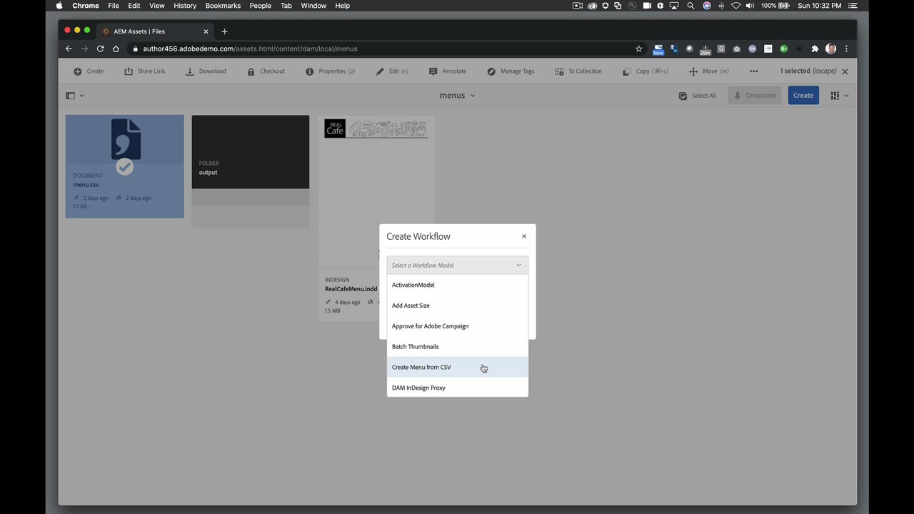
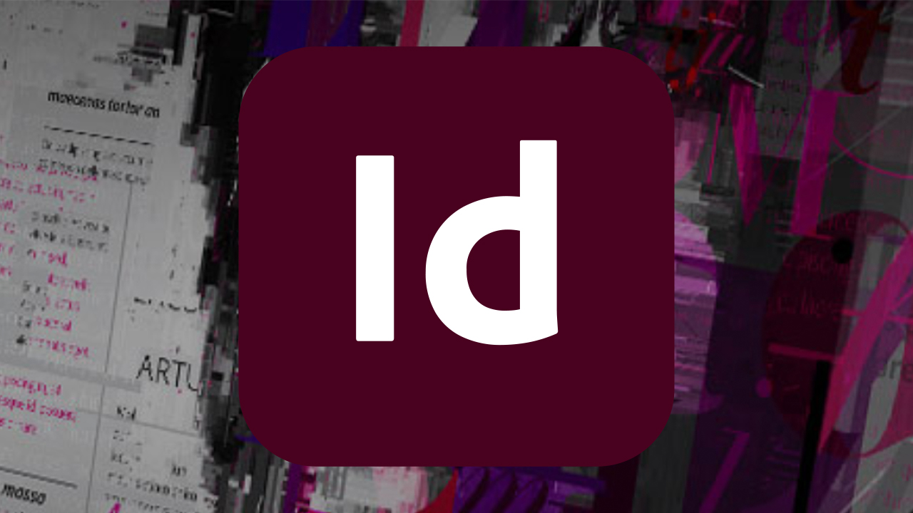

# InDesign Server

Adobe InDesignInDesign ® Server har en robust och skalanpassningsbar motor med funktioner för design, layout och typografi som gör det möjligt att programmatiskt skapa engagerande automatiserade dokument.

## Bläddra i Tutorials

<table style="table-layout:fixed">
<tr>
 <td>
   
    

   <a href="indesignserver.md#tutorial1"><strong>Datadrivet InDesign Server-innehåll</strong></a>
    

    <em>Datadriven utformning kan uppnås programmässigt med InDesign Server</em>
     
  </td>
  <td>
    
    

     
  </td>
  <td>
    
    

     
  </td>
</tr>
</table>

## Datadrivet InDesign Server-innehåll (4:14) {#tutorial1}

>[!VIDEO](https://video.tv.adobe.com/v/326901?hidetitle=true)

**Beskrivning**
Datadriven utformning kan uppnås programmässigt med InDesign Server.

I den här självstudiekursen får du lära dig mer om att:
* Skapa InDesign-mallar med förformaterade text- eller objektformat
* Flöde i externt datadrivet innehåll för snabbare innehållsanpassning
* Skapa spot-on-PDF eller koppla in dig i andra AEM-drivna utdataformat med din layout

**Presenteras av:**
ERIC ROWSE, KONSULT FÖR SENIORA LÖSNINGAR (DIGITALA MEDIA)

## Ytterligare resurser från InDesign Server

<table>
<tr>
 <td>
   
    

   <a href="https://www.adobe.com/products/indesignserver/buying-guide.html"><strong>InDesign Server: Köpguide</strong></a>
    

    <em>Resurser tillgängliga för interna utvecklare eller partners</em>
     
  </td>
  <td>
   
    

   <a href="https://www.adobe.com/products/indesignserver/partner.html"><strong>InDesign Server: Hitta en partner</strong></a>
    

    <em>Även om du har expertisen att utveckla internt rekommenderar Adobe att du samarbetar med våra partners för att hitta en lösning som uppfyller dina krav</em>
     
  </td>
  <td>
    
    

     
  </td>
</tr>
</table>

**Resurser för InDesign Server**

[Lär dig mer och support](https://www.adobe.com/products/indesignserver.html) är navet för ytterligare självstudiekurser, Nyheter och länkar till användarforum.

**Versionen från oktober 2020**

Börja använda dessa funktioner (och mycket mer!) genom att hämta den senaste uppdateringen från Creative Cloud-datorprogrammet.
