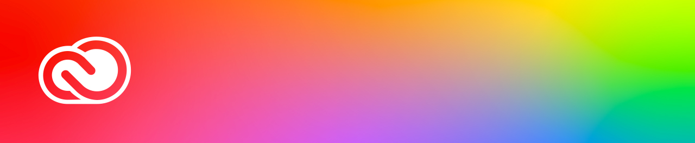

# Självstudiekurser

För kreativa företag måste du samarbeta med distribuerade team, upprätta skalbara processer och följa företagets system och riktlinjer. De här självstudiekurserna hjälper dig att lära dig nya funktioner i 2021-versionen av Creative Cloud - ur ett företagsperspektiv.

## Tutorials från Desktop Products

<table style="table-layout:fixed">
<tr>
 <td>
    
    

    <a href="acrobat-sign.md"><strong>Acrobat och Adobe Sign</strong></a>
    

    <em>Skapa, redigera och signera PDF-dokument och -formulär</em>
     
  </td>
  <td>
    
    

    <a href="dimension.md"><strong>Dimension</strong></a>
    

    <em>Skapa fotorealistiska 3D-bilder för branding, produktbilder och förpackningsdesign</em>
     
  </td>
  <td>
    
    

    <a href="illustrator.md"><strong>Illustrator</strong></a>
    

    <em>Vektorgrafik och -illustrationer</em>
     
  </td>
</tr>
<tr>
 <td>
    
    

    <a href="indesign.md"><strong>InDesign</strong></a>
    

    <em>Skapa layouter för tryck och digital publicering</em>
     
  </td>
  <td>
    
    

    <a href="photoshop.md"><strong>Photoshop</strong></a>
    

    <em>Redigera, gör montage och skapa vackra bilder, grafik och digital konst på datorn</em>
     
  </td>
  <td>
    
    

    <a href="rush.md"><strong>Rush</strong></a>
    

    <em>Skapa och dela onlinevideor var du vill</em>
     
  </td>
</tr>
<tr>
 <td>
    
    

    <a href="xd.md"><strong>XD</strong></a>
    

    <em>Designa, skapa prototyper och dela användarupplevelser</em>
     
  </td>
  <td>
    
    

     
  </td>
  <td>
    
    

     
  </td>
</tr>
</table>

### Tutorials av mobilapp

<table style="table-layout:fixed">
<tr>
 <td>
    
    

    <a href="capture.md"><strong>Capture</strong></a>
    

    <em>Omvandla en bild till ett färgtema, vektorgrafik, pensel med mera</em>
     
  </td>
  <td>
    
    

    <a href="fresco.md"><strong>Fresco</strong></a>
    

    <em>Återupptäck glädjen med att teckna och måla</em>
     
  </td>
  <td>
    
    

    <a href="illustratoripad.md"><strong>Illustrator på iPad</strong></a>
    

    <em>Vektorgrafik och -illustrationer</em>
     
  </td>
</tr>
<tr>
 <td>
    
    

    <a href="photoshopipad.md"><strong>Photoshop på iPad.</strong></a>
    

    <em>Redigera, gör montage och skapa vackra bilder, grafik och digital konst på datorn och iPad</em>
     
  </td>
  <td>
    
    

     
  </td>
  <td>
    
    

     
  </td>
</tr>
</table>

### Tutorials genom integration

<table style="table-layout:fixed">
<tr>
 <td>
    
    

    <a href="aem.md"><strong>AEM Assets och Asset Link</strong></a>
    

    <em>Nästa generations hantering av digitala tillgångar</em>
     
  </td>
  <td>
    
    

    <a href="creativeclouddesktopapp.md"><strong>Creative Cloud-datorprogrammet</strong></a>
    

    <em>Datorprogrammet Creative Cloud är navet där du hanterar CC-program, tjänster och samarbeten - och mycket mer!</em>
     
  </td>
  <td>
    
    

    <a href="cclibraries.md"><strong>CC Libraries</strong></a>
    

    <em>Ha dina mediefiler till hands och dina projekt till hands på ett varumärke</em>
     
  </td>
</tr>
<tr>
<td>
    
    

    <a href="indesignserver.md"><strong>InDesign Server</strong></a>
    

    <em>De sofistikerade verktygen i InDesign i kombination med anpassad automatisering</em>
     
  </td>
 <td>
    
    

    <a href="stock.md"><strong>Adobe [!DNL Stock]</strong></a>
    

    <em>Digitala bilder, illustrationer, videor, ljud, mallar och annat av hög kvalitet</em>
     
  </td>
  <td>
    
    

     
  </td>
</tr>
</table>

### Praktiskt projekt: Skapa en egen ansiktsmask

<table style="table-layout:fixed">
<tr>
 <td>
    
    

    <a href="handsonproject.md"><strong>Skapa en egen ansiktsmask</strong></a>
    

    <em>Med plugin-programmet Adobe Design to Print kan du visualisera dina mönster på hundratals Zazzle-produkter och publicera direkt på deras onlinemarknad</em>
     
  </td>
  <td>
    
    

     
  </td>
  <td>
    
    

     
  </td>
</tr>
</table>
