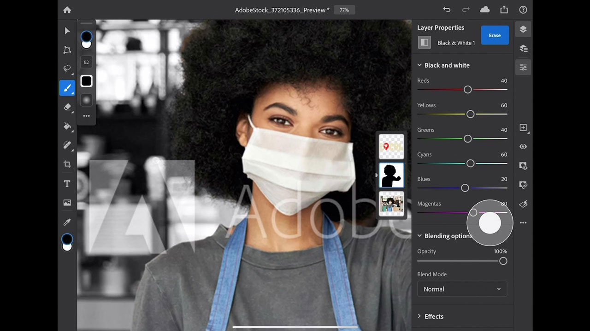

# Photoshop på iPad.

Photoshop är världens bästa bildbehandlings- och grafikdesignprogram. Det ger proffsen obegränsad kreativitet på alla enheter. Nu kan vem som helst skapa vad som helst som de föreställer sig, var som helst och när som helst. Om du kan tro det, kan du göra det med Photoshop.

## Bläddra i Tutorials

<table style="table-layout:fixed">
<tr>
 <td>
   
    

   <a href="photoshopipad.md#tutorial1"><strong>Introduktion till Photoshop på iPad</strong></a>
    

    <em>Ta en rundtur i gränssnittet och lär dig några funktioner i Photoshop som har gjorts om för användning på Apple iPad</em>
     
  </td>
  <td>
    
    

     
  </td>
  <td>
    
    

     
  </td>
</tr>
</table>

## Introduktion till Photoshop på iPad (5:14) {#tutorial1}

>[!VIDEO](https://video.tv.adobe.com/v/326899?hidetitle=true)

**Beskrivning**
Ta en rundtur i gränssnittet och lär dig några funktioner i Photoshop som har gjorts om för användning på Apple iPad.

I den här självstudiekursen får du lära dig mer om att:
* Få tillgång till dina Photoshop-favoritverktyg på
* Exakt redigering på mobilen utan att kompromissa med kvaliteten
* Mer uppslukande och naturlig upplevelse
* Smidigt arbetsflöde med molndokument

**Presenteras av:**
Dan Armstrong, lösningskonsult (digitala medier)

**Resurser för Photoshop på iPad**

[Lär dig mer och support](https://helpx.adobe.com/support/photoshop.html) är navet för ytterligare självstudiekurser och länkar till användarforum.

**Versionen från oktober 2020**

Börja använda dessa funktioner (och mycket mer!) genom att hämta den senaste uppdateringen från Creative Cloud-datorprogrammet.
