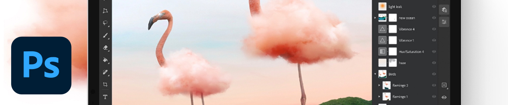

# Photoshop på iPad.

Photoshop är världens bästa program för bildbehandling och grafisk design, vilket ger obegränsat med kreativitet för proffs på olika enheter. Nu kan vem som helst skapa vad som helst, var som helst. Om du kan tro det, kan du göra det med Photoshop.

## Bläddra i Tutorials

<table style="table-layout:fixed">
<tr>
 <td>
   
    

   <a href="photoshopipad.md#tutorial1"><strong>Introduktion till Photoshop på iPad</strong></a>
    

    <em>Se en gränssnittsdemo och lär dig några av funktionerna i Photoshop som har förnyats för användning i Apple iPad</em>
     
  </td>
  <td>
    
    

     
  </td>
  <td>
    
    

     
  </td>
</tr>
</table>

## Introduktion till Photoshop på iPad (5:14) {#tutorial1}

>[!VIDEO](https://video.tv.adobe.com/v/326899?hidetitle=true)

**Beskrivning**
Ta en rundtur i gränssnittet och lär dig några nya funktioner i Photoshop som har förnyats för användning i Apple iPad.

I den här självstudiekursen får du lära dig hur du:
* Kom åt dina favoritverktyg från Photoshop på
* Exakt redigering på mobilen utan att kompromissa med kvaliteten
* Mer engagerande och naturlig upplevelse
* Smidigt arbetsflöde med molndokument

**Presenteras av:**
Dan Armstrong, lösningskonsult (Digital Media)

**Photoshop på iPad Resources**

[Utbildning och support](https://helpx.adobe.com/support/photoshop.html) är navet för ytterligare självstudiekurser och länkar till användarforum.

**Oktober 2020-utgåvan**

Börja använda dessa funktioner (och mycket mer!) genom att hämta den senaste uppdateringen från Creative Cloud-datorprogrammet.
