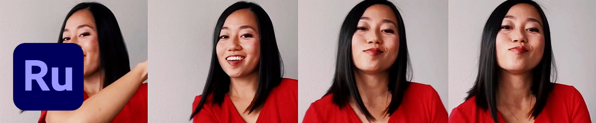
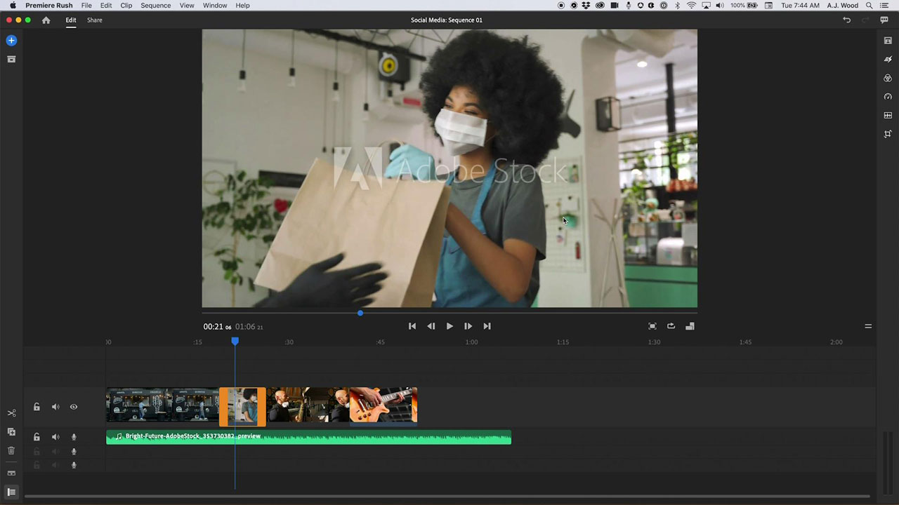

# [!DNL Rush]

Premiere [!DNL Rush] är den första kompletta videoredigeringsappen för flera enheter som gör det enklare än någonsin att skapa och dela onlinematerial. Denna integrerade dator- och mobillösning synkroniserar automatiskt dina projekt och redigeringar till molnet så att du kan arbeta var som helst, på vilken enhet som helst.

## Bläddra i Tutorials

<table style="table-layout:fixed">
<tr>
 <td>
   
    

   <a href="rush.md#tutorial1"><strong>Skapa en video för sociala medier</strong></a>
    

    <em>Adobe [!DNL Rush] gör att du kan arbeta på vilken enhet som helst och gör professionell produktion lätt nog för nybörjare</em>
     
  </td>
  <td>
    
    

     
  </td>
  <td>
    
    

     
  </td>
</tr>
</table>

## Skapa en video för sociala medier (18:11) {#tutorial1}

>[!VIDEO](https://video.tv.adobe.com/v/326900?hidetitle=true)

**Beskrivning**
Berätta en historia med video och ljud från Adobe [!DNL Stock]. Adobe [!DNL Rush] gör att du kan arbeta på vilken enhet som helst och gör professionella resultat enkelt nog för nybörjare.

I den här självstudiekursen får du lära dig hur du:
* Redigera video smidigt på dator, surfplatta och telefon
* Håll motivet centrerat över horisontella, kvadratiska och vertikala formfaktorer med funktionen Ändra bildruteproportioner automatiskt med AI-teknik
* Mallar för rörelsegrafik (MoGRTS) ger professionella och anpassningsbara titlar och lägre tredjedelar
* Exportera och publicera enkelt direkt i sociala medier
* Öppna [!DNL Rush] projekt i Adobe Premiere Pro

**Presenteras av:**
A.J. Wood, lösningskonsult (Digital Media)

**[!DNL Rush]Resurser**

[Utbildning och support](https://helpx.adobe.com/support/premiere-rush.html) är ditt nav för ytterligare självstudiekurser, [Nyheter](https://helpx.adobe.com/premiere-rush/user-guide.html/premiere-rush/help/whats-new.ug.html)och länkar till användarforum.

**Oktober 2020-utgåvan**

Börja använda dessa funktioner (och mycket mer!) genom att hämta den senaste uppdateringen från Creative Cloud-datorprogrammet.
