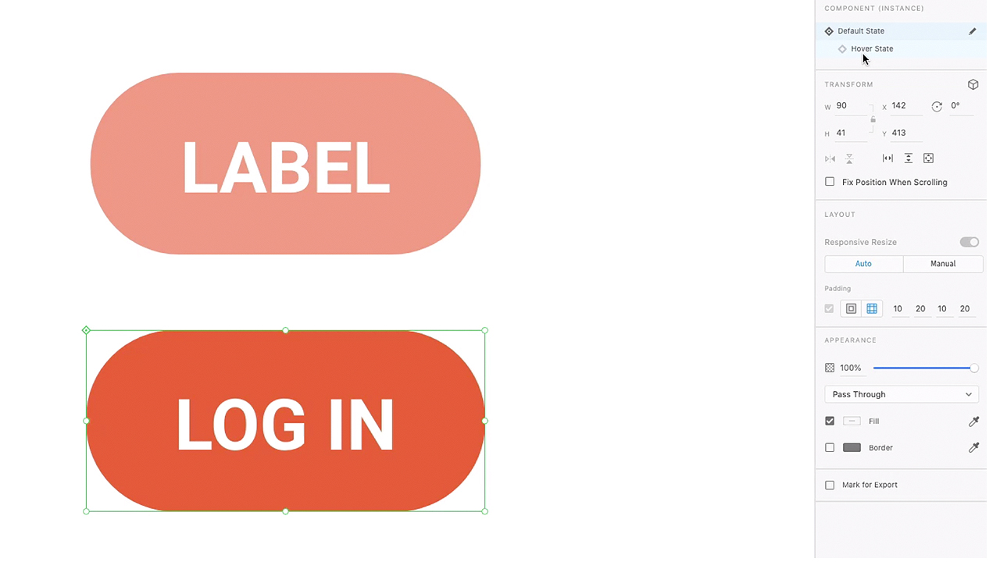
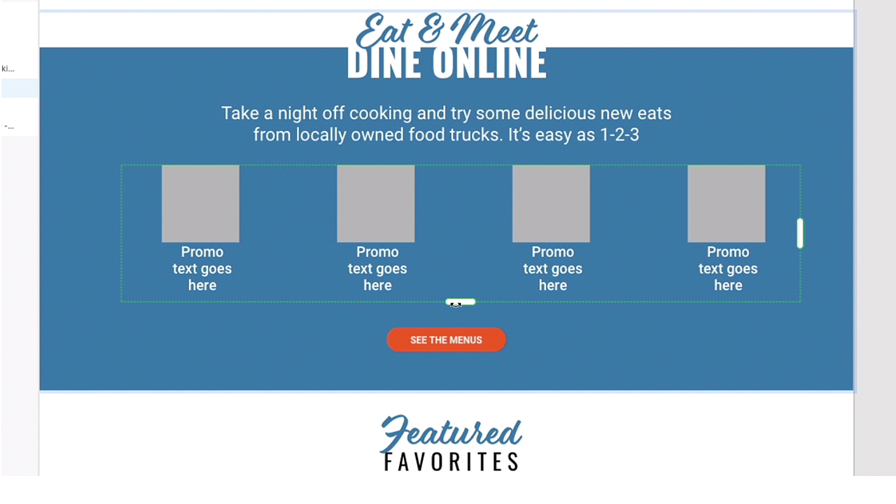
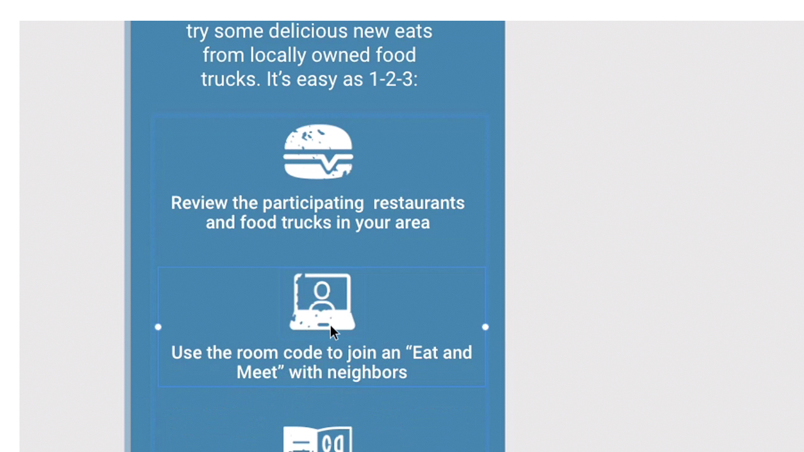
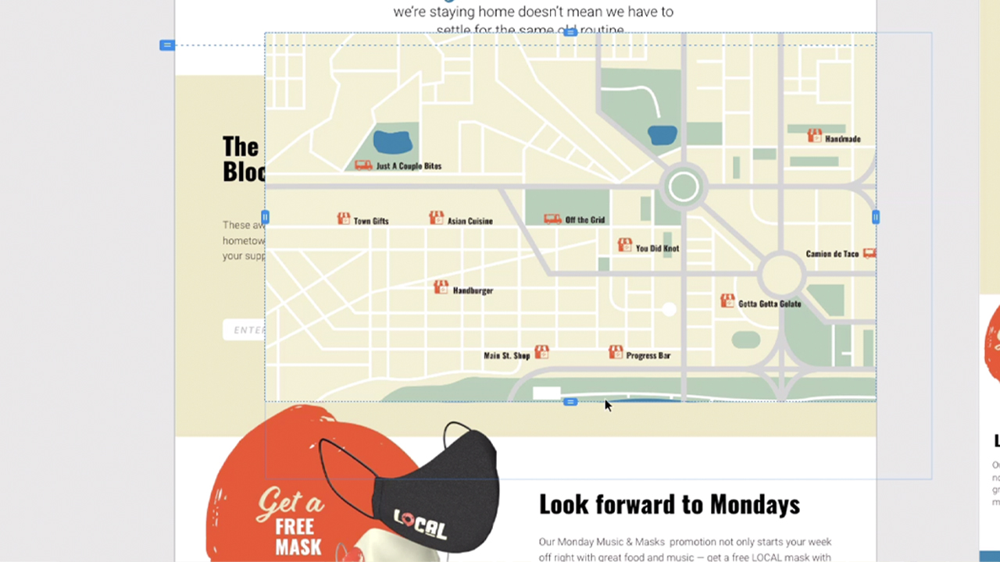
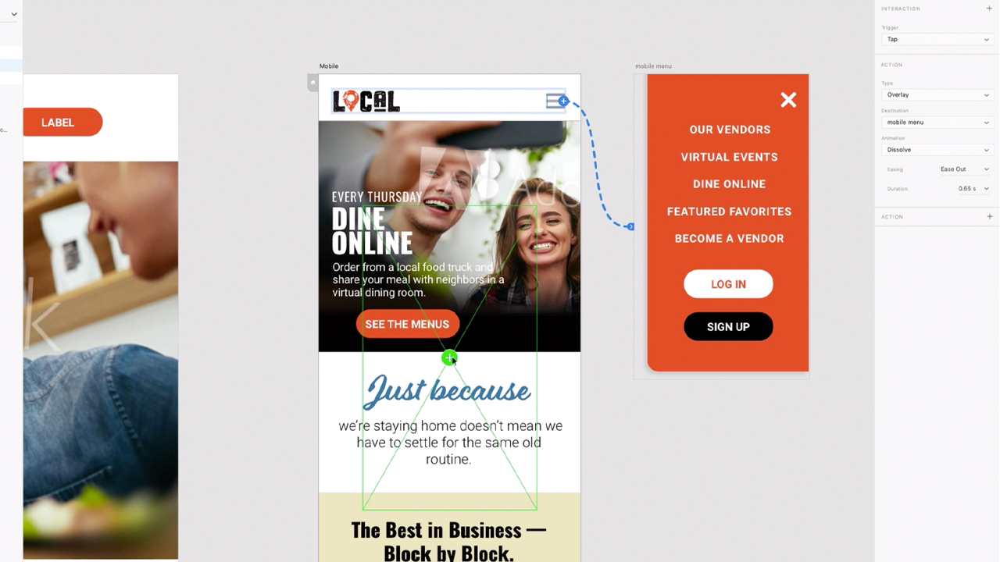
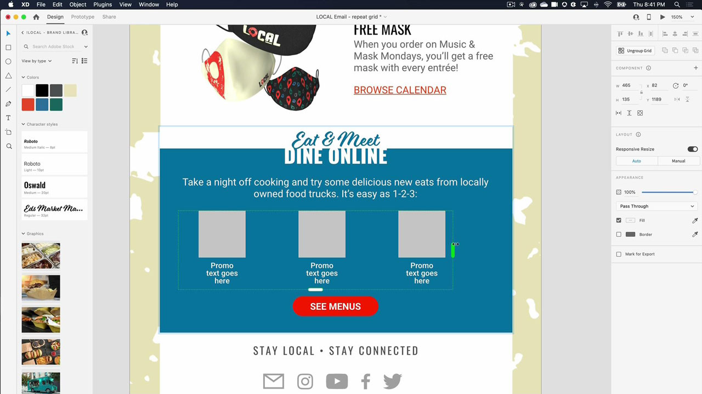
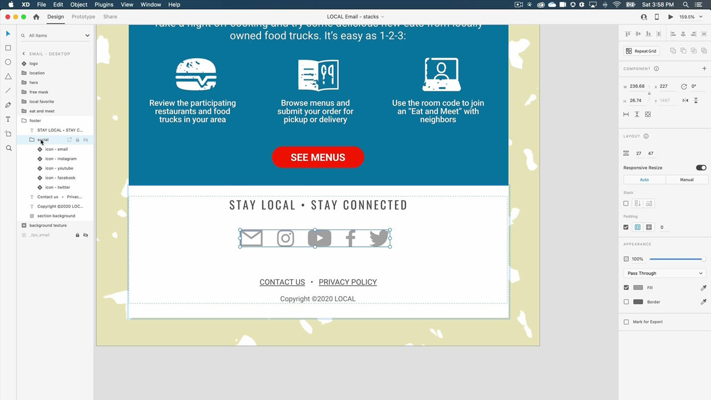

# XD

Adobe XD är ett verktyg för design och prototyper av användarupplevelser för att designa webbplatser, appar, röstgränssnitt, spel och andra typer av digitala upplevelser.

## Bläddra i Tutorials

<table style="table-layout:fixed">
<tr>
 <td>
   
    

   <a href="xd.md#tutorial1"><strong>Skapa komponenter med hovringstillstånd</strong></a>
    

    <em>Skapa återanvändbara, dynamiskt skalbara knappar för interaktiv design</em>
     
  </td>
  <td>
    
    

    <a href="xd.md#tutorial2"><strong>Skapa och fylla i ett stödraster med upprepningar</strong></a>
    

    <em>Förvandla ett enskilt element till upprepade stödraster genom att klicka och dra</em>
     
  </td>
  <td>
   
    

    <a href="xd.md#tutorial3"><strong>Arbeta med högar</strong></a>
    

    <em>Använd egenskapen stack för att enkelt ordna om element</em>
     
  </td>
</tr>
<tr>
 <td>
    
    

    <a href="xd.md#tutorial4"><strong>Skapa en prototyp - Fäst länkar och rullningsgrupper</strong></a>
    

    <em>Lägga till navigering och rullning i en prototyp</em>
     
  </td>
  <td>
    
    

    <a href="xd.md#tutorial5"><strong>Skapa en prototyp - interaktiva komponentlägen</strong></a>
    

    <em>Lägga till interaktivitet och en överläggsmeny i en prototyp</em>
     
  </td>
  <td>
   
    

   <a href="xd.md#tutorial7"><strong>E-post - Skapa och fylla i ett stödraster med upprepningar</strong></a>
    

    <em>Förvandla ett enskilt element till upprepade stödraster genom att klicka och dra</em>
     
  </td>
</tr>
<tr>
 <td>
    
    

    <a href="xd.md#tutorial7"><strong>E-post - arbeta med högar</strong></a>
    

    <em>Använd egenskapen stack för att enkelt ordna om element</em>
     
  </td>
  <td>
    
    

     
  </td>
  <td>
    
    

     
  </td>
</tr>
</table>

## Skapa [!UICONTROL Komponenter] med hovringstillstånd (7:35) {#tutorial1}

>[!VIDEO](https://video.tv.adobe.com/v/326874?hidetitle=true)

**Beskrivning**
Skapa återanvändbara knappar som dynamiskt kan storleksändras för din interaktiva design.

I den här självstudiekursen får du lära dig hur du:
* Gör ändringar i en källhuvudkomponent så överförs ändringarna automatiskt till alla förekomster av den komponenten
* Använd komponenter för enhetlighet, tidsbesparing och färre klick

**Presenteras av:**
Michael Murphy, Senior Solutions Consultant (Digital Media)

## Skapa och fylla i ett stödraster med upprepningar (2:57) {#tutorial2}

>[!VIDEO](https://video.tv.adobe.com/v/326955?hidetitle=true)

**Beskrivning**
Förvandla ett enskilt element till upprepade stödraster genom att klicka och dra.

I den här självstudiekursen får du lära dig hur du:
* Utöka arbetsflödet och dra ut det stödraster du behöver - direkt
* Lägg in riktigt innehåll och data så monterar XD alla bilder och text i ditt rutnät
* Gör ändringarna en gång och använd dem var du vill, i valfri riktning

**Presenteras av:**
Ashley Dvorin, Senior Solutions Consultant (Digital Media)

## Arbeta med högar (5:33) {#tutorial3}

>[!VIDEO](https://video.tv.adobe.com/v/326956?hidetitle=true)

**Beskrivning**
Använd egenskapen stack för att enkelt ordna om element.

I den här självstudiekursen får du lära dig hur du:
* Behåll justeringen och avståndet mellan objekt på arbetsytan även när designen ändras
* Infoga nya objekt eller ändra ordning på objekt i en stapel så justeras allt automatiskt

**Presenteras av:**
Michael Murphy, Senior Solutions Consultant (Digital Media)

## Skapa en prototyp - Fäst länkar och rullningsgrupper (9:55) {#tutorial4}

>[!VIDEO](https://video.tv.adobe.com/v/326957?hidetitle=true)

**Beskrivning**
Lägg till navigering och bläddring i en prototyp.

I den här självstudiekursen får du lära dig hur du:
* Lägga till länkar till prototyper med ett funktionsmakro som gör att användare kan gå till olika punkter på samma rityta
* Skapa aktivitetsflöden, bildkaruseller, produktlistor med mera genom att definiera områden som rullar oberoende av resten av designen
* Skapa grupper som rullar lodrätt, vågrätt eller både och

**Presenteras av:**
Michael Murphy, Senior Solutions Consultant (Digital Media)

## Skapa en prototyp - Interaktiva komponentlägen (8:55) {#tutorial5}

>[!VIDEO](https://video.tv.adobe.com/v/326958?hidetitle=true)

**Beskrivning**
Lägg till interaktivitet och en överläggsmeny i en prototyp.

I den här självstudiekursen får du lära dig hur du:
* Skapa en icke-linjär interaktiv och animerad användarupplevelse utan att behöva ytterligare ritytor
* Skapa flera prototyper eller interaktionsflöden i ett enda XD-dokument och publicera unika delningslänkar för varje flöde

**Presenteras av:**
Emilie Enke, Associate Solutions Consultant (Digital Media)

## E-post - Skapa och fylla i ett stödraster med upprepningar (4:45) {#tutorial6}

>[!VIDEO](https://video.tv.adobe.com/v/326775?hidetitle=true)

**Beskrivning**
Förvandla ett enskilt element till upprepade stödraster genom att klicka och dra.

I den här självstudiekursen får du lära dig hur du:
* Utöka arbetsflödet och dra ut det stödraster du behöver - direkt
* Lägg in riktigt innehåll och data så monterar XD alla bilder och text i ditt rutnät
* Gör ändringarna en gång och använd dem var du vill, i valfri riktning

**Presenteras av:**
Victoria Torres, lösningskonsult (Digital Media)

## E-post - arbeta med högar (3:38) {#tutorial7}

>[!VIDEO](https://video.tv.adobe.com/v/326759?hidetitle=true)

**Beskrivning**
Använd egenskapen stack för att enkelt ordna om element.

I den här självstudiekursen får du lära dig hur du:
* Behåll justeringen och avståndet mellan objekt på arbetsytan även när designen ändras
* Infoga nya objekt eller ändra ordning på objekt i en stapel så justeras allt automatiskt

**Presenteras av:**
Victoria Torres, lösningskonsult (Digital Media)

**XD-resurser**

[Utbildning och support](https://helpx.adobe.com/support/xd.html) är ditt nav för ytterligare självstudiekurser, [Nyheter](https://helpx.adobe.com/xd/user-guide.html/xd/help/whats-new.ug.html)och länkar till användarforum.

**Oktober 2020-utgåvan**

Börja använda dessa funktioner (och mycket mer!) genom att hämta den senaste uppdateringen från Creative Cloud-datorprogrammet.
